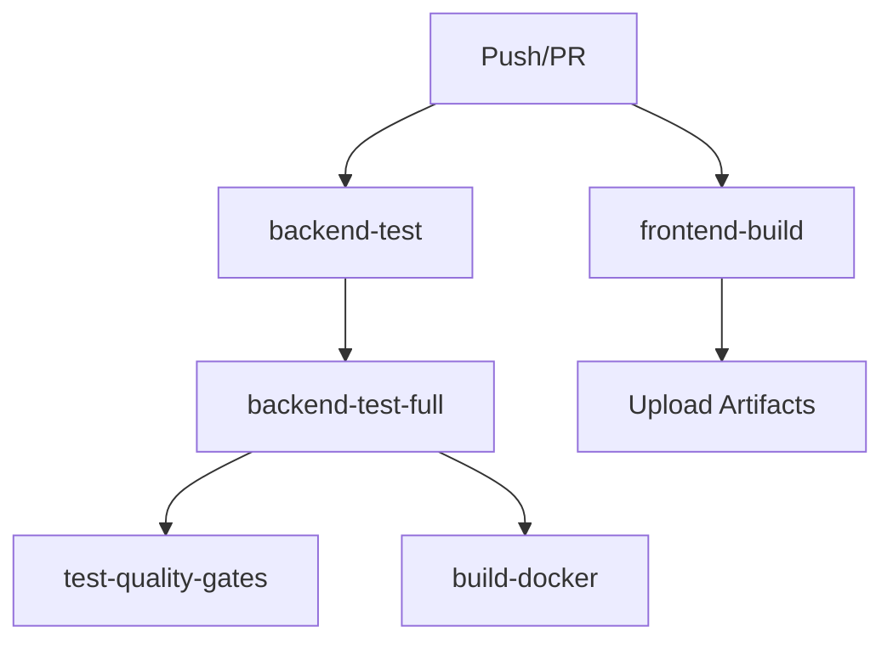
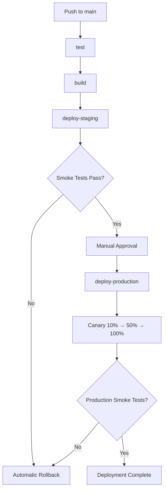
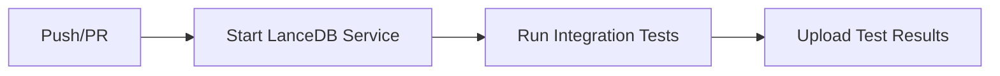

# GitHub Actions Workflows

**Purpose**: Documentation for Atom CI/CD workflows
**Last Updated**: 2026-02-20

## Workflow Overview

Atom uses GitHub Actions for continuous integration and deployment. Workflows are defined in `.github/workflows/` directory.

---

## Workflows

### 1. CI Pipeline (ci.yml)

**Purpose**: Run tests, linting, type checking, and build Docker images
**Trigger**: Push to `main` or `develop` branches, pull requests
**Duration**: 15-20 minutes

**Jobs**:
1. **backend-test**: Import verification (1 minute)
2. **frontend-build**: Frontend build and artifact upload (2 minutes)
3. **backend-test-full**: Full test suite with coverage (10 minutes)
4. **test-quality-gates**: Test independence, pass rate, performance (5 minutes)
5. **build-docker**: Docker image build with caching (3 minutes)

**Architecture**:


**Quality Gates**:
- **TQ-01**: Test independence (random order execution)
- **TQ-02**: Test pass rate (>=98%)
- **TQ-03**: Test performance (<60 minutes)
- **TQ-04**: Test determinism (flaky test detection)
- **TQ-05**: Coverage quality (>=25%)

**Artifacts**:
- Frontend build: `frontend-nextjs-build`
- Coverage reports: `coverage-reports`

---

### 2. Deploy Pipeline (deploy.yml)

**Purpose**: Deploy to staging and production environments
**Trigger**: Push to `main` branch (staging auto, production manual)
**Duration**: 10-15 minutes

**Jobs**:
1. **test**: Unit and integration tests (5 minutes)
2. **build**: Docker image build and push (3 minutes)
3. **deploy-staging**: Deploy to staging (5 minutes)
4. **deploy-production**: Deploy to production with canary (10 minutes)

**Architecture**:


**Deployment Environments**:
- **Staging**: Automatic deployment on push to `main`
- **Production**: Manual approval required (GitHub environment protection)

**Canary Deployment**:
- **10% traffic** (5 minutes): Monitor error rate
- **50% traffic** (5 minutes): Scale up, monitor
- **100% traffic**: Full rollout

**Automatic Rollback**:
- Triggered by: Smoke test failure, high error rate, high latency
- Rollback command: `kubectl rollout undo deployment/atom`
- Rollback timeout: 5 minutes

---

### 3. LanceDB Integration Tests (lancedb-integration.yml)

**Purpose**: Run LanceDB integration tests with real service
**Trigger**: Push to `main` or `develop` branches, pull requests, manual
**Duration**: 15-20 minutes

**Jobs**:
1. **lancedb-integration**: LanceDB integration tests (15 minutes)

**Architecture**:


**Service Container**:
- **Image**: `lancedb/lancedb:latest`
- **Port**: 8080
- **Health check**: `curl -f http://localhost:8080/health`

**Environment Variables**:
- `LANCEDB_URI`: `sqlite:///tmp/lancedb_test.db`
- `ATOM_DISABLE_LANCEDB`: `false` (use real service)

---

## Job Dependencies

### CI Workflow Dependencies

```
backend-test (independent)
frontend-build (independent)
   ↓
backend-test-full (depends on backend-test)
   ↓
test-quality-gates (depends on backend-test-full)
build-docker (depends on backend-test-full)
```

### Deploy Workflow Dependencies

```
test
   ↓
build (depends on test)
   ↓
deploy-staging (depends on build)
   ↓
deploy-production (depends on deploy-staging)
```

---

## Environment Variables

### CI Workflow Variables

| Variable | Purpose | Default |
|----------|---------|---------|
| `DATABASE_URL` | Test database | `sqlite:///:memory:` |
| `BYOK_ENCRYPTION_KEY` | Encryption key | `test_key_for_ci_only` |
| `ENVIRONMENT` | Environment name | `test` |
| `ATOM_DISABLE_LANCEDB` | Disable LanceDB | `true` |
| `ATOM_MOCK_DATABASE` | Mock database | `true` |

### Deploy Workflow Variables (Secrets)

| Variable | Purpose | Required |
|----------|---------|----------|
| `KUBECONFIG_STAGING` | Staging cluster config | Yes |
| `KUBECONFIG_PRODUCTION` | Production cluster config | Yes |
| `REGISTRY_USERNAME` | Container registry username | Yes |
| `REGISTRY_PASSWORD` | Container registry password | Yes |
| `SMOKE_TEST_USERNAME` | Smoke test user | Yes |
| `SMOKE_TEST_PASSWORD` | Smoke test password | Yes |
| `STAGING_URL` | Staging URL | Yes |
| `PRODUCTION_URL` | Production URL | Yes |
| `PROMETHEUS_URL` | Monitoring endpoint | No |
| `GRAFANA_URL` | Dashboard URL | No |
| `GRAFANA_API_KEY` | Grafana API key | No |
| `SLACK_WEBHOOK_URL` | Slack webhook | No |

---

## Quality Gates

### TQ-01: Test Independence

**Purpose**: Validate tests run independently without ordering dependencies

**Enforcement**: Random order test execution

**Job**: `test-quality-gates` → `TQ-01 Check test independence`

**Pass Criteria**: All tests pass in random order

**Implementation**:
```yaml
- name: TQ-01 Check test independence
  run: |
    pytest tests/ --random-order --random-order-seed=random -v --maxfail=5
```

### TQ-02: Test Pass Rate

**Purpose**: Ensure 98% minimum test pass rate

**Enforcement**: Pass rate calculated from pytest JSON output

**Job**: `test-quality-gates` → `TQ-02 Check test pass rate`

**Pass Criteria**: Pass rate >=98%

**Implementation**:
```yaml
- name: TQ-02 Check test pass rate
  run: |
    pytest tests/ --json-report --json-report-file=pytest_report.json
    python tests/scripts/parse_pytest_output.py pytest_report.json
```

### TQ-03: Test Performance

**Purpose**: Ensure test suite completes in reasonable time

**Enforcement**: Test duration measured

**Job**: `backend-test-full` → Test execution time

**Pass Criteria**: Full test suite <60 minutes

**Implementation**:
```yaml
- name: Run tests with coverage
  run: |
    START_TIME=$(date +%s)
    pytest tests/ --cov=core --cov=api --cov=tools --cov-report=xml
    END_TIME=$(date +%s)
    DURATION=$((END_TIME - START_TIME))
    echo "Test duration: $DURATION seconds"
    if [ $DURATION -gt 3600 ]; then
      echo "Tests exceeded 60 minute threshold"
      exit 1
    fi
```

### TQ-04: Test Determinism

**Purpose**: Ensure tests produce consistent results

**Enforcement**: Flaky test detection with retries

**Job**: `test-quality-gates` → `TQ-02 Check test pass rate` (includes `--reruns 2`)

**Pass Criteria**: Tests pass after 2 retries

**Implementation**:
```yaml
- name: TQ-02 Check test pass rate
  run: |
    pytest tests/ --reruns 2 --reruns-delay 1 --json-report --json-report-file=pytest_report.json
```

### TQ-05: Coverage Quality

**Purpose**: Ensure adequate code coverage

**Enforcement**: Coverage percentage measured

**Job**: `backend-test-full` → Coverage report

**Pass Criteria**: Coverage >=25%

**Implementation**:
```yaml
- name: Check coverage threshold
  run: |
    coverage=$(cd backend && coverage report | grep TOTAL | awk '{print $4}' | sed 's/%//')
    echo "Coverage: $coverage%"
    if (( $(echo "$coverage < 25" | bc -l) )); then
      echo "Coverage below 25% threshold"
      exit 1
    fi
```

---

## Workflow Triggers

### CI Pipeline Triggers

**Push triggers**:
```yaml
on:
  push:
    branches: [ main, develop ]
```

**Pull request triggers**:
```yaml
on:
  pull_request:
    branches: [ main, develop ]
```

### Deploy Pipeline Triggers

**Push triggers**:
```yaml
on:
  push:
    branches: [ main ]
```

**Manual triggers**:
```yaml
on:
  workflow_dispatch:
    inputs:
      environment:
        description: 'Target environment'
        required: true
        type: choice
        options:
          - staging
          - production
```

---

## Docker Build Caching

### Cache Strategy

**GitHub Actions Cache**:
```yaml
cache-from: type=gha,mode=max
cache-to: type=gha,mode=max
```

**Registry Cache**:
```yaml
cache-from: type=registry,ref=registry.example.com/atom:buildcache
cache-to: type=registry,ref=registry.example.com/atom:buildcache,mode=max
```

**Inline Cache**:
```yaml
cache-to: type=inline,mode=max
```

### Cache Performance

**Without caching**:
- Build time: 10-15 minutes
- No layers cached

**With mode=max caching**:
- Build time: 2-3 minutes (75% reduction)
- Most layers cached

**Cache hit rate**:
- First build: 0% (baseline)
- Subsequent builds: 80-90% (requirements.txt unchanged)
- Dependency changes: 30-40% (partial cache)

---

## Deployment Environments

### Staging Environment

**Configuration**:
```yaml
environment:
  name: staging
  url: https://staging.atom.example.com
```

**Characteristics**:
- Automatic deployment on push to `main`
- No approval required
- Relaxed error thresholds (<1%)
- Used for pre-production validation

### Production Environment

**Configuration**:
```yaml
environment:
  name: production
  url: https://atom.example.com
```

**Characteristics**:
- Manual approval required
- Strict error thresholds (<0.1%)
- Canary deployment (10% → 50% → 100%)
- Used for live traffic

---

## Monitoring and Observability

### Prometheus Metrics

**Deployment metrics**:
- `deployment_total`: Total deployments by status
- `deployment_duration_seconds`: Deployment duration
- `deployment_rollback_total`: Total rollbacks

**Smoke test metrics**:
- `smoke_test_total`: Smoke test results
- `smoke_test_duration_seconds`: Test duration

**Canary metrics**:
- `canary_traffic_percentage`: Current traffic percentage
- `canary_error_rate`: Error rate during canary

### Grafana Dashboards

**Deployment Overview**:
- URL: `https://grafana.example.com/d/atom-deployment-overview`
- Refresh: 30s
- Panels: Success rate, rollback rate, duration, canary status

**CI/CD Performance**:
- URL: `https://grafana.example.com/d/atom-cicd-performance`
- Refresh: 1m
- Panels: Build duration, test duration, queue time

---

## Troubleshooting

See [CI/CD Troubleshooting Guide](../backend/docs/CI_CD_TROUBLESHOOTING.md) for common issues and solutions.

**Quick commands**:
```bash
# View workflow history
gh run list --workflow=ci.yml --limit 10

# View specific workflow run
gh run view <run-id>

# Download workflow artifacts
gh run download <run-id>

# Retry failed workflow
gh run rerun <run-id>

# Cancel running workflow
gh run cancel <run-id>

# Watch workflow run
gh run watch --interval 10
```

---

## Related Documentation

- [CI/CD Runbook](../backend/docs/CI_CD_RUNBOOK.md)
- [Deployment Guide](../backend/docs/DEPLOYMENT_GUIDE.md)
- [Monitoring Setup](../backend/docs/MONITORING_SETUP.md)
- [Troubleshooting](../backend/docs/CI_CD_TROUBLESHOOTING.md)
