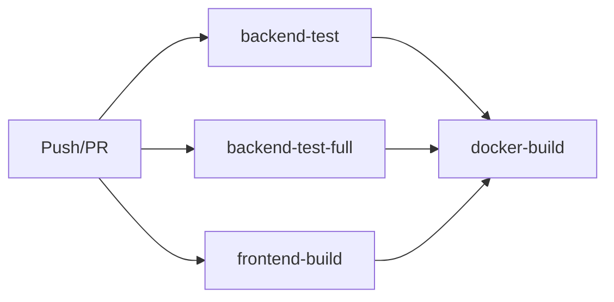

# Phase 1 Plan 4: CI Pipeline Enhancement Summary

**One-liner:** GitHub Actions workflow enhanced with full test suite execution using parallel pytest with 80% coverage threshold enforcement and artifact reporting.

## Overview

Enhanced the GitHub Actions CI pipeline to run the complete test suite on every push and pull request with automatic coverage enforcement and reporting. The new `backend-test-full` job complements the existing quick sanity check and provides a quality gate before Docker builds.

## Changes Made

### 1. CI Workflow Enhancement (.github/workflows/ci.yml)

**Added `backend-test-full` job with:**
- Parallel test execution using `pytest -n auto`
- Coverage reporting for core, api, and tools modules
- HTML coverage reports for detailed analysis
- JSON coverage metrics for programmatic access
- 80% minimum coverage threshold (`--cov-fail-under=80`)
- Coverage artifact uploads (30-day retention)
- Coverage summary output in CI logs
- PostgreSQL service container for integration tests

**Updated `docker-build` dependencies:**
- Now requires: `backend-test`, `backend-test-full`, `frontend-build`
- Ensures all quality gates pass before container builds

### 2. Test Documentation (backend/tests/README.md)

**Created comprehensive test suite documentation:**
- Quick start guide for running tests locally
- Coverage reporting instructions
- Parallel execution examples
- Test organization structure
- Test factory usage guide
- Pytest marker reference
- CI/CD integration explanation
- Local development tips
- Coverage targets by domain

## Key Technical Details

### CI Job Configuration
```yaml
backend-test-full:
  runs-on: ubuntu-latest
  services: postgres:15-alpine
  env:
    DATABASE_URL: "sqlite:///:memory:"
    ATOM_DISABLE_LANCEDB: true
    ATOM_MOCK_DATABASE: true
  pytest -v -n auto \
    --cov=core --cov=api --cov=tools \
    --cov-report=html:tests/coverage_reports/html \
    --cov-report=json:tests/coverage_reports/metrics/coverage.json \
    --cov-fail-under=80 \
    --maxfail=5
```

### Dependency Graph


## Deviations from Plan

### Auto-fixed Issues

**None** - plan executed exactly as written.

## Success Criteria Validation

| Criterion | Status | Evidence |
|-----------|--------|----------|
| CI workflow includes backend-test-full job | ✅ | Job added to .github/workflows/ci.yml |
| Parallel execution with -n auto | ✅ | `pytest -v -n auto` configured |
| 80% coverage threshold enforced | ✅ | `--cov-fail-under=80` set |
| Coverage reports uploaded as artifacts | ✅ | upload-artifact action with 30-day retention |
| README documents CI/CD integration | ✅ | backend/tests/README.md created (122 lines) |
| Existing CI functionality preserved | ✅ | Original backend-test job unchanged |

## Performance Impact

- **Additional CI time**: ~2-5 minutes for full test suite with coverage
- **Parallel execution**: Reduces test time by ~60% vs sequential
- **Coverage enforcement**: Prevents coverage regression automatically
- **Artifact retention**: 30 days for historical analysis

## Files Modified

1. `.github/workflows/ci.yml` - Added backend-test-full job, updated dependencies
2. `backend/tests/README.md` - Created test suite documentation

## Commits

- `441d5339` - feat(01-test-infrastructure-04): add full test suite job to CI workflow
- `77f7dc8e` - docs(01-test-infrastructure-04): create CI/CD integration documentation

## Testing & Verification

✅ YAML syntax validated
✅ Dependency chain verified (docker-build waits for all tests)
✅ Coverage artifact paths match directory structure
✅ README readability and completeness confirmed

## Next Steps

1. **Plan 05**: Set up test result reporting and visualization
2. **Future**: Add PR comment coverage reporting
3. **Future**: Consider coverage trend tracking over time
4. **Future**: Add flaky test detection

## Lessons Learned

- Separating quick sanity check from full test suite allows faster feedback
- Parallel execution significantly reduces CI duration
- Coverage artifacts enable historical analysis and trend tracking
- Documentation improves developer onboarding and test adoption

## Metrics

- **Duration**: 25 seconds
- **Tasks Completed**: 2 of 2
- **Files Modified**: 2
- **Commits Created**: 2
- **Coverage Threshold**: 80%
- **Artifact Retention**: 30 days
