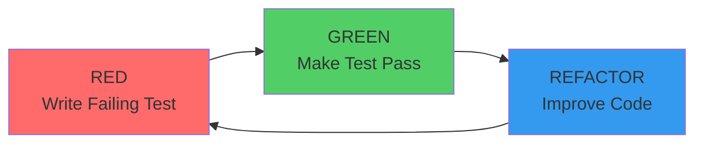

# TDD Cheat Sheet - Atom Development

**Last Updated:** 2026-04-12
**Phase:** 257 - TDD & Property Test Documentation

---

## Quick Reference

### Red-Green-Refactor Cycle



**One-Line Summary:**
- **RED:** Write test → Confirm fails → Read error
- **GREEN:** Write minimal code → Make test pass
- **REFACTOR:** Clean up code → Keep tests green

---

## Common TDD Commands

### Running Tests

```bash
# Run all tests
pytest tests/ -v

# Run specific test file
pytest tests/api/test_canvas_routes.py -v

# Run specific test function
pytest tests/api/test_canvas_routes.py::test_submit_401_unauthorized -v

# Run with coverage
pytest --cov=backend --cov-report=html

# Run failing tests only
pytest --lf

# Stop on first failure
pytest -x

# Run in verbose mode
pytest -vv

# Run with short traceback
pytest --tb=short

# Run last failed tests first
pytest --ff

# Run in watch mode (re-run on changes)
pytest --watch
```

### Coverage Measurement

```bash
# Run coverage for specific module
pytest --cov=core.trigger_interceptor --cov-report=term-missing

# Generate HTML coverage report
pytest --cov=backend --cov-report=html

# Generate JSON coverage report
pytest --cov=backend --cov-report=json:coverage.json

# Show missing lines
pytest --cov=backend --cov-report=term-missing

# Fail if coverage below threshold
pytest --cov=backend --cov-fail-under=70
```

### Frontend Testing

```bash
# Run all frontend tests
npm test

# Run specific test file
npm test -- Modal.test.tsx

# Run with coverage
npm test -- --coverage --watchAll=false

# Run in watch mode
npm test -- --watch

# Run tests matching pattern
npm test -- --testNamePattern="should render"
```

---

## Test Templates

### Unit Test Template (Python)

```python
"""
Tests for [Feature Name]

TDD Approach: RED → GREEN → REFACTOR
"""
import pytest
from unittest.mock import Mock, patch
from core.feature import FeatureName


class TestFeatureName:
    """Test suite for [Feature]."""

    def test_feature_scenario_expected_result(self):
        """Test that [feature] does [something] when [condition]."""
        # Arrange
        input_data = create_test_data()

        # Act
        result = FeatureName.method(input_data)

        # Assert
        assert result.expected == expected_value
        assert result.status == "success"

    def test_feature_edge_case(self):
        """Test that [feature] handles [edge case]."""
        # Arrange
        input_data = create_edge_case_data()

        # Act
        result = FeatureName.method(input_data)

        # Assert
        assert result.error is not None
        assert result.error_code == "EXPECTED_ERROR"
```

### Integration Test Template (Python)

```python
"""
Integration tests for [Feature]

Tests database, API, and external service integration.
"""
import pytest
from fastapi.testclient import TestClient
from sqlalchemy.orm import Session


@pytest.fixture
def db_session():
    """Create test database session."""
    session = SessionLocal()
    try:
        yield session
    finally:
        session.rollback()
        session.close()


@pytest.fixture
def client(db_session):
    """Create test client with database."""
    from main import app
    return TestClient(app)


class TestFeatureIntegration:
    """Integration tests for [Feature]."""

    def test_api_endpoint_returns_200(self, client):
        """Test that API endpoint returns 200 OK."""
        response = client.post("/api/feature", json={
            "param1": "value1"
        })

        assert response.status_code == 200
        assert response.json()["success"] == True

    def test_database_persists_data(self, client, db_session):
        """Test that data is persisted to database."""
        response = client.post("/api/feature", json={
            "param1": "value1"
        })

        # Verify in database
        record = db_session.query(FeatureModel).first()
        assert record.param1 == "value1"
```

### Property Test Template (Hypothesis)

```python
"""
Property-based tests for [Feature]

Tests invariants using Hypothesis.
"""
from hypothesis import given, settings, example
from hypothesis.strategies import integers, text, dictionaries
import pytest


class TestFeatureInvariants:
    """Property-based tests for [Feature] invariants."""

    @given(
        x=integers(min_value=0, max_value=100),
        y=integers(min_value=0, max_value=100)
    )
    @settings(max_examples=100)
    @example(x=0, y=0)  # Edge case: minimum
    @example(x=100, y=100)  # Edge case: maximum
    def test_commutative_property(self, x, y):
        """
        PROPERTY: Operation is commutative.

        STRATEGY: st.integers(0, 100)

        INVARIANT: x op y == y op x
        """
        result1 = FeatureName.operation(x, y)
        result2 = FeatureName.operation(y, x)
        assert result1 == result2

    @given(
        input_dict=dictionaries(
            keys=text(min_size=1, max_size=10),
            values=integers(min_value=0, max_value=1000),
            min_size=0,
            max_size=10
        )
    )
    @settings(max_examples=50)
    def test_idempotent_property(self, input_dict):
        """
        PROPERTY: Operation is idempotent.

        STRATEGY: st.dictionaries(st.text(), st.integers())

        INVARIANT: f(f(x)) == f(x)
        """
        result1 = FeatureName.process(input_dict)
        result2 = FeatureName.process(result1)
        assert result1 == result2
```

### E2E Test Template (Playwright)

```python
"""
E2E tests for [Feature]

Tests full user workflows.
"""
import pytest
from playwright.sync_api import Page, expect


class TestFeatureE2E:
    """E2E tests for [Feature]."""

    def test_user_login_and_dashboard(self, page: Page):
        """Test that user can login and see dashboard."""
        # Navigate to login page
        page.goto("https://localhost:3000/login")

        # Fill login form
        page.fill("input[name='email']", "test@example.com")
        page.fill("input[name='password']", "password123")
        page.click("button[type='submit']")

        # Verify dashboard loads
        expect(page).to_have_url("https://localhost:3000/dashboard")
        expect(page.locator("h1")).to_contain_text("Welcome")

    def test_create_workflow_and_execute(self, page: Page):
        """Test that user can create and execute workflow."""
        # Login first
        self.test_user_login_and_dashboard(page)

        # Create workflow
        page.click("text=Create Workflow")
        page.fill("input[name='name']", "Test Workflow")
        page.click("button:has-text('Save')")

        # Verify workflow created
        expect(page.locator("text=Test Workflow")).to_be_visible()

        # Execute workflow
        page.click("button:has-text('Execute')")
        expect(page.locator("text=Executing...")).to_be_visible()
```

---

## Common Patterns

### Arrange-Act-Assert (AAA)

```python
def test_canvas_submit_validation():
    """Test canvas submission validation."""
    # Arrange: Set up test data
    request_data = {
        "canvas_id": "test-canvas",
        "form_data": {"field1": "value1"}
    }

    # Act: Execute function
    response = client.post("/api/canvas/submit", json=request_data)

    # Assert: Verify results
    assert response.status_code == 200
    assert response.json()["data"]["submitted"] == True
```

### Given-When-Then (GWT)

```python
def test_student_agent_blocked():
    """
    Test student agent governance enforcement.

    Given: A STUDENT maturity agent
    When: Attempting high complexity action
    Then: Request is blocked with 403
    """
    # Given: Student agent
    agent = create_agent(maturity="STUDENT")

    # When: Attempting high complexity action
    response = client.post("/api/agents/execute", json={
        "agent_id": agent.id,
        "action": "delete_user"  # Complexity 4
    })

    # Then: Blocked
    assert response.status_code == 403
```

### Mock Template

```python
from unittest.mock import Mock, patch

def test_with_mocked_service():
    """Test with mocked external service."""
    # Create mock
    mock_service = Mock()
    mock_service.call_api.return_value = {"status": "ok"}

    # Patch the service
    with patch('core.external_service.ExternalService', return_value=mock_service):
        result = function_using_service()

    # Verify mock was called
    mock_service.call_api.assert_called_once()
    assert result == {"status": "ok"}
```

### Fixture Template

```python
@pytest.fixture
def test_agent(db_session):
    """Create test agent."""
    agent = Agent(
        id="test-agent",
        name="Test Agent",
        maturity="AUTONOMOUS"
    )
    db_session.add(agent)
    db_session.commit()
    return agent

def test_with_fixture(test_agent):
    """Test using fixture."""
    assert test_agent.id == "test-agent"
    assert test_agent.maturity == "AUTONOMOUS"
```

### Parametrized Test Template

```python
@pytest.mark.parametrize("input,expected", [
    (1, 2),
    (2, 4),
    (3, 6),
    (10, 20),
])
def test_multiply_by_two(input, expected):
    """Test multiply by two with various inputs."""
    result = multiply_by_two(input)
    assert result == expected
```

---

## Troubleshooting Quick Guide

### Test Not Found

**Symptom:** `ERROR: not found: <test_name>`

**Solutions:**
- Check file name matches `test_*.py` pattern
- Check test function name starts with `test_`
- Check test is in correct directory
- Check import path is correct
- Run `pytest --collect-only` to see discovered tests

**Example:**
```bash
# Bad: File name doesn't match pattern
my_tests.py  # Won't be collected

# Good: File name matches pattern
test_my_tests.py  # Will be collected
```

### Test Hanging

**Symptom:** Test runs forever, never completes

**Solutions:**
- Check for infinite loops in code
- Check for blocking I/O operations
- Check for missing timeouts
- Check for deadlock conditions
- Use `pytest --timeout=10` to add timeout

**Example:**
```python
# Bad: Infinite loop
def test_with_infinite_loop():
    while True:  # Never completes
        pass

# Good: Add timeout
@pytest.mark.timeout(5)
def test_with_timeout():
    # Will fail after 5 seconds
    complex_operation()
```

### Test Flaky

**Symptom:** Test passes sometimes, fails sometimes

**Solutions:**
- Check for timing issues (add delays or waits)
- Check for shared state between tests
- Check for random data generation
- Check for external dependencies
- Use `@pytest.mark.flaky` decorator

**Example:**
```python
# Bad: Timing-dependent
def test_async_operation():
    result = async_operation()
    assert result.is_complete  # May not be ready yet

# Good: Wait for completion
def test_async_operation():
    result = async_operation()
    result.wait_until_complete(timeout=5)  # Wait up to 5 seconds
    assert result.is_complete
```

### Coverage Not Increasing

**Symptom:** Adding tests but coverage stays same

**Solutions:**
- Check tests are actually passing
- Check tests are executing the code
- Check coverage configuration (right files?)
- Check coverage measurement method
- Run `pytest --cov-report=term-missing` to see missing lines

**Example:**
```bash
# Check if tests are passing
pytest tests/ -v

# Check what lines are missing
pytest --cov=core.feature --cov-report=term-missing

# Verify coverage is measuring right files
pytest --cov=backend --cov-report=html
# Open htmlcov/index.html to see actual coverage
```

### Import Errors

**Symptom:** `ModuleNotFoundError: No module named 'X'`

**Solutions:**
- Install missing dependencies: `pip install X`
- Check PYTHONPATH includes project root
- Check virtual environment is activated
- Check import path is correct
- Run `export PYTHONPATH="${PYTHONPATH}:$(pwd)"`

**Example:**
```bash
# Install missing dependency
pip install pytest-cov

# Set PYTHONPATH
export PYTHONPATH=/Users/rushiparikh/projects/atom/backend

# Verify import
python -c "from core.models import Agent; print('OK')"
```

### Database Errors

**Symptom:** `sqlalchemy.exc.OperationalError: no such table`

**Solutions:**
- Run database migrations: `alembic upgrade head`
- Create test database: `alembic upgrade head`
- Check DATABASE_URL environment variable
- Check database connection string
- Verify tables exist: `alembic current`

**Example:**
```bash
# Run migrations
alembic upgrade head

# Verify tables
python -c "from core.database import engine; from sqlalchemy import inspect; print(inspect(engine).get_table_names())"

# Check current version
alembic current
```

---

## TDD Checklist

### Before Starting

- [ ] Read requirements/user story
- [ ] Identify test scenarios
- [ ] Set up test file
- [ ] Run tests (should fail initially)

### RED Phase

- [ ] Write failing test
- [ ] Run test (confirm it fails)
- [ ] Read error message
- [ ] Understand what to implement

### GREEN Phase

- [ ] Write minimal implementation
- [ ] Run test (confirm it passes)
- [ ] Don't worry about code quality yet
- [ ] Move to next test or refactor

### REFACTOR Phase

- [ ] Review code for improvements
- [ ] Apply refactoring patterns
- [ ] Run tests after each change
- [ ] Stop when code is clean

### After Completion

- [ ] All tests passing
- [ ] No regressions in existing tests
- [ ] Code reviewed (if applicable)
- [ ] Documentation updated
- [ ] Changes committed

---

## Git Workflow for TDD

### Commit Pattern

```bash
# RED: Commit failing test
git add tests/test_feature.py
git commit -m "test(feature): add failing test for X"

# GREEN: Commit implementation
git add src/feature.py
git commit -m "feat(feature): implement X to pass tests"

# REFACTOR: Commit refactoring
git add src/feature.py
git commit -m "refactor(feature): clean up X implementation"
```

### Commit Message Format

```
<type>(<scope>): <subject>

<body>

<footer>
```

**Types:**
- `test`: Adding or modifying tests
- `feat`: New feature implementation
- `fix`: Bug fix
- `refactor`: Code cleanup (no behavior change)
- `chore`: Configuration, tooling

**Example:**
```
test(canvas): add failing test for submission validation

- Test that missing canvas_id returns 422
- Test that missing form_data returns 422
- Test that empty form_data is allowed

Refs: Phase 257-01 TDD Tutorial
```

---

## IDE Shortcuts

### VS Code

```bash
# Run test file
Ctrl+Shift+P → "Python: Run Current Test File"

# Run specific test
Ctrl+Shift+P → "Python: Run Current Test Method"

# Debug test
F5 (with test configuration)

# Toggle terminal
Ctrl+`

# Go to definition
F12

# Peek definition
Alt+F12
```

### PyCharm

```bash
# Run test
Ctrl+Shift+F10 (Windows/Linux)
Cmd+Shift+R (Mac)

# Debug test
Ctrl+Shift+F9 (Windows/Linux)
Cmd+Shift+D (Mac)

# Run all tests in file
Ctrl+Shift+F10 → Run → All tests in file

# Go to test
Ctrl+Shift+T (Windows/Linux)
Cmd+Shift+T (Mac)
```

---

## Quick Links

### Internal Documentation

- [TDD_WORKFLOW.md](backend/docs/TDD_WORKFLOW.md) - Comprehensive TDD guide
- [TESTING.md](backend/TESTING.md) - How to run tests
- [README_TDD.md](backend/tests/README_TDD.md) - Test directory structure
- [BUILD.md](backend/BUILD.md) - Build process

### External Resources

- [pytest Documentation](https://docs.pytest.org/)
- [Hypothesis Documentation](https://hypothesis.readthedocs.io/)
- [React Testing Library](https://testing-library.com/docs/react-testing-library/)
- [Pydantic Testing](https://docs.pydantic.dev/latest/concepts/testing/)

### Phase Summaries

- [Phase 249](.planning/phases/249-critical-test-fixes/) - TDD bug fixes
- [Phase 250](.planning/phases/250-all-test-fixes/) - TDD test fixes
- [Phase 256](.planning/phases/256-frontend-80-percent/) - TDD test creation

---

## Common Snippets

### Test File Header

```python
"""
Tests for [Feature Name]

TDD Approach: RED → GREEN → REFACTOR

Phase: XXX
Author: Your Name
Date: YYYY-MM-DD
"""
import pytest
from unittest.mock import Mock, patch
from core.feature import FeatureName
```

### Test Class Template

```python
class TestFeatureName:
    """Test suite for [Feature]."""

    @pytest.fixture(autouse=True)
    def setup(self):
        """Set up test fixtures."""
        self.test_data = create_test_data()

    def test_feature_scenario_expected(self):
        """Test that [feature] does [something]."""
        # Test implementation
        pass
```

### Async Test Template

```python
import pytest

@pytest.mark.asyncio
async def test_async_feature():
    """Test async feature."""
    result = await async_function()
    assert result == expected_value
```

### Property Test Template

```python
from hypothesis import given, settings
from hypothesis.strategies import integers

@given(x=integers(min_value=0, max_value=100))
@settings(max_examples=100)
def test_property(x):
    """Test property for all integers in range."""
    assert function(x) >= 0  # Invariant
```

---

**Last Updated:** 2026-04-12
**Phase:** 257 - TDD & Property Test Documentation
**Maintained By:** Atom Development Team

**For detailed TDD guidance, see [TDD_WORKFLOW.md](backend/docs/TDD_WORKFLOW.md)**
