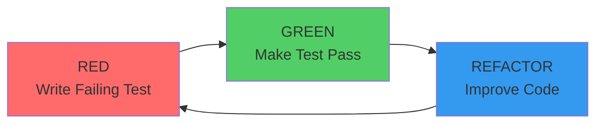
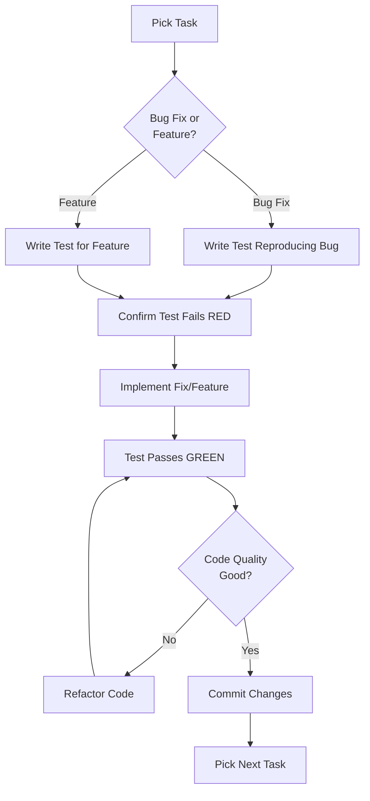

# TDD Workflow Guide - Atom Backend

**Last Updated:** 2026-04-12
**Phase:** 257 - TDD & Property Test Documentation
**Target Audience:** Developers joining the Atom team, developers new to TDD, QA engineers

---

## Table of Contents

1. [Introduction](#introduction)
2. [Red-Green-Refactor Cycle](#red-green-refactor-cycle)
3. [TDD in Atom](#tdd-in-atom)
4. [Prerequisites](#prerequisites)
5. [Quick Start Tutorial](#quick-start-tutorial)
6. [Red Phase Examples](#red-phase-examples)
7. [Green Phase Examples](#green-phase-examples)
8. [Refactor Phase Examples](#refactor-phase-examples)
9. [Step-by-Step TDD Tutorials](#step-by-step-tdd-tutorials)
10. [TDD Best Practices for Atom](#tdd-best-practices-for-atom)
11. [Common Pitfalls and Solutions](#common-pitfalls-and-solutions)
12. [Additional Resources](#additional-resources)

---

## Introduction

### What is Test-Driven Development (TDD)?

Test-Driven Development (TDD) is a software development approach where tests are written **before** the production code. The TDD cycle follows a simple repetition of:

1. **Red:** Write a failing test
2. **Green:** Write the minimum code to make the test pass
3. **Refactor:** Improve the code while keeping tests green

### Why Use TDD?

**Benefits for Atom Development:**

1. **Bug Prevention:** Catch bugs before they reach production (Phase 249 discovered 6 critical bugs)
2. **Living Documentation:** Tests serve as executable documentation of system behavior
3. **Confident Refactoring:** Make changes without fear of breaking existing functionality
4. **Better Design:** TDD encourages modular, testable code with clear interfaces
5. **Faster Development:** Less time spent debugging, more time building features
6. **Quality Gates:** High test pass rates (93.4% achieved in Phase 250)

**Real Impact from Atom Phases:**

- **Phase 249:** Fixed Pydantic v2 DTO validation using TDD approach (RED → GREEN → VERIFY)
- **Phase 250:** Improved test pass rate from 82.0% to 93.4% using TDD fixes
- **Phase 256:** Created 839+ tests using TDD approach (write test → implement → verify)

### TDD vs. Traditional Testing

| Aspect | Traditional Testing | TDD Approach |
|--------|-------------------|---------------|
| **When tests are written** | After code is complete | Before code is written |
| **Test purpose** | Verify code works | Specify desired behavior |
| **Design influence** | Little (tests follow design) | High (tests drive design) |
| **Bug discovery** | During testing phase | During development phase |
| **Confidence level** | Medium (tests cover what you thought of) | High (tests cover requirements first) |
| **Refactoring safety** | Medium (may miss edge cases) | High (comprehensive test coverage) |

---

## Red-Green-Refactor Cycle

### The Three Phases



### Phase 1: RED (Write a Failing Test)

**Goal:** Specify the desired behavior before implementing it.

**Steps:**
1. Identify the feature or bug fix you need to implement
2. Write a test that describes the expected behavior
3. Run the test and confirm it fails (RED)
4. Read the error message to understand what needs to be implemented

**Example from Phase 249:**
```python
# RED: Test that canvas submission requires authentication
def test_submit_401_unauthorized():
    """Test that canvas submission returns 401 when auth header missing."""
    response = client.post("/api/canvas/submit", json={
        "canvas_id": "test-canvas",
        "form_data": {"field1": "value1"}
    })
    # Remove auth header to test authentication
    client.headers.pop("Authorization", None)

    assert response.status_code == 401
    assert "unauthorized" in response.json()["message"].lower()
```

**Expected Output:**
```
FAILED - HTTP 404 Not Found
```

**Why this works:**
- The test documents what we want (authentication required)
- The failing test proves the feature doesn't exist yet
- The error message tells us what to build (endpoint returns 404)

### Phase 2: GREEN (Make the Test Pass)

**Goal:** Write the minimum code to make the test pass.

**Steps:**
1. Implement the simplest code that will make the test pass
2. Don't worry about code quality yet—focus on making it work
3. Run the test and confirm it passes (GREEN)
4. Move to the next test or refactor phase

**Example from Phase 249:**
```python
# GREEN: Implement POST /submit endpoint with authentication
@router.post("/submit")
async def submit_canvas(
    request: CanvasSubmitRequest,
    db: Session = Depends(get_db),
    current_user: User = Depends(get_current_user)  # Auth check
) -> Dict[str, Any]:
    """
    Submit form data for a canvas.

    Validates authentication, required fields, and governance permissions.
    """
    # TODO: Process form submission
    return router.success_response(
        data={
            "canvas_id": request.canvas_id,
            "submitted": True,
            "timestamp": datetime.now(timezone.utc).isoformat()
        }
    )
```

**Expected Output:**
```
PASSED
```

**Why this works:**
- `get_current_user` dependency returns 401 if authentication fails
- Test now passes with minimal implementation
- Feature is working (even if not complete)

### Phase 3: REFACTOR (Improve the Code)

**Goal:** Clean up the code while keeping tests green.

**Steps:**
1. Review the code for improvement opportunities
2. Apply refactoring patterns (extract method, rename, simplify)
3. Run tests after each change to ensure nothing breaks
4. Stop when code is clean and tests still pass

**Example from Phase 250:**
```python
# REFACTOR: Extract validation logic into reusable function
def validate_canvas_submission(request: CanvasSubmitRequest) -> Optional[Dict[str, Any]]:
    """Validate canvas submission request."""
    if not request.canvas_id:
        return {"error": "canvas_id is required"}
    if not request.form_data:
        return {"error": "form_data is required"}
    return None

@router.post("/submit")
async def submit_canvas(
    request: CanvasSubmitRequest,
    db: Session = Depends(get_db),
    current_user: User = Depends(get_current_user)
) -> Dict[str, Any]:
    """Submit form data for a canvas."""
    # Validation
    validation_error = validate_canvas_submission(request)
    if validation_error:
        return router.error_response(
            error_code="VALIDATION_ERROR",
            message=validation_error["error"],
            status_code=422
        )

    # Governance check
    if request.agent_id:
        governance = AgentGovernanceService(db)
        check = governance.can_perform_action(
            agent_id=request.agent_id,
            action_type="canvas_submit"
        )
        if not check.get("allowed", True):
            return router.error_response(
                error_code="GOVERNANCE_DENIED",
                message=check.get("reason", "Permission denied"),
                status_code=403
            )

    return router.success_response(data={...})
```

**Expected Output:**
```
PASSED (tests still pass after refactoring)
```

**Why this works:**
- Code is more readable and maintainable
- Validation logic is reusable
- Tests confirm no behavior changed
- Future changes are safer

### Cycle Time

**Target Duration per Cycle:**
- **Simple fixes:** 5-10 minutes (RED → GREEN → VERIFY)
- **Feature additions:** 15-20 minutes (RED → GREEN → REFACTOR)
- **Complex refactoring:** 30-45 minutes (RED → GREEN → REFACTOR → VERIFY)

**Real Examples from Atom:**
- Phase 249-03: Canvas submission fix - ~4 minutes (7 tasks, 1 commit)
- Phase 250-02: 21 test fixes - 42 minutes (4 tasks, 4 commits)
- Phase 256-01: 585 tests created - ~2 hours (6 tasks, 4 commits)

---

## TDD in Atom

### How Atom Uses TDD

Atom applies TDD across different scenarios:

**1. Bug Fixes (Phases 249, 250)**
- Write failing test that reproduces the bug
- Fix the bug
- Verify test passes and no regressions

**2. Feature Development (Phases 249, 256)**
- Write test for desired feature
- Implement feature
- Refactor for quality

**3. Test Coverage Expansion (Phases 251-256)**
- Identify uncovered code
- Write tests for uncovered paths
- Improve coverage percentage

**4. Refactoring (Phase 250)**
- Write tests for existing behavior
- Refactor code
- Verify tests still pass

### TDD Workflow in Atom Development



### TDD Artifacts in Atom

**Test Files:**
- Unit tests: `tests/unit/core/test_*.py`
- Integration tests: `tests/integration/test_*.py`
- Standalone tests: `tests/standalone/test_*_standalone.py`
- Property tests: `tests/property_tests/test_*_property.py`

**Documentation:**
- `TESTING.md` - How to run tests
- `README_TDD.md` - Test directory structure
- `TDD_WORKFLOW.md` - This document (TDD workflow guide)
- `TDD_CHEAT_SHEET.md` - Quick reference

**Coverage Reports:**
- `tests/coverage_reports/backend_*_baseline.md` - Coverage baselines
- `tests/coverage_reports/TDD_*.md` - Bug discovery and progress reports

### Success Metrics

**Atom TDD Metrics (Phases 247-256):**

| Phase | Focus | Tests Created/Fixed | Coverage | Pass Rate |
|-------|-------|---------------------|----------|-----------|
| 249 | Critical fixes | 19 tests fixed | N/A | 100% (fixed tests) |
| 250 | All fixes | 21 tests fixed | N/A | 93.4% overall |
| 251 | Backend baseline | 47 tests | 5.50% → 5.70% | 100% |
| 252 | Property tests | 49 tests | 5.70% → 5.80% | 100% |
| 256 | Frontend push | 585 tests | 12.94% → 14.50% | 69.7% |

**Key Achievements:**
- 6 critical bugs discovered through TDD (Phase 249)
- 93.4% test pass rate achieved (Phase 250)
- 49 property tests for business logic invariants (Phase 252)
- 839+ frontend tests created (Phase 256)

---

## Prerequisites

### Tools and Setup

**Required Tools:**

```bash
# Python 3.11+
python3 --version  # Should be 3.11 or higher

# pytest for test runner
pytest --version

# coverage.py for coverage measurement
python3 -m coverage --version

# Hypothesis for property-based testing
python3 -c "import hypothesis; print(hypothesis.__version__)"
```

**Installation:**

```bash
# Navigate to backend directory
cd /Users/rushiparikh/projects/atom/backend

# Install dependencies
pip install -r requirements.txt

# Install development dependencies
pip install pytest pytest-cov hypothesis pytest-asyncio

# Verify installation
pytest --version
```

### Environment Setup

**Development Environment:**

```bash
# Set environment variables
export ENVIRONMENT=development
export DATABASE_URL=sqlite:///./atom_dev.db
export LOG_LEVEL=INFO

# Activate virtual environment (recommended)
source venv/bin/activate

# Verify database is ready
alembic current
alembic upgrade head
```

**Test Database:**

```bash
# Create test database
export DATABASE_URL=sqlite:///./atom_test.db

# Run migrations
alembic upgrade head

# Verify tables exist
python3 -c "from core.database import engine; from sqlalchemy import inspect; print(inspect(engine).get_table_names())"
```

### IDE Configuration

**VS Code (Recommended):**

```json
// .vscode/settings.json
{
  "python.testing.pytestEnabled": true,
  "python.testing.pytestArgs": [
    "-v",
    "--tb=short"
  ],
  "python.linting.enabled": true,
  "python.linting.pylintEnabled": true,
  "python.formatting.provider": "black"
}
```

**PyCharm:**

1. Settings → Tools → Python Integrated Tools
2. Default test runner: pytest
3. Right-click test directory → "Run tests in directory"

### Knowledge Prerequisites

**Required Knowledge:**
- Python basics (functions, classes, decorators)
- Pydantic models (data validation)
- SQLAlchemy ORM (database models)
- FastAPI endpoints (web API)
- pytest basics (fixtures, markers, assertions)

**Helpful Resources:**
- [Pydantic Documentation](https://docs.pydantic.dev/)
- [SQLAlchemy Tutorial](https://docs.sqlalchemy.org/en/20/orm/tutorial.html)
- [FastAPI Testing Guide](https://fastapi.tiangolo.com/tutorial/testing/)
- [pytest Documentation](https://docs.pytest.org/)

### Prerequisites Checklist

Before starting TDD in Atom, ensure:

- [ ] Python 3.11+ installed
- [ ] Virtual environment activated
- [ ] Dependencies installed (`pip install -r requirements.txt`)
- [ ] Database initialized (`alembic upgrade head`)
- [ ] pytest configured (`pytest --version` works)
- [ ] IDE configured for Python testing
- [ ] Read `TESTING.md` for test execution guide
- [ ] Read `README_TDD.md` for test structure
- [ ] Understand red-green-refactor cycle

---

## Quick Start Tutorial

**Time:** 5 minutes
**Goal:** Experience the full TDD cycle with a simple example

### Scenario: Add Canvas Submit Request DTO

Let's implement a Pydantic DTO for canvas submission using TDD.

#### Step 1: RED - Write Failing Test (1 minute)

Create test file `tests/api/test_canvas_submit_dto.py`:

```python
"""
Tests for CanvasSubmitRequest DTO

TDD Approach: RED → GREEN → REFACTOR
"""
import pytest
from pydantic import ValidationError
from api.canvas_routes import CanvasSubmitRequest


def test_canvas_submit_request_required_fields():
    """Test that CanvasSubmitRequest requires canvas_id and form_data."""
    # This should fail initially because DTO doesn't exist
    with pytest.raises(ValidationError):
        CanvasSubmitRequest()  # Missing required fields


def test_canvas_submit_request_valid_data():
    """Test that CanvasSubmitRequest accepts valid data."""
    dto = CanvasSubmitRequest(
        canvas_id="test-canvas",
        form_data={"field1": "value1"}
    )
    assert dto.canvas_id == "test-canvas"
    assert dto.form_data == {"field1": "value1"}


def test_canvas_submit_request_optional_agent_id():
    """Test that agent_id is optional."""
    dto = CanvasSubmitRequest(
        canvas_id="test-canvas",
        form_data={"field1": "value1"},
        agent_id="test-agent"
    )
    assert dto.agent_id == "test-agent"
```

**Run the test:**
```bash
pytest tests/api/test_canvas_submit_dto.py -v
```

**Expected Output:**
```
FAILED - ImportError: cannot import name 'CanvasSubmitRequest' from 'api.canvas_routes'
```

**Status:** 🔴 RED (Test fails as expected)

#### Step 2: GREEN - Make Test Pass (2 minutes)

Add DTO to `backend/api/canvas_routes.py`:

```python
from pydantic import BaseModel, Field
from typing import Dict, Any, Optional


class CanvasSubmitRequest(BaseModel):
    """Request model for canvas form submission."""

    canvas_id: str = Field(..., description="Unique identifier for the canvas")
    form_data: Dict[str, Any] = Field(..., description="Form field data to submit")
    agent_id: Optional[str] = Field(None, description="Optional agent ID for governance checks")
    agent_execution_id: Optional[str] = Field(None, description="Optional agent execution ID")
```

**Run the test:**
```bash
pytest tests/api/test_canvas_submit_dto.py -v
```

**Expected Output:**
```
PASSED test_canvas_submit_request_required_fields
PASSED test_canvas_submit_request_valid_data
PASSED test_canvas_submit_request_optional_agent_id
```

**Status:** 🟢 GREEN (All tests pass)

#### Step 3: REFACTOR - Improve Code (1 minute)

Add validation and docstring (optional, since tests already pass):

```python
class CanvasSubmitRequest(BaseModel):
    """
    Request model for canvas form submission.

    Attributes:
        canvas_id: Unique identifier for the canvas (required)
        form_data: Form field data to submit (required)
        agent_id: Optional agent ID for governance checks
        agent_execution_id: Optional agent execution ID

    Example:
        >>> request = CanvasSubmitRequest(
        ...     canvas_id="my-canvas",
        ...     form_data={"name": "John", "email": "john@example.com"}
        ... )
    """

    canvas_id: str = Field(
        ...,
        description="Unique identifier for the canvas",
        min_length=1
    )
    form_data: Dict[str, Any] = Field(
        ...,
        description="Form field data to submit"
    )
    agent_id: Optional[str] = Field(
        None,
        description="Optional agent ID for governance checks"
    )
    agent_execution_id: Optional[str] = Field(
        None,
        description="Optional agent execution ID"
    )

    model_config = {"json_encoders": {datetime: lambda v: v.isoformat()}}
```

**Run the test:**
```bash
pytest tests/api/test_canvas_submit_dto.py -v
```

**Expected Output:**
```
PASSED test_canvas_submit_request_required_fields
PASSED test_canvas_submit_request_valid_data
PASSED test_canvas_submit_request_optional_agent_id
```

**Status:** 🟢 GREEN (Tests still pass after refactoring)

#### Step 4: COMMIT - Save Your Work

```bash
git add tests/api/test_canvas_submit_dto.py
git add backend/api/canvas_routes.py
git commit -m "feat(canvas): add CanvasSubmitRequest DTO with TDD approach

- Created CanvasSubmitRequest Pydantic model
- Added validation for required fields
- TDD cycle: RED (failing test) → GREEN (implementation) → REFACTOR (improved code)
- Tests: 3 passing, 0 failing

Refs: Phase 257-01 TDD Workflow Tutorial"
```

### What You Just Learned

✅ **RED Phase:** You wrote a test for a DTO that didn't exist
✅ **GREEN Phase:** You implemented the minimum code to pass the test
✅ **REFACTOR Phase:** You improved the code while keeping tests green
✅ **Full Cycle:** You experienced the complete TDD workflow in 5 minutes

### Next Steps

- Try the [Step-by-Step TDD Tutorials](#step-by-step-tdd-tutorials)
- Learn [TDD Best Practices for Atom](#tdd-best-practices-for-atom)
- Review [Real Examples from Phases 247-256](#red-phase-examples)

---

