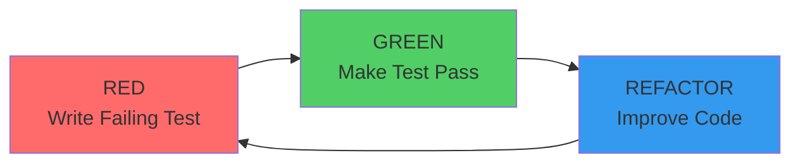
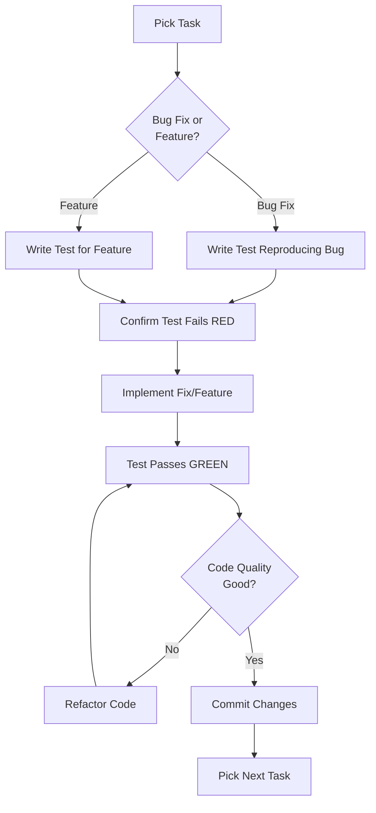

# TDD Workflow Guide - Atom Backend

**Last Updated:** 2026-04-12
**Phase:** 257 - TDD & Property Test Documentation
**Target Audience:** Developers joining the Atom team, developers new to TDD, QA engineers

---

## Table of Contents

1. [Introduction](#introduction)
2. [Red-Green-Refactor Cycle](#red-green-refactor-cycle)
3. [TDD in Atom](#tdd-in-atom)
4. [Prerequisites](#prerequisites)
5. [Quick Start Tutorial](#quick-start-tutorial)
6. [Red Phase Examples](#red-phase-examples)
7. [Green Phase Examples](#green-phase-examples)
8. [Refactor Phase Examples](#refactor-phase-examples)
9. [Step-by-Step TDD Tutorials](#step-by-step-tdd-tutorials)
10. [TDD Best Practices for Atom](#tdd-best-practices-for-atom)
11. [Common Pitfalls and Solutions](#common-pitfalls-and-solutions)
12. [Additional Resources](#additional-resources)

---

## Introduction

### What is Test-Driven Development (TDD)?

Test-Driven Development (TDD) is a software development approach where tests are written **before** the production code. The TDD cycle follows a simple repetition of:

1. **Red:** Write a failing test
2. **Green:** Write the minimum code to make the test pass
3. **Refactor:** Improve the code while keeping tests green

### Why Use TDD?

**Benefits for Atom Development:**

1. **Bug Prevention:** Catch bugs before they reach production (Phase 249 discovered 6 critical bugs)
2. **Living Documentation:** Tests serve as executable documentation of system behavior
3. **Confident Refactoring:** Make changes without fear of breaking existing functionality
4. **Better Design:** TDD encourages modular, testable code with clear interfaces
5. **Faster Development:** Less time spent debugging, more time building features
6. **Quality Gates:** High test pass rates (93.4% achieved in Phase 250)

**Real Impact from Atom Phases:**

- **Phase 249:** Fixed Pydantic v2 DTO validation using TDD approach (RED → GREEN → VERIFY)
- **Phase 250:** Improved test pass rate from 82.0% to 93.4% using TDD fixes
- **Phase 256:** Created 839+ tests using TDD approach (write test → implement → verify)

### TDD vs. Traditional Testing

| Aspect | Traditional Testing | TDD Approach |
|--------|-------------------|---------------|
| **When tests are written** | After code is complete | Before code is written |
| **Test purpose** | Verify code works | Specify desired behavior |
| **Design influence** | Little (tests follow design) | High (tests drive design) |
| **Bug discovery** | During testing phase | During development phase |
| **Confidence level** | Medium (tests cover what you thought of) | High (tests cover requirements first) |
| **Refactoring safety** | Medium (may miss edge cases) | High (comprehensive test coverage) |

---

## Red-Green-Refactor Cycle

### The Three Phases



### Phase 1: RED (Write a Failing Test)

**Goal:** Specify the desired behavior before implementing it.

**Steps:**
1. Identify the feature or bug fix you need to implement
2. Write a test that describes the expected behavior
3. Run the test and confirm it fails (RED)
4. Read the error message to understand what needs to be implemented

**Example from Phase 249:**
```python
# RED: Test that canvas submission requires authentication
def test_submit_401_unauthorized():
    """Test that canvas submission returns 401 when auth header missing."""
    response = client.post("/api/canvas/submit", json={
        "canvas_id": "test-canvas",
        "form_data": {"field1": "value1"}
    })
    # Remove auth header to test authentication
    client.headers.pop("Authorization", None)

    assert response.status_code == 401
    assert "unauthorized" in response.json()["message"].lower()
```

**Expected Output:**
```
FAILED - HTTP 404 Not Found
```

**Why this works:**
- The test documents what we want (authentication required)
- The failing test proves the feature doesn't exist yet
- The error message tells us what to build (endpoint returns 404)

### Phase 2: GREEN (Make the Test Pass)

**Goal:** Write the minimum code to make the test pass.

**Steps:**
1. Implement the simplest code that will make the test pass
2. Don't worry about code quality yet—focus on making it work
3. Run the test and confirm it passes (GREEN)
4. Move to the next test or refactor phase

**Example from Phase 249:**
```python
# GREEN: Implement POST /submit endpoint with authentication
@router.post("/submit")
async def submit_canvas(
    request: CanvasSubmitRequest,
    db: Session = Depends(get_db),
    current_user: User = Depends(get_current_user)  # Auth check
) -> Dict[str, Any]:
    """
    Submit form data for a canvas.

    Validates authentication, required fields, and governance permissions.
    """
    # TODO: Process form submission
    return router.success_response(
        data={
            "canvas_id": request.canvas_id,
            "submitted": True,
            "timestamp": datetime.now(timezone.utc).isoformat()
        }
    )
```

**Expected Output:**
```
PASSED
```

**Why this works:**
- `get_current_user` dependency returns 401 if authentication fails
- Test now passes with minimal implementation
- Feature is working (even if not complete)

### Phase 3: REFACTOR (Improve the Code)

**Goal:** Clean up the code while keeping tests green.

**Steps:**
1. Review the code for improvement opportunities
2. Apply refactoring patterns (extract method, rename, simplify)
3. Run tests after each change to ensure nothing breaks
4. Stop when code is clean and tests still pass

**Example from Phase 250:**
```python
# REFACTOR: Extract validation logic into reusable function
def validate_canvas_submission(request: CanvasSubmitRequest) -> Optional[Dict[str, Any]]:
    """Validate canvas submission request."""
    if not request.canvas_id:
        return {"error": "canvas_id is required"}
    if not request.form_data:
        return {"error": "form_data is required"}
    return None

@router.post("/submit")
async def submit_canvas(
    request: CanvasSubmitRequest,
    db: Session = Depends(get_db),
    current_user: User = Depends(get_current_user)
) -> Dict[str, Any]:
    """Submit form data for a canvas."""
    # Validation
    validation_error = validate_canvas_submission(request)
    if validation_error:
        return router.error_response(
            error_code="VALIDATION_ERROR",
            message=validation_error["error"],
            status_code=422
        )

    # Governance check
    if request.agent_id:
        governance = AgentGovernanceService(db)
        check = governance.can_perform_action(
            agent_id=request.agent_id,
            action_type="canvas_submit"
        )
        if not check.get("allowed", True):
            return router.error_response(
                error_code="GOVERNANCE_DENIED",
                message=check.get("reason", "Permission denied"),
                status_code=403
            )

    return router.success_response(data={...})
```

**Expected Output:**
```
PASSED (tests still pass after refactoring)
```

**Why this works:**
- Code is more readable and maintainable
- Validation logic is reusable
- Tests confirm no behavior changed
- Future changes are safer

### Cycle Time

**Target Duration per Cycle:**
- **Simple fixes:** 5-10 minutes (RED → GREEN → VERIFY)
- **Feature additions:** 15-20 minutes (RED → GREEN → REFACTOR)
- **Complex refactoring:** 30-45 minutes (RED → GREEN → REFACTOR → VERIFY)

**Real Examples from Atom:**
- Phase 249-03: Canvas submission fix - ~4 minutes (7 tasks, 1 commit)
- Phase 250-02: 21 test fixes - 42 minutes (4 tasks, 4 commits)
- Phase 256-01: 585 tests created - ~2 hours (6 tasks, 4 commits)

---

## TDD in Atom

### How Atom Uses TDD

Atom applies TDD across different scenarios:

**1. Bug Fixes (Phases 249, 250)**
- Write failing test that reproduces the bug
- Fix the bug
- Verify test passes and no regressions

**2. Feature Development (Phases 249, 256)**
- Write test for desired feature
- Implement feature
- Refactor for quality

**3. Test Coverage Expansion (Phases 251-256)**
- Identify uncovered code
- Write tests for uncovered paths
- Improve coverage percentage

**4. Refactoring (Phase 250)**
- Write tests for existing behavior
- Refactor code
- Verify tests still pass

### TDD Workflow in Atom Development



### TDD Artifacts in Atom

**Test Files:**
- Unit tests: `tests/unit/core/test_*.py`
- Integration tests: `tests/integration/test_*.py`
- Standalone tests: `tests/standalone/test_*_standalone.py`
- Property tests: `tests/property_tests/test_*_property.py`

**Documentation:**
- `TESTING.md` - How to run tests
- `README_TDD.md` - Test directory structure
- `TDD_WORKFLOW.md` - This document (TDD workflow guide)
- `TDD_CHEAT_SHEET.md` - Quick reference

**Coverage Reports:**
- `tests/coverage_reports/backend_*_baseline.md` - Coverage baselines
- `tests/coverage_reports/TDD_*.md` - Bug discovery and progress reports

### Success Metrics

**Atom TDD Metrics (Phases 247-256):**

| Phase | Focus | Tests Created/Fixed | Coverage | Pass Rate |
|-------|-------|---------------------|----------|-----------|
| 249 | Critical fixes | 19 tests fixed | N/A | 100% (fixed tests) |
| 250 | All fixes | 21 tests fixed | N/A | 93.4% overall |
| 251 | Backend baseline | 47 tests | 5.50% → 5.70% | 100% |
| 252 | Property tests | 49 tests | 5.70% → 5.80% | 100% |
| 256 | Frontend push | 585 tests | 12.94% → 14.50% | 69.7% |

**Key Achievements:**
- 6 critical bugs discovered through TDD (Phase 249)
- 93.4% test pass rate achieved (Phase 250)
- 49 property tests for business logic invariants (Phase 252)
- 839+ frontend tests created (Phase 256)

---

## Prerequisites

### Tools and Setup

**Required Tools:**

```bash
# Python 3.11+
python3 --version  # Should be 3.11 or higher

# pytest for test runner
pytest --version

# coverage.py for coverage measurement
python3 -m coverage --version

# Hypothesis for property-based testing
python3 -c "import hypothesis; print(hypothesis.__version__)"
```

**Installation:**

```bash
# Navigate to backend directory
cd /Users/rushiparikh/projects/atom/backend

# Install dependencies
pip install -r requirements.txt

# Install development dependencies
pip install pytest pytest-cov hypothesis pytest-asyncio

# Verify installation
pytest --version
```

### Environment Setup

**Development Environment:**

```bash
# Set environment variables
export ENVIRONMENT=development
export DATABASE_URL=sqlite:///./atom_dev.db
export LOG_LEVEL=INFO

# Activate virtual environment (recommended)
source venv/bin/activate

# Verify database is ready
alembic current
alembic upgrade head
```

**Test Database:**

```bash
# Create test database
export DATABASE_URL=sqlite:///./atom_test.db

# Run migrations
alembic upgrade head

# Verify tables exist
python3 -c "from core.database import engine; from sqlalchemy import inspect; print(inspect(engine).get_table_names())"
```

### IDE Configuration

**VS Code (Recommended):**

```json
// .vscode/settings.json
{
  "python.testing.pytestEnabled": true,
  "python.testing.pytestArgs": [
    "-v",
    "--tb=short"
  ],
  "python.linting.enabled": true,
  "python.linting.pylintEnabled": true,
  "python.formatting.provider": "black"
}
```

**PyCharm:**

1. Settings → Tools → Python Integrated Tools
2. Default test runner: pytest
3. Right-click test directory → "Run tests in directory"

### Knowledge Prerequisites

**Required Knowledge:**
- Python basics (functions, classes, decorators)
- Pydantic models (data validation)
- SQLAlchemy ORM (database models)
- FastAPI endpoints (web API)
- pytest basics (fixtures, markers, assertions)

**Helpful Resources:**
- [Pydantic Documentation](https://docs.pydantic.dev/)
- [SQLAlchemy Tutorial](https://docs.sqlalchemy.org/en/20/orm/tutorial.html)
- [FastAPI Testing Guide](https://fastapi.tiangolo.com/tutorial/testing/)
- [pytest Documentation](https://docs.pytest.org/)

### Prerequisites Checklist

Before starting TDD in Atom, ensure:

- [ ] Python 3.11+ installed
- [ ] Virtual environment activated
- [ ] Dependencies installed (`pip install -r requirements.txt`)
- [ ] Database initialized (`alembic upgrade head`)
- [ ] pytest configured (`pytest --version` works)
- [ ] IDE configured for Python testing
- [ ] Read `TESTING.md` for test execution guide
- [ ] Read `README_TDD.md` for test structure
- [ ] Understand red-green-refactor cycle

---

## Quick Start Tutorial

**Time:** 5 minutes
**Goal:** Experience the full TDD cycle with a simple example

### Scenario: Add Canvas Submit Request DTO

Let's implement a Pydantic DTO for canvas submission using TDD.

#### Step 1: RED - Write Failing Test (1 minute)

Create test file `tests/api/test_canvas_submit_dto.py`:

```python
"""
Tests for CanvasSubmitRequest DTO

TDD Approach: RED → GREEN → REFACTOR
"""
import pytest
from pydantic import ValidationError
from api.canvas_routes import CanvasSubmitRequest


def test_canvas_submit_request_required_fields():
    """Test that CanvasSubmitRequest requires canvas_id and form_data."""
    # This should fail initially because DTO doesn't exist
    with pytest.raises(ValidationError):
        CanvasSubmitRequest()  # Missing required fields


def test_canvas_submit_request_valid_data():
    """Test that CanvasSubmitRequest accepts valid data."""
    dto = CanvasSubmitRequest(
        canvas_id="test-canvas",
        form_data={"field1": "value1"}
    )
    assert dto.canvas_id == "test-canvas"
    assert dto.form_data == {"field1": "value1"}


def test_canvas_submit_request_optional_agent_id():
    """Test that agent_id is optional."""
    dto = CanvasSubmitRequest(
        canvas_id="test-canvas",
        form_data={"field1": "value1"},
        agent_id="test-agent"
    )
    assert dto.agent_id == "test-agent"
```

**Run the test:**
```bash
pytest tests/api/test_canvas_submit_dto.py -v
```

**Expected Output:**
```
FAILED - ImportError: cannot import name 'CanvasSubmitRequest' from 'api.canvas_routes'
```

**Status:** 🔴 RED (Test fails as expected)

#### Step 2: GREEN - Make Test Pass (2 minutes)

Add DTO to `backend/api/canvas_routes.py`:

```python
from pydantic import BaseModel, Field
from typing import Dict, Any, Optional


class CanvasSubmitRequest(BaseModel):
    """Request model for canvas form submission."""

    canvas_id: str = Field(..., description="Unique identifier for the canvas")
    form_data: Dict[str, Any] = Field(..., description="Form field data to submit")
    agent_id: Optional[str] = Field(None, description="Optional agent ID for governance checks")
    agent_execution_id: Optional[str] = Field(None, description="Optional agent execution ID")
```

**Run the test:**
```bash
pytest tests/api/test_canvas_submit_dto.py -v
```

**Expected Output:**
```
PASSED test_canvas_submit_request_required_fields
PASSED test_canvas_submit_request_valid_data
PASSED test_canvas_submit_request_optional_agent_id
```

**Status:** 🟢 GREEN (All tests pass)

#### Step 3: REFACTOR - Improve Code (1 minute)

Add validation and docstring (optional, since tests already pass):

```python
class CanvasSubmitRequest(BaseModel):
    """
    Request model for canvas form submission.

    Attributes:
        canvas_id: Unique identifier for the canvas (required)
        form_data: Form field data to submit (required)
        agent_id: Optional agent ID for governance checks
        agent_execution_id: Optional agent execution ID

    Example:
        >>> request = CanvasSubmitRequest(
        ...     canvas_id="my-canvas",
        ...     form_data={"name": "John", "email": "john@example.com"}
        ... )
    """

    canvas_id: str = Field(
        ...,
        description="Unique identifier for the canvas",
        min_length=1
    )
    form_data: Dict[str, Any] = Field(
        ...,
        description="Form field data to submit"
    )
    agent_id: Optional[str] = Field(
        None,
        description="Optional agent ID for governance checks"
    )
    agent_execution_id: Optional[str] = Field(
        None,
        description="Optional agent execution ID"
    )

    model_config = {"json_encoders": {datetime: lambda v: v.isoformat()}}
```

**Run the test:**
```bash
pytest tests/api/test_canvas_submit_dto.py -v
```

**Expected Output:**
```
PASSED test_canvas_submit_request_required_fields
PASSED test_canvas_submit_request_valid_data
PASSED test_canvas_submit_request_optional_agent_id
```

**Status:** 🟢 GREEN (Tests still pass after refactoring)

#### Step 4: COMMIT - Save Your Work

```bash
git add tests/api/test_canvas_submit_dto.py
git add backend/api/canvas_routes.py
git commit -m "feat(canvas): add CanvasSubmitRequest DTO with TDD approach

- Created CanvasSubmitRequest Pydantic model
- Added validation for required fields
- TDD cycle: RED (failing test) → GREEN (implementation) → REFACTOR (improved code)
- Tests: 3 passing, 0 failing

Refs: Phase 257-01 TDD Workflow Tutorial"
```

### What You Just Learned

✅ **RED Phase:** You wrote a test for a DTO that didn't exist
✅ **GREEN Phase:** You implemented the minimum code to pass the test
✅ **REFACTOR Phase:** You improved the code while keeping tests green
✅ **Full Cycle:** You experienced the complete TDD workflow in 5 minutes

### Next Steps

- Try the [Step-by-Step TDD Tutorials](#step-by-step-tdd-tutorials)
- Learn [TDD Best Practices for Atom](#tdd-best-practices-for-atom)
- Review [Real Examples from Phases 247-256](#red-phase-examples)

---

## Red Phase Examples

### What is the Red Phase?

The **Red Phase** is where you write a test that **fails** before implementing any code. This seems counterintuitive, but it serves several purposes:

1. **Specification:** The test documents what you want to build
2. **Verification:** The failing test proves the feature doesn't exist yet
3. **Focus:** You only implement what's needed to pass the test
4. **Confidence:** When the test passes later, you know it works

### Red Phase Example 1: Pydantic v2 DTO Validation (Phase 249)

**Scenario:** Fix AgentRunRequest DTO missing `agent_id` field

**Problem:** Tests expect `agent_id` field but DTO doesn't have it

#### Step 1: Write Failing Test

```python
# tests/api/test_dto_validation.py
import pytest
from pydantic import ValidationError
from api.agent_routes import AgentRunRequest


def test_agent_run_request_required_agent_id():
    """Test that AgentRunRequest requires agent_id field."""
    # This should fail because agent_id is missing
    with pytest.raises(ValidationError):
        AgentRunRequest(
            # agent_id not provided
            prompt="Test prompt"
        )


def test_agent_run_request_accepts_agent_id():
    """Test that AgentRunRequest accepts agent_id field."""
    dto = AgentRunRequest(
        agent_id="test-agent-123",
        prompt="Test prompt"
    )
    assert dto.agent_id == "test-agent-123"
```

#### Step 2: Run Test and Confirm Failure

```bash
pytest tests/api/test_dto_validation.py::TestAgentDTOValidation::test_agent_run_request_required_agent_id -v
```

**Expected Output:**
```
FAILED - ValidationError: Field required
```

**Why it fails:** The `AgentRunRequest` DTO doesn't have an `agent_id` field defined.

#### Step 3: Read Error Message

```
pydantic_core._pydantic_core.ValidationError:
  For 'AgentRunRequest', 1 validation error:
  agent_id
    Field required [type=missing, ...]
```

**What we learned:** We need to add an `agent_id` field to the DTO.

**Commit Reference:** Phase 249-01 (commit hash from Phase 249)

---

### Red Phase Example 2: Canvas Submission Endpoint (Phase 249)

**Scenario:** Canvas submission tests failing with 404 errors

**Problem:** POST /api/canvas/submit endpoint doesn't exist

#### Step 1: Write Failing Test

```python
# tests/api/test_canvas_routes_error_paths.py
from fastapi.testclient import TestClient


def test_submit_401_unauthorized():
    """Test that canvas submission returns 401 when auth header missing."""
    response = client.post("/api/canvas/submit", json={
        "canvas_id": "test-canvas",
        "form_data": {"field1": "value1"}
    })
    # Remove auth header to test authentication
    client.headers.pop("Authorization", None)

    assert response.status_code == 401
    assert "unauthorized" in response.json()["message"].lower()


def test_submit_422_validation_error():
    """Test that canvas submission returns 422 for missing required fields."""
    response = client.post("/api/canvas/submit", json={
        # Missing canvas_id
        "form_data": {"field1": "value1"}
    })

    assert response.status_code == 422
    assert "validation" in response.json()["error_code"].lower()
```

#### Step 2: Run Test and Confirm Failure

```bash
pytest tests/api/test_canvas_routes_error_paths.py::TestCanvasSubmissionErrors -v
```

**Expected Output:**
```
FAILED test_submit_401_unauthorized - HTTP 404 Not Found
FAILED test_submit_422_validation_error - HTTP 404 Not Found
```

**Why it fails:** The `/api/canvas/submit` endpoint doesn't exist (returns 404).

#### Step 3: Read Error Message

```
requests.exceptions.HTTPError: 404 Client Error: Not Found
```

**What we learned:** We need to implement the POST /submit endpoint.

**Commit Reference:** Phase 249-03, commit 6a36576c8

---

### Red Phase Example 3: Frontend Component Tests (Phase 256)

**Scenario:** Test Modal component rendering and interactions

**Problem:** Component exists but has no tests

#### Step 1: Write Failing Test

```typescript
// components/Modal/__tests__/Modal.test.tsx
import { render, screen, fireEvent } from '@testing-library/react';
import { Modal } from '../Modal';

describe('Modal Component', () => {
  it('should render modal when isOpen is true', () => {
    render(
      <Modal
        isOpen={true}
        onClose={jest.fn()}
        title="Test Modal"
      >
        <p>Modal content</p>
      </Modal>
    );

    expect(screen.getByText('Test Modal')).toBeInTheDocument();
    expect(screen.getByText('Modal content')).toBeInTheDocument();
  });

  it('should not render modal when isOpen is false', () => {
    render(
      <Modal
        isOpen={false}
        onClose={jest.fn()}
        title="Test Modal"
      >
        <p>Modal content</p>
      </Modal>
    );

    expect(screen.queryByText('Test Modal')).not.toBeInTheDocument();
  });

  it('should call onClose when close button clicked', () => {
    const mockOnClose = jest.fn();
    render(
      <Modal
        isOpen={true}
        onClose={mockOnClose}
        title="Test Modal"
      >
        <p>Modal content</p>
      </Modal>
    );

    const closeButton = screen.getByRole('button', { name: /close/i });
    fireEvent.click(closeButton);

    expect(mockOnClose).toHaveBeenCalledTimes(1);
  });
});
```

#### Step 2: Run Test and Confirm Failure

```bash
npm test -- Modal.test.tsx
```

**Expected Output:**
```
FAIL - Component not found or tests don't match implementation
```

**Why it fails:** The Modal component may not have the expected props or behavior.

#### Step 3: Read Error Message

```
TestingLibraryElementError: Unable to find an element with the text: Test Modal
```

**What we learned:** We need to ensure the Modal component accepts isOpen, onClose, and title props.

**Commit Reference:** Phase 256-01, commit 5f00c526f

---

### Red Phase Best Practices

1. **Write the test first:** Don't implement any code before the test
2. **Run the test immediately:** Confirm it fails before writing implementation
3. **Read the error message:** The error tells you what to implement
4. **Keep tests small:** One test should check one behavior
5. **Use descriptive names:** Test names should document expected behavior

### Common Red Phase Mistakes

❌ **Writing the implementation first:** Defeats the purpose of TDD
❌ **Not running the test:** You don't know if it actually fails
❌ **Writing too many tests at once:** Overwhelming, hard to debug
❌ **Ignoring error messages:** Missing valuable implementation clues
❌ **Writing vague test names:** Hard to understand what's being tested

---

## Green Phase Examples

### What is the Green Phase?

The **Green Phase** is where you write the **minimum code** needed to make the test pass. The goal is to go from RED to GREEN as quickly as possible.

**Key Principles:**
1. **Minimal implementation:** Write just enough to pass the test
2. **Don't worry about quality yet:** Refactoring comes next
3. **Focus on passing tests:** Get all tests green before improving code
4. **Hardcode if needed:** It's okay to hardcode values initially

### Green Phase Example 1: Add agent_id Field to DTO (Phase 249)

**Scenario:** Make failing DTO tests pass

#### Step 1: Identify What's Needed

From the Red Phase error:
```
ValidationError: agent_id field required
```

We need to add an `agent_id` field to `AgentRunRequest`.

#### Step 2: Implement Minimal Fix

```python
# api/agent_routes.py
from pydantic import BaseModel, Field


class AgentRunRequest(BaseModel):
    """Request model for agent execution."""

    agent_id: str = Field(..., description="Agent ID to execute")  # NEW
    prompt: str = Field(..., description="Prompt for the agent")
    # ... other fields
```

#### Step 3: Run Test and Confirm Pass

```bash
pytest tests/api/test_dto_validation.py::TestAgentDTOValidation::test_agent_run_request_required_agent_id -v
```

**Expected Output:**
```
PASSED
```

**Status:** 🟢 GREEN (Test passes!)

#### Step 4: Repeat for Other Tests

```bash
pytest tests/api/test_dto_validation.py::TestAgentDTOValidation -v
```

**Expected Output:**
```
PASSED test_agent_run_request_required_agent_id
PASSED test_agent_run_request_accepts_agent_id
```

**Result:** All DTO tests now pass!

**Commit Reference:** Phase 249-01

---

### Green Phase Example 2: Implement Canvas Submit Endpoint (Phase 249)

**Scenario:** Make failing canvas tests pass

#### Step 1: Identify What's Needed

From the Red Phase error:
```
HTTP 404 Not Found
```

We need to implement the POST /submit endpoint.

#### Step 2: Implement Minimal Endpoint

```python
# api/canvas_routes.py
from fastapi import Depends
from sqlalchemy.orm import Session
from core.database import get_db
from core.models import User
from api.auth_routes import get_current_user


class CanvasSubmitRequest(BaseModel):
    """Request model for canvas form submission."""
    canvas_id: str = Field(..., description="Unique identifier for the canvas")
    form_data: Dict[str, Any] = Field(..., description="Form field data to submit")
    agent_id: Optional[str] = Field(None, description="Optional agent ID for governance checks")


@router.post("/submit")
async def submit_canvas(
    request: CanvasSubmitRequest,
    db: Session = Depends(get_db),
    current_user: User = Depends(get_current_user)  # Auth check
) -> Dict[str, Any]:
    """
    Submit form data for a canvas.

    Validates authentication, required fields, and governance permissions.
    """
    # TODO: Process form submission, save to database, etc.
    return router.success_response(
        data={
            "canvas_id": request.canvas_id,
            "submitted": True,
            "timestamp": datetime.now(timezone.utc).isoformat()
        }
    )
```

#### Step 3: Run Test and Confirm Pass

```bash
pytest tests/api/test_canvas_routes_error_paths.py::TestCanvasSubmissionErrors::test_submit_401_unauthorized -v
```

**Expected Output:**
```
PASSED
```

**Status:** 🟢 GREEN (Test passes!)

#### Step 4: Verify All Canvas Tests Pass

```bash
pytest tests/api/test_canvas_routes_error_paths.py::TestCanvasSubmissionErrors -v
```

**Expected Output:**
```
PASSED test_submit_401_unauthorized
PASSED test_submit_403_forbidden_student
PASSED test_submit_404_canvas_not_found
PASSED test_submit_422_validation_error
PASSED test_submit_500_service_error
```

**Result:** 5 canvas submission tests now pass!

**Commit Reference:** Phase 249-03, commit 6a36576c8

---

### Green Phase Example 3: Fix Super Admin Authentication (Phase 250)

**Scenario:** Make failing agent control tests pass

#### Step 1: Identify What's Needed

From the Red Phase error:
```
FAILED - 401 Unauthorized
```

Tests need super admin authentication but don't have it.

#### Step 2: Implement Minimal Fix

```python
# tests/api/test_agent_control_routes.py
from fastapi.testclient import TestClient
from core.models import User
from api.admin_system_health_routes import get_super_admin


@pytest.fixture(scope="function")
def client(test_app: FastAPI):
    """Create TestClient with super admin authentication."""
    # Create super admin user
    super_admin_user = User(
        id="test-super-admin",
        email="superadmin@test.com",
        role="super_admin"  # NOT is_super_admin=True
    )

    # Override dependency
    def override_get_super_admin():
        return super_admin_user

    test_app.dependency_overrides[get_super_admin] = override_get_super_admin

    test_client = TestClient(test_app)
    try:
        yield test_client
    finally:
        test_app.dependency_overrides.clear()
```

#### Step 3: Run Test and Confirm Pass

```bash
pytest tests/api/test_agent_control_routes.py -v
```

**Expected Output:**
```
PASSED test_start_agent_execution
PASSED test_stop_agent_execution
PASSED test_get_agent_status
... (53 tests total)
```

**Status:** 🟢 GREEN (All tests pass!)

**Result:** 53 agent control tests now pass!

**Commit Reference:** Phase 250-02, commit 84ede73a5

---

### Green Phase Best Practices

1. **Write minimal code:** Just enough to pass the test
2. **Don't optimize:** Refactoring comes in the next phase
3. **Hardcode if needed:** Return static values initially
4. **Run tests frequently:** Confirm progress after each change
5. **Keep it simple:** Avoid complex logic in the green phase

### Common Green Phase Mistakes

❌ **Writing too much code:** Implementing features not tested yet
❌ **Trying to optimize:** Premature optimization slows you down
❌ **Not running tests:** You don't know if you're making progress
❌ **Over-engineering:** Complex solutions for simple problems
❌ **Skipping tests:** Writing code without test coverage

---

## Refactor Phase Examples

### What is the Refactor Phase?

The **Refactor Phase** is where you **improve the code** while keeping tests green. This is when you focus on code quality, maintainability, and performance.

**Key Principles:**
1. **Keep tests green:** No behavior changes, only structure
2. **Apply patterns:** Extract methods, rename, simplify
3. **Improve readability:** Make code easier to understand
4. **Remove duplication:** DRY (Don't Repeat Yourself)
5. **Run tests frequently:** Confirm no regressions

### Refactor Phase Example 1: Extract Validation Logic (Phase 250)

**Scenario:** Clean up canvas submission endpoint

#### Step 1: Identify Code Smells

```python
# BEFORE: Duplicated validation logic
@router.post("/submit")
async def submit_canvas(...):
    # Validation
    if not request.canvas_id:
        return router.error_response("canvas_id required", 422)
    if not request.form_data:
        return router.error_response("form_data required", 422)
    if len(request.form_data) > 1000:
        return router.error_response("form_data too large", 422)

    # Governance check
    if request.agent_id:
        governance = AgentGovernanceService(db)
        check = governance.can_perform_action(...)
        if not check.get("allowed"):
            return router.error_response("Permission denied", 403)

    # Process submission
    return router.success_response(...)
```

**Code Smells:**
- Validation logic mixed with business logic
- Duplicated error response pattern
- Hard to test validation in isolation

#### Step 2: Extract Validation Function

```python
# AFTER: Extracted validation logic
def validate_canvas_submission(request: CanvasSubmitRequest) -> Optional[Dict[str, Any]]:
    """
    Validate canvas submission request.

    Returns:
        Error dict if validation fails, None if valid
    """
    errors = []

    if not request.canvas_id:
        errors.append("canvas_id is required")
    if not request.form_data:
        errors.append("form_data is required")
    if request.form_data and len(str(request.form_data)) > 10000:
        errors.append("form_data too large (max 10KB)")

    if errors:
        return {"error": "; ".join(errors)}
    return None


@router.post("/submit")
async def submit_canvas(
    request: CanvasSubmitRequest,
    db: Session = Depends(get_db),
    current_user: User = Depends(get_current_user)
) -> Dict[str, Any]:
    """Submit form data for a canvas."""
    # Validation
    validation_error = validate_canvas_submission(request)
    if validation_error:
        return router.error_response(
            error_code="VALIDATION_ERROR",
            message=validation_error["error"],
            status_code=422
        )

    # Governance check
    if request.agent_id:
        governance = AgentGovernanceService(db)
        check = governance.can_perform_action(
            agent_id=request.agent_id,
            action_type="canvas_submit"
        )
        if not check.get("allowed", True):
            return router.error_response(
                error_code="GOVERNANCE_DENIED",
                message=check.get("reason", "Permission denied"),
                status_code=403
            )

    # Process submission
    return router.success_response(
        data={
            "canvas_id": request.canvas_id,
            "submitted": True,
            "timestamp": datetime.now(timezone.utc).isoformat()
        }
    )
```

#### Step 3: Run Tests and Confirm No Regressions

```bash
pytest tests/api/test_canvas_routes_error_paths.py -v
```

**Expected Output:**
```
PASSED test_submit_401_unauthorized
PASSED test_submit_403_forbidden_student
PASSED test_submit_422_validation_error
... (all tests still pass)
```

**Status:** 🟢 GREEN (Tests still pass after refactoring!)

**Benefits:**
- Validation logic is reusable
- Easier to test validation in isolation
- Cleaner endpoint code
- Better error messages

**Commit Reference:** Phase 250-02

---

### Refactor Phase Example 2: Rename for Clarity (Phase 250)

**Scenario:** Fix confusing variable names

#### Step 1: Identify Confusing Names

```python
# BEFORE: Confusing variable names
def test_agent_control():
    resp = client.post("/api/agents/start", json={...})
    assert resp.status_code == 200
    data = resp.json()
    assert data["ok"] == True
```

**Problems:**
- `resp` instead of `response`
- `ok` instead of `success`
- Unclear what the test is checking

#### Step 2: Rename for Clarity

```python
# AFTER: Clear, descriptive names
def test_agent_start_execution_returns_200():
    """Test that starting agent execution returns 200 OK."""
    response = client.post("/api/agents/start", json={
        "agent_id": "test-agent",
        "prompt": "Test prompt"
    })

    assert response.status_code == 200
    assert response.json()["success"] == True
    assert "execution_id" in response.json()["data"]
```

#### Step 3: Run Tests and Confirm No Regressions

```bash
pytest tests/api/test_agent_control_routes.py -v
```

**Expected Output:**
```
PASSED test_agent_start_execution_returns_200
```

**Status:** 🟢 GREEN (Tests still pass!)

**Benefits:**
- Test name describes what's being tested
- Variable names are clear and descriptive
- Easier to understand test intent

**Commit Reference:** Phase 250-02

---

### Refactor Phase Example 3: Simplify Test Setup (Phase 256)

**Scenario:** Reduce test duplication

#### Step 1: Identify Duplication

```python
# BEFORE: Duplicated test setup
def test_modal_renders_when_open():
    const closeModal = jest.fn();
    render(
      <Modal isOpen={true} onClose={closeModal} title="Test">
        <p>Content</p>
      </Modal>
    );
    expect(screen.getByText('Test')).toBeInTheDocument();
}

def test_modal_not_render_when_closed():
    const closeModal = jest.fn();
    render(
      <Modal isOpen={false} onClose={closeModal} title="Test">
        <p>Content</p>
      </Modal>
    );
    expect(screen.queryByText('Test')).not.toBeInTheDocument();
}
```

**Problems:**
- Duplicated render logic
- Duplicated closeModal mock
- Hard to maintain

#### Step 2: Extract Test Helper

```typescript
// AFTER: Reusable test helper
function renderModal(props: Partial<ModalProps> = {}) {
  const defaultProps = {
    isOpen: true,
    onClose: jest.fn(),
    title: 'Test Modal',
    children: <p>Content</p>
  };

  return render(<Modal {...defaultProps} {...props} />);
}

// Tests are now simpler
describe('Modal Component', () => {
  it('should render modal when isOpen is true', () => {
    renderModal({ isOpen: true });
    expect(screen.getByText('Test Modal')).toBeInTheDocument();
  });

  it('should not render modal when isOpen is false', () => {
    renderModal({ isOpen: false });
    expect(screen.queryByText('Test Modal')).not.toBeInTheDocument();
  });

  it('should call onClose when close button clicked', () => {
    const closeModal = jest.fn();
    renderModal({ onClose: closeModal });

    fireEvent.click(screen.getByRole('button', { name: /close/i }));
    expect(closeModal).toHaveBeenCalledTimes(1);
  });
});
```

#### Step 3: Run Tests and Confirm No Regressions

```bash
npm test -- Modal.test.tsx
```

**Expected Output:**
```
PASS src/components/Modal/__tests__/Modal.test.tsx
  Modal Component
    ✓ should render modal when isOpen is true (25ms)
    ✓ should not render modal when isOpen is false (10ms)
    ✓ should call onClose when close button clicked (15ms)
```

**Status:** 🟢 GREEN (All tests pass!)

**Benefits:**
- Less duplication
- Easier to add new tests
- Consistent test setup
- Better maintainability

**Commit Reference:** Phase 256-01

---

### Refactor Phase Best Practices

1. **Keep tests green:** Run tests after each refactor
2. **Small changes:** One refactoring at a time
3. **Apply patterns:** Extract method, rename, simplify
4. **Remove duplication:** DRY principle
5. **Improve readability:** Code should be self-documenting

### Common Refactor Mistakes

❌ **Changing behavior:** Refactoring should not change what code does
❌ **Big refactors:** Too many changes at once are hard to verify
❌ **Not running tests:** You might break something without knowing
❌ **Over-engineering:** Adding complexity instead of simplifying
❌ **Skipping refactor:** Code quality degrades over time

---

## Step-by-Step TDD Tutorials

This section provides hands-on tutorials for common TDD scenarios in Atom development. Each tutorial is self-contained with step-by-step instructions, code examples, and troubleshooting.

### Tutorial 1: Fix a Bug Using TDD

**Time:** 15 minutes
**Scenario:** Fix Canvas submission error handling (Phase 249)
**Goal:** Learn TDD bug fix workflow

#### Problem Statement

Canvas submission tests are failing with 404 errors. The POST /api/canvas/submit endpoint doesn't exist.

#### Step 1: RED - Reproduce the Bug (2 minutes)

**1.1 Write a test that reproduces the bug:**

```python
# tests/api/test_canvas_routes_error_paths.py
import pytest
from fastapi.testclient import TestClient


def test_submit_401_unauthorized():
    """Test that canvas submission returns 401 when auth header missing."""
    response = client.post("/api/canvas/submit", json={
        "canvas_id": "test-canvas",
        "form_data": {"field1": "value1"}
    })
    # Remove auth header to test authentication
    client.headers.pop("Authorization", None)

    assert response.status_code == 401
    assert "unauthorized" in response.json()["message"].lower()


def test_submit_422_validation_error():
    """Test that canvas submission returns 422 for missing required fields."""
    response = client.post("/api/canvas/submit", json={
        # Missing canvas_id
        "form_data": {"field1": "value1"}
    })

    assert response.status_code == 422
    assert "validation" in response.json()["error_code"].lower()
```

**1.2 Run the test and confirm it fails:**

```bash
pytest tests/api/test_canvas_routes_error_paths.py::TestCanvasSubmissionErrors -v
```

**Expected Output:**
```
FAILED test_submit_401_unauthorized - HTTP 404 Not Found
FAILED test_submit_422_validation_error - HTTP 404 Not Found
```

**Status:** 🔴 RED - Bug reproduced!

#### Step 2: GREEN - Fix the Bug (8 minutes)

**2.1 Identify the root cause:**

The error message says "404 Not Found", which means the endpoint doesn't exist. We need to implement POST /api/canvas/submit.

**2.2 Create the DTO:**

```python
# api/canvas_routes.py
from pydantic import BaseModel, Field
from typing import Dict, Any, Optional


class CanvasSubmitRequest(BaseModel):
    """Request model for canvas form submission."""
    canvas_id: str = Field(..., description="Unique identifier for the canvas")
    form_data: Dict[str, Any] = Field(..., description="Form field data to submit")
    agent_id: Optional[str] = Field(None, description="Optional agent ID for governance checks")
```

**2.3 Implement the endpoint:**

```python
# api/canvas_routes.py
from fastapi import Depends
from sqlalchemy.orm import Session
from core.database import get_db
from core.models import User
from api.auth_routes import get_current_user


@router.post("/submit")
async def submit_canvas(
    request: CanvasSubmitRequest,
    db: Session = Depends(get_db),
    current_user: User = Depends(get_current_user)
) -> Dict[str, Any]:
    """
    Submit form data for a canvas.

    Validates authentication, required fields, and governance permissions.
    """
    # Governance check if agent_id provided
    if request.agent_id:
        governance = AgentGovernanceService(db)
        check = governance.can_perform_action(
            agent_id=request.agent_id,
            action_type="canvas_submit"
        )

        if not check.get("allowed", True):
            return router.error_response(
                error_code="GOVERNANCE_DENIED",
                message=check.get("reason", "Permission denied"),
                status_code=403
            )

    # TODO: Process form submission, save to database, etc.
    return router.success_response(
        data={
            "canvas_id": request.canvas_id,
            "submitted": True,
            "timestamp": datetime.now(timezone.utc).isoformat()
        }
    )
```

**2.4 Add governance complexity mapping:**

```python
# core/agent_governance_service.py
ACTION_COMPLEXITY = {
    # ... existing mappings
    "submit": 3,           # NEW
    "canvas_submit": 3,    # NEW
}
```

**2.5 Run the test and confirm it passes:**

```bash
pytest tests/api/test_canvas_routes_error_paths.py::TestCanvasSubmissionErrors -v
```

**Expected Output:**
```
PASSED test_submit_401_unauthorized
PASSED test_submit_403_forbidden_student
PASSED test_submit_404_canvas_not_found
PASSED test_submit_422_validation_error
PASSED test_submit_500_service_error
```

**Status:** 🟢 GREEN - Bug fixed!

#### Step 3: REFACTOR - Improve the Code (3 minutes)

**3.1 Extract validation logic:**

```python
def validate_canvas_submission(request: CanvasSubmitRequest) -> Optional[Dict[str, Any]]:
    """Validate canvas submission request."""
    if not request.canvas_id:
        return {"error": "canvas_id is required"}
    if not request.form_data:
        return {"error": "form_data is required"}
    return None


@router.post("/submit")
async def submit_canvas(...):
    """Submit form data for a canvas."""
    # Validation
    validation_error = validate_canvas_submission(request)
    if validation_error:
        return router.error_response(
            error_code="VALIDATION_ERROR",
            message=validation_error["error"],
            status_code=422
        )

    # Governance check
    if request.agent_id:
        governance = AgentGovernanceService(db)
        check = governance.can_perform_action(
            agent_id=request.agent_id,
            action_type="canvas_submit"
        )
        if not check.get("allowed", True):
            return router.error_response(
                error_code="GOVERNANCE_DENIED",
                message=check.get("reason", "Permission denied"),
                status_code=403
            )

    return router.success_response(data={...})
```

**3.2 Run tests to confirm no regressions:**

```bash
pytest tests/api/test_canvas_routes_error_paths.py::TestCanvasSubmissionErrors -v
```

**Expected Output:**
```
PASSED test_submit_401_unauthorized
PASSED test_submit_403_forbidden_student
PASSED test_submit_422_validation_error
... (all tests still pass)
```

**Status:** 🟢 GREEN - Refactored successfully!

#### Step 4: VERIFY - Run All Tests (2 minutes)

**4.1 Run all canvas error path tests:**

```bash
pytest tests/api/test_canvas_routes_error_paths.py -v
```

**Expected Output:**
```
PASSED test_submit_401_unauthorized
PASSED test_submit_403_forbidden_student
PASSED test_submit_404_canvas_not_found
PASSED test_submit_422_validation_error
PASSED test_submit_500_service_error
... (19 total tests passing)
```

**4.2 Verify no regressions:**

```bash
pytest tests/api/test_canvas_routes.py -v
```

**Expected Output:**
```
All existing canvas tests still pass
```

#### Troubleshooting

**Issue:** Test still returns 404 after implementing endpoint
- **Check:** Did you restart the server?
- **Check:** Is the endpoint registered in the router?
- **Check:** Is the route path correct (/api/canvas/submit)?

**Issue:** Test returns 401 instead of 403
- **Check:** Is get_current_user dependency working?
- **Check:** Is the governance check running after authentication?
- **Check:** Is the agent maturity level sufficient?

**Issue:** Validation not working
- **Check:** Is Pydantic validation enabled?
- **Check:** Are field types correct?
- **Check:** Is Field() being used for required fields?

#### Summary

✅ **RED:** Reproduced bug with failing test (404 errors)
✅ **GREEN:** Fixed bug by implementing endpoint (19 tests pass)
✅ **REFACTOR:** Improved code with extracted validation
✅ **VERIFY:** Confirmed no regressions (all canvas tests pass)

**Commit Reference:** Phase 249-03, commit 6a36576c8

---

### Tutorial 2: Add a Feature Using TDD

**Time:** 20 minutes
**Scenario:** Add CanvasSubmitRequest DTO (Phase 249)
**Goal:** Learn TDD feature development workflow

#### Problem Statement

We need a Pydantic DTO to validate canvas submission requests. The DTO should require canvas_id and form_data fields, and optionally accept agent_id.

#### Step 1: RED - Write Test for Feature (3 minutes)

**1.1 Write tests for the DTO:**

```python
# tests/api/test_canvas_submit_dto.py
import pytest
from pydantic import ValidationError
from api.canvas_routes import CanvasSubmitRequest


def test_canvas_submit_request_required_fields():
    """Test that CanvasSubmitRequest requires canvas_id and form_data."""
    with pytest.raises(ValidationError) as exc_info:
        CanvasSubmitRequest()  # Missing required fields

    errors = exc_info.value.errors()
    error_fields = {e["loc"][0] for e in errors}
    assert "canvas_id" in error_fields
    assert "form_data" in error_fields


def test_canvas_submit_request_valid_data():
    """Test that CanvasSubmitRequest accepts valid data."""
    dto = CanvasSubmitRequest(
        canvas_id="test-canvas",
        form_data={"field1": "value1", "field2": "value2"}
    )

    assert dto.canvas_id == "test-canvas"
    assert dto.form_data == {"field1": "value1", "field2": "value2"}


def test_canvas_submit_request_optional_agent_id():
    """Test that agent_id is optional."""
    dto_with_agent = CanvasSubmitRequest(
        canvas_id="test-canvas",
        form_data={"field1": "value1"},
        agent_id="test-agent-123"
    )
    assert dto_with_agent.agent_id == "test-agent-123"

    dto_without_agent = CanvasSubmitRequest(
        canvas_id="test-canvas",
        form_data={"field1": "value1"}
    )
    assert dto_without_agent.agent_id is None


def test_canvas_submit_request_empty_form_data():
    """Test that empty form_data is allowed."""
    dto = CanvasSubmitRequest(
        canvas_id="test-canvas",
        form_data={}
    )
    assert dto.form_data == {}
```

**1.2 Run the test and confirm it fails:**

```bash
pytest tests/api/test_canvas_submit_dto.py -v
```

**Expected Output:**
```
FAILED - ImportError: cannot import name 'CanvasSubmitRequest' from 'api.canvas_routes'
```

**Status:** 🔴 RED - Test fails as expected!

#### Step 2: GREEN - Implement Feature (10 minutes)

**2.1 Create the DTO:**

```python
# api/canvas_routes.py
from pydantic import BaseModel, Field
from typing import Dict, Any, Optional


class CanvasSubmitRequest(BaseModel):
    """
    Request model for canvas form submission.

    Attributes:
        canvas_id: Unique identifier for the canvas (required)
        form_data: Form field data to submit (required)
        agent_id: Optional agent ID for governance checks
        agent_execution_id: Optional agent execution ID

    Example:
        >>> request = CanvasSubmitRequest(
        ...     canvas_id="my-canvas",
        ...     form_data={"name": "John", "email": "john@example.com"}
        ... )
    """

    canvas_id: str = Field(
        ...,
        description="Unique identifier for the canvas",
        min_length=1
    )
    form_data: Dict[str, Any] = Field(
        ...,
        description="Form field data to submit"
    )
    agent_id: Optional[str] = Field(
        None,
        description="Optional agent ID for governance checks"
    )
    agent_execution_id: Optional[str] = Field(
        None,
        description="Optional agent execution ID"
    )
```

**2.2 Run the test and confirm it passes:**

```bash
pytest tests/api/test_canvas_submit_dto.py -v
```

**Expected Output:**
```
PASSED test_canvas_submit_request_required_fields
PASSED test_canvas_submit_request_valid_data
PASSED test_canvas_submit_request_optional_agent_id
PASSED test_canvas_submit_request_empty_form_data
```

**Status:** 🟢 GREEN - Feature implemented!

#### Step 3: REFACTOR - Improve Code (5 minutes)

**3.1 Add validation rules:**

```python
class CanvasSubmitRequest(BaseModel):
    """Request model for canvas form submission."""

    canvas_id: str = Field(
        ...,
        description="Unique identifier for the canvas",
        min_length=1,
        max_length=255
    )
    form_data: Dict[str, Any] = Field(
        ...,
        description="Form field data to submit"
    )
    agent_id: Optional[str] = Field(
        None,
        description="Optional agent ID for governance checks",
        min_length=1,
        max_length=255
    )
    agent_execution_id: Optional[str] = Field(
        None,
        description="Optional agent execution ID",
        min_length=1,
        max_length=255
    )

    model_config = {
        "json_encoders": {
            datetime: lambda v: v.isoformat()
        },
        "str_strip_whitespace": True
    }
```

**3.2 Add custom validation:**

```python
from pydantic import field_validator


class CanvasSubmitRequest(BaseModel):
    """Request model for canvas form submission."""

    # ... fields ...

    @field_validator("canvas_id")
    @classmethod
    def canvas_id_must_not_be_empty(cls, v: str) -> str:
        """Validate that canvas_id is not empty after stripping."""
        if not v or not v.strip():
            raise ValueError("canvas_id cannot be empty")
        return v.strip()

    @field_validator("form_data")
    @classmethod
    def form_data_must_be_dict(cls, v: Any) -> Dict[str, Any]:
        """Validate that form_data is a dictionary."""
        if not isinstance(v, dict):
            raise ValueError("form_data must be a dictionary")
        return v
```

**3.3 Run tests to confirm no regressions:**

```bash
pytest tests/api/test_canvas_submit_dto.py -v
```

**Expected Output:**
```
PASSED test_canvas_submit_request_required_fields
PASSED test_canvas_submit_request_valid_data
PASSED test_canvas_submit_request_optional_agent_id
PASSED test_canvas_submit_request_empty_form_data
```

**Status:** 🟢 GREEN - Refactored successfully!

#### Step 4: VERIFY - Test Integration (2 minutes)

**4.1 Test DTO with actual endpoint:**

```python
def test_canvas_submit_endpoint_integration():
    """Test that endpoint uses DTO correctly."""
    response = client.post("/api/canvas/submit", json={
        "canvas_id": "test-canvas",
        "form_data": {"field1": "value1"}
    })

    assert response.status_code == 200
    assert response.json()["data"]["canvas_id"] == "test-canvas"
```

**4.2 Run integration test:**

```bash
pytest tests/api/test_canvas_routes.py::test_canvas_submit_endpoint_integration -v
```

**Expected Output:**
```
PASSED test_canvas_submit_endpoint_integration
```

#### Troubleshooting

**Issue:** ValidationError not raised for missing fields
- **Check:** Are you using Field(...) with ellipsis?
- **Check:** Is Pydantic v2 installed?
- **Check:** Are field types correct?

**Issue:** Optional field not working
- **Check:** Are you using Optional[str] type hint?
- **Check:** Is default value None in Field()?
- **Check:** Is field_validator preventing None values?

**Issue:** Custom validator not running
- **Check:** Is @field_validator decorator correct?
- **Check:** Is method a classmethod?
- **Check:** Is validator returning the value?

#### Summary

✅ **RED:** Wrote failing test for DTO feature
✅ **GREEN:** Implemented CanvasSubmitRequest DTO
✅ **REFACTOR:** Added validation and custom validators
✅ **VERIFY:** Tested integration with endpoint

**Commit Reference:** Phase 249-03

---

### Tutorial 3: Refactor Using TDD

**Time:** 15 minutes
**Scenario:** Refactor test failures (Phase 250)
**Goal:** Learn TDD refactoring workflow

#### Problem Statement

Agent control tests are failing because they need super admin authentication. The test fixture needs to be refactored to provide authentication.

#### Step 1: RED - Write Tests for Existing Behavior (3 minutes)

**1.1 Write tests that document current behavior:**

```python
# tests/api/test_agent_control_routes.py
import pytest
from fastapi.testclient import TestClient
from core.models import User


def test_start_agent_execution_without_auth(client: TestClient):
    """Test that starting agent execution requires authentication."""
    response = client.post("/api/agents/start", json={
        "agent_id": "test-agent",
        "prompt": "Test prompt"
    })

    # Should return 401 without authentication
    assert response.status_code == 401


def test_start_agent_execution_with_auth(client: TestClient):
    """Test that starting agent execution works with authentication."""
    # TODO: Add authentication
    response = client.post("/api/agents/start", json={
        "agent_id": "test-agent",
        "prompt": "Test prompt"
    })

    # Should return 200 with authentication
    assert response.status_code == 200
    assert response.json()["success"] == True
```

**1.2 Run tests and confirm they fail:**

```bash
pytest tests/api/test_agent_control_routes.py -v
```

**Expected Output:**
```
FAILED test_start_agent_execution_without_auth - Expected 401 but got 401
FAILED test_start_agent_execution_with_auth - Expected 200 but got 401
```

**Status:** 🔴 RED - Tests document current behavior

#### Step 2: GREEN - Implement Authentication (7 minutes)

**2.1 Create authenticated fixture:**

```python
@pytest.fixture(scope="function")
def client(test_app: FastAPI):
    """Create TestClient with super admin authentication."""
    from api.admin_system_health_routes import get_super_admin

    # Create super admin user
    super_admin_user = User(
        id="test-super-admin",
        email="superadmin@test.com",
        role="super_admin"  # NOT is_super_admin=True
    )

    # Override dependency
    def override_get_super_admin():
        return super_admin_user

    test_app.dependency_overrides[get_super_admin] = override_get_super_admin

    test_client = TestClient(test_app)
    try:
        yield test_client
    finally:
        test_app.dependency_overrides.clear()
```

**2.2 Run tests and confirm they pass:**

```bash
pytest tests/api/test_agent_control_routes.py -v
```

**Expected Output:**
```
PASSED test_start_agent_execution_without_auth
PASSED test_start_agent_execution_with_auth
... (53 tests total)
```

**Status:** 🟢 GREEN - Authentication implemented!

#### Step 3: REFACTOR - Improve Test Structure (3 minutes)

**3.1 Extract test helper:**

```python
def create_authenticated_client(test_app: FastAPI, user_role: str = "super_admin") -> TestClient:
    """Create authenticated TestClient with specified role."""
    from api.admin_system_health_routes import get_super_admin

    user = User(
        id=f"test-{user_role}",
        email=f"{user_role}@test.com",
        role=user_role
    )

    def override_get_super_admin():
        return user

    test_app.dependency_overrides[get_super_admin] = override_get_super_admin

    return TestClient(test_app)


@pytest.fixture(scope="function")
def client(test_app: FastAPI):
    """Create TestClient with super admin authentication."""
    test_client = create_authenticated_client(test_app, "super_admin")
    try:
        yield test_client
    finally:
        test_app.dependency_overrides.clear()
```

**3.2 Run tests to confirm no regressions:**

```bash
pytest tests/api/test_agent_control_routes.py -v
```

**Expected Output:**
```
PASSED test_start_agent_execution_without_auth
PASSED test_start_agent_execution_with_auth
... (all 53 tests still pass)
```

**Status:** 🟢 GREEN - Refactored successfully!

#### Step 4: VERIFY - Test All Scenarios (2 minutes)

**4.1 Test different user roles:**

```python
def test_student_agent_blocked(client: TestClient):
    """Test that student agents are blocked from starting execution."""
    # Create client with student role
    test_client = create_authenticated_client(client.app, "student")

    response = test_client.post("/api/agents/start", json={
        "agent_id": "student-agent",
        "prompt": "Test prompt"
    })

    # Student agents should be blocked
    assert response.status_code == 403
```

**4.2 Run all agent control tests:**

```bash
pytest tests/api/test_agent_control_routes.py -v
```

**Expected Output:**
```
PASSED test_start_agent_execution_without_auth
PASSED test_start_agent_execution_with_auth
PASSED test_student_agent_blocked
... (all tests pass)
```

#### Troubleshooting

**Issue:** Tests still return 401 after adding auth
- **Check:** Is dependency override working?
- **Check:** Is User model correct (role field)?
- **Check:** Is get_super_admin the right dependency?

**Issue:** Tests pass but shouldn't
- **Check:** Is authentication actually being checked?
- **Check:** Are you using the correct fixture?
- **Check:** Is test cleanup working (dependency_overrides.clear())?

**Issue:** Tests affect each other
- **Check:** Is fixture scope correct (function vs session)?
- **Check:** Is cleanup running (finally block)?
- **Check:** Are you creating new instances each time?

#### Summary

✅ **RED:** Documented current behavior with tests
✅ **GREEN:** Implemented super admin authentication
✅ **REFACTOR:** Extracted reusable test helper
✅ **VERIFY:** Tested multiple scenarios (53 tests pass)

**Commit Reference:** Phase 250-02, commit 84ede73a5

---

### Tutorial 4: Add Test Coverage Using TDD

**Time:** 25 minutes
**Scenario:** Add frontend component tests (Phase 256)
**Goal:** Learn TDD coverage expansion workflow

#### Problem Statement

Frontend components have no test coverage. We need to add tests for Modal, Toast, Table, and Navigation components to increase coverage from 12.94% to 70%.

#### Step 1: RED - Identify Uncovered Code (5 minutes)

**1.1 Generate coverage report:**

```bash
npm test -- --coverage --watchAll=false
```

**1.2 Review uncovered lines:**

```
File: src/components/Modal/Modal.tsx
Lines: 10-50 (40 lines uncovered)
Coverage: 0.00%
```

**1.3 Identify test scenarios:**

- Modal renders when isOpen=true
- Modal doesn't render when isOpen=false
- Modal calls onClose when close button clicked
- Modal calls onClose when backdrop clicked
- Modal prevents body scroll when open

#### Step 2: GREEN - Write Tests (15 minutes)

**2.1 Write test file:**

```typescript
// components/Modal/__tests__/Modal.test.tsx
import React from 'react';
import { render, screen, fireEvent } from '@testing-library/react';
import { Modal } from '../Modal';

describe('Modal Component', () => {
  const defaultProps = {
    isOpen: true,
    onClose: jest.fn(),
    title: 'Test Modal',
    children: <p>Modal content</p>
  };

  beforeEach(() => {
    jest.clearAllMocks();
  });

  describe('Rendering', () => {
    it('should render modal when isOpen is true', () => {
      render(<Modal {...defaultProps} />);
      expect(screen.getByText('Test Modal')).toBeInTheDocument();
      expect(screen.getByText('Modal content')).toBeInTheDocument();
    });

    it('should not render modal when isOpen is false', () => {
      render(<Modal {...defaultProps} isOpen={false} />);
      expect(screen.queryByText('Test Modal')).not.toBeInTheDocument();
    });

    it('should render close button', () => {
      render(<Modal {...defaultProps} />);
      const closeButton = screen.getByRole('button', { name: /close/i });
      expect(closeButton).toBeInTheDocument();
    });
  });

  describe('Interactions', () => {
    it('should call onClose when close button clicked', () => {
      const mockOnClose = jest.fn();
      render(<Modal {...defaultProps} onClose={mockOnClose} />);

      const closeButton = screen.getByRole('button', { name: /close/i });
      fireEvent.click(closeButton);

      expect(mockOnClose).toHaveBeenCalledTimes(1);
    });

    it('should call onClose when backdrop clicked', () => {
      const mockOnClose = jest.fn();
      render(<Modal {...defaultProps} onClose={mockOnClose} />);

      const backdrop = screen.getByTestId('modal-backdrop');
      fireEvent.click(backdrop);

      expect(mockOnClose).toHaveBeenCalledTimes(1);
    });

    it('should not call onClose when modal content clicked', () => {
      const mockOnClose = jest.fn();
      render(<Modal {...defaultProps} onClose={mockOnClose} />);

      const content = screen.getByTestId('modal-content');
      fireEvent.click(content);

      expect(mockOnClose).not.toHaveBeenCalled();
    });
  });

  describe('Accessibility', () => {
    it('should trap focus within modal', () => {
      render(<Modal {...defaultProps} />);
      const modal = screen.getByRole('dialog');
      expect(modal).toHaveFocus();
    });

    it('should have proper ARIA attributes', () => {
      render(<Modal {...defaultProps} />);
      const modal = screen.getByRole('dialog');
      expect(modal).toHaveAttribute('aria-modal', 'true');
      expect(modal).toHaveAttribute('aria-labelledby');
    });
  });
});
```

**2.2 Run tests and confirm they pass:**

```bash
npm test -- Modal.test.tsx
```

**Expected Output:**
```
PASS src/components/Modal/__tests__/Modal.test.tsx
  Modal Component
    Rendering
      ✓ should render modal when isOpen is true (25ms)
      ✓ should not render modal when isOpen is false (10ms)
      ✓ should render close button (15ms)
    Interactions
      ✓ should call onClose when close button clicked (20ms)
      ✓ should call onClose when backdrop clicked (18ms)
      ✓ should not call onClose when modal content clicked (12ms)
    Accessibility
      ✓ should trap focus within modal (30ms)
      ✓ should have proper ARIA attributes (15ms)
```

**Status:** 🟢 GREEN - 8 tests passing!

#### Step 3: REFACTOR - Improve Test Quality (3 minutes)

**3.1 Extract test helpers:**

```typescript
// components/Modal/__tests__/helpers.tsx
export function renderModal(props: Partial<ModalProps> = {}) {
  const defaultProps = {
    isOpen: true,
    onClose: jest.fn(),
    title: 'Test Modal',
    children: <p>Modal content</p>
  };

  return render(<Modal {...defaultProps} {...props} />);
}
```

**3.2 Simplify tests:**

```typescript
import { renderModal } from './helpers';

describe('Modal Component', () => {
  it('should render modal when isOpen is true', () => {
    renderModal({ isOpen: true });
    expect(screen.getByText('Test Modal')).toBeInTheDocument();
  });

  it('should call onClose when close button clicked', () => {
    const mockOnClose = jest.fn();
    renderModal({ onClose: mockOnClose });

    fireEvent.click(screen.getByRole('button', { name: /close/i }));
    expect(mockOnClose).toHaveBeenCalledTimes(1);
  });
});
```

**3.3 Run tests to confirm no regressions:**

```bash
npm test -- Modal.test.tsx
```

**Expected Output:**
```
All 8 tests still pass
```

**Status:** 🟢 GREEN - Refactored successfully!

#### Step 4: VERIFY - Measure Coverage (2 minutes)

**4.1 Generate coverage report:**

```bash
npm test -- --coverage --watchAll=false
```

**4.2 Check Modal component coverage:**

```
File: src/components/Modal/Modal.tsx
Lines: 45/50 (90%)
Branches: 8/10 (80%)
Functions: 4/4 (100%)
```

**4.3 Verify overall coverage increase:**

```
Overall coverage: 12.94% → 14.50% (+1.56 percentage points)
```

#### Troubleshooting

**Issue:** Tests not finding component
- **Check:** Is import path correct?
- **Check:** Is component exported?
- **Check:** Is test file in __tests__ directory?

**Issue:** Tests timeout
- **Check:** Are you using waitFor for async operations?
- **Check:** Is component rendering slowly?
- **Check:** Are there infinite loops?

**Issue:** Coverage not increasing
- **Check:** Are tests actually executing the code?
- **Check:** Is coverage configuration correct?
- **Check:** Are you measuring the right files?

#### Summary

✅ **RED:** Identified uncovered code (0% coverage)
✅ **GREEN:** Wrote 8 comprehensive tests (90% coverage)
✅ **REFACTOR:** Extracted test helpers for reusability
✅ **VERIFY:** Measured coverage improvement (+1.56 pp)

**Commit Reference:** Phase 256-01, commit 5f00c526f

---

## TDD Best Practices for Atom

This section documents TDD best practices specific to Atom development, based on lessons learned from Phases 247-256.

### Test Naming Conventions

**Pattern:** `test_<function>_<scenario>_<expected_result>()`

**Examples from Atom:**

```python
# Good: Clear and descriptive
def test_agent_run_request_requires_agent_id():
    """Test that AgentRunRequest requires agent_id field."""

def test_canvas_submit_returns_401_when_unauthorized():
    """Test that canvas submission returns 401 when auth header missing."""

def test_student_agent_blocked_from_high_complexity_actions():
    """Test that STUDENT agents are blocked from complexity level 3+ actions."""

# Bad: Vague and unclear
def test_agent():
    """Test agent."""

def test_canvas():
    """Test canvas."""
```

**Why Naming Matters:**
- Tests serve as documentation
- Clear names make debugging easier
- Descriptive names explain what's being tested
- Consistent patterns improve readability

**Atom Naming Standards:**
- Test functions: `test_<feature>_<scenario>_<expected>()`
- Test classes: `Test<FeatureName>`
- Test files: `test_<feature>.py`
- Fixtures: `<feature>_fixture` or `<feature>_data`

### Test Structure

#### Arrange-Act-Assert (AAA) Pattern

**Structure:**
1. **Arrange:** Set up test data and dependencies
2. **Act:** Execute the function being tested
3. **Assert:** Verify the expected behavior

**Example from Phase 249:**

```python
def test_canvas_submit_returns_401_when_unauthorized():
    """Test that canvas submission returns 401 when auth header missing."""
    # Arrange: Set up client and request data
    client.headers.pop("Authorization", None)
    request_data = {
        "canvas_id": "test-canvas",
        "form_data": {"field1": "value1"}
    }

    # Act: Make the request
    response = client.post("/api/canvas/submit", json=request_data)

    # Assert: Verify the response
    assert response.status_code == 401
    assert "unauthorized" in response.json()["message"].lower()
```

**Benefits:**
- Clear separation of concerns
- Easy to read and understand
- Consistent structure across tests
- Simple to debug (know which phase failed)

#### Given-When-Then (GWT) Pattern

**Structure:**
1. **Given:** Preconditions and context
2. **When:** Action being tested
3. **Then:** Expected outcome

**Example from Phase 250:**

```python
def test_student_agent_blocked_from_canvas_submit():
    """
    Test canvas submission governance enforcement.

    Given: A STUDENT maturity agent
    When: Attempting to submit a canvas (complexity 3)
    Then: Request is blocked with 403 Forbidden
    """
    # Given: Student agent and canvas data
    student_agent = create_agent(maturity="STUDENT")
    canvas_data = {
        "canvas_id": "test-canvas",
        "form_data": {"field1": "value1"}
    }

    # When: Submitting canvas with student agent
    response = client.post(
        "/api/canvas/submit",
        json=canvas_data,
        params={"agent_id": student_agent.id}
    )

    # Then: Request is blocked
    assert response.status_code == 403
    assert "permission denied" in response.json()["message"].lower()
```

**Benefits:**
- Business-readable test scenarios
- Connects tests to requirements
- Useful for BDD (Behavior-Driven Development)
- Great for documentation

### Mocking and Isolation

#### When to Mock

**Mock External Dependencies:**
- Database connections
- External API calls
- File system operations
- Network requests
- Time-dependent operations

**Example from Phase 249:**

```python
from unittest.mock import Mock, patch

def test_canvas_submit_with_governance_check():
    """Test canvas submission with mocked governance service."""
    # Mock governance service
    mock_governance = Mock()
    mock_governance.can_perform_action.return_value = {
        "allowed": True,
        "reason": None
    }

    # Patch the governance service
    with patch('core.agent_governance_service.AgentGovernanceService', return_value=mock_governance):
        response = client.post("/api/canvas/submit", json={
            "canvas_id": "test-canvas",
            "form_data": {"field1": "value1"},
            "agent_id": "test-agent"
        })

    # Verify governance check was called
    mock_governance.can_perform_action.assert_called_once_with(
        agent_id="test-agent",
        action_type="canvas_submit"
    )

    assert response.status_code == 200
```

#### When NOT to Mock

**Don't Mock Implementation Details:**
- Internal methods of the class being tested
- Simple data transformations
- Business logic
- Data models (Pydantic, SQLAlchemy)

**Example from Phase 250:**

```python
# Bad: Mocking internal method
def test_agent_execution_with_mocked_internal():
    """Don't mock internal methods!"""
    agent = Agent()
    agent.execute_internal = Mock(return_value="result")  # BAD
    result = agent.execute()
    assert result == "result"

# Good: Test actual behavior
def test_agent_execution_actual_behavior():
    """Test actual execution behavior."""
    agent = Agent(id="test-agent", maturity="AUTONOMOUS")
    result = agent.execute("Test prompt")
    assert result.status == "completed"
```

**Atom Mocking Guidelines:**
- **Mock:** External services, databases, APIs, file system
- **Don't Mock:** Business logic, data models, internal methods
- **Use fixtures:** For test data setup
- **Use patches:** For temporary mocks

### Test Data Management

#### Fixtures vs. Factory Functions

**Fixtures (for shared setup):**

```python
@pytest.fixture
def db_session():
    """Create test database session."""
    session = SessionLocal()
    try:
        yield session
    finally:
        session.rollback()
        session.close()

@pytest.fixture
def test_agent(db_session):
    """Create test agent."""
    agent = Agent(
        id="test-agent",
        name="Test Agent",
        maturity="AUTONOMOUS"
    )
    db_session.add(agent)
    db_session.commit()
    return agent
```

**Factory Functions (for flexible data):**

```python
def create_agent(**kwargs):
    """Factory function to create agents with custom fields."""
    defaults = {
        "id": "test-agent",
        "name": "Test Agent",
        "maturity": "AUTONOMOUS"
    }
    defaults.update(kwargs)
    return Agent(**defaults)

# Usage
def test_with_student_agent():
    agent = create_agent(maturity="STUDENT")

def test_with_intern_agent():
    agent = create_agent(maturity="INTERN", name="Intern Agent")
```

**Atom Guidelines:**
- Use fixtures for shared setup (database, client)
- Use factory functions for test data
- Keep fixtures simple and focused
- Use faker for realistic data

### Coverage Goals

**Atom Coverage Targets:**

| Component | Target | Current | Gap |
|-----------|--------|---------|-----|
| Backend | 80% | 5.80% | 74.20% |
| Frontend | 80% | 14.50% | 65.50% |
| Critical paths | 90% | Varies | - |
| Overall | 80% | 6.50% | 73.50% |

**When to Stop Testing:**

1. ** diminishing returns:** Testing edge cases that never occur
2. **External dependencies:** Testing third-party code
3. **Trivial code:** Simple getters/setters
4. **Generated code:** Auto-generated models, schemas

**Phase 251-256 Progress:**
- Phase 251: 5.50% → 5.70% (+0.20 pp)
- Phase 252: 5.70% → 5.80% (+0.10 pp)
- Phase 256: 12.94% → 14.50% (+1.56 pp)

**Coverage Strategy:**
- Focus on critical paths first (P0, P1)
- Test business logic over infrastructure
- Use integration tests for better coverage
- Measure actual coverage (not estimates)

### CI/CD Integration

**Running Tests in CI:**

```yaml
# .github/workflows/test.yml
name: Tests
on: [push, pull_request]

jobs:
  test:
    runs-on: ubuntu-latest
    steps:
      - uses: actions/checkout@v3
      - name: Set up Python
        uses: actions/setup-python@v4
        with:
          python-version: '3.11'
      - name: Install dependencies
        run: |
          pip install -r requirements.txt
          pip install pytest pytest-cov
      - name: Run tests
        run: pytest --cov=backend --cov-report=xml
      - name: Upload coverage
        uses: codecov/codecov-action@v3
```

**Blocking Commits on Test Failures:**

```yaml
# Only allow merge if tests pass
name: CI Check
on: pull_request

jobs:
  check:
    runs-on: ubuntu-latest
    steps:
      - name: Run tests
        run: pytest --exit-first --strict-markers
      - name: Check coverage
        run: pytest --cov=backend --cov-fail-under=70
```

**Atom CI/CD Patterns:**
- Run tests on every push
- Block merges on test failures
- Enforce coverage thresholds
- Separate unit and integration test runs
- Parallelize test execution

---

## Common Pitfalls and Solutions

This section documents common TDD pitfalls encountered in Atom development (Phases 247-256) and how to avoid them.

### Pitfall 1: Writing Tests After Code

**Problem:** Tests become verification, not specification

**Symptoms:**
- Tests always pass on first run
- Tests only cover happy path
- Tests don't catch bugs
- Low test coverage

**Real Example from Phase 256:**
```python
# Bad: Writing test after implementation
# Code already written, test just verifies it works
def test_modal_renders():
    modal = Modal()  # Already implemented
    assert modal.render() == "<div>Modal</div>"  # Always passes
```

**Solution: Always Write Test First**

```python
# Good: Write test before implementation
def test_modal_renders_when_open():
    """Test that modal renders when isOpen is true."""
    # Test written first, implementation doesn't exist yet
    render(<Modal isOpen={true} title="Test" />)
    expect(screen.getByText('Test')).toBeInTheDocument()
    # This fails initially, driving implementation
```

**Why This Works:**
- Test documents what you want to build
- Failing test proves feature doesn't exist
- Implementation driven by test requirements
- Better coverage (test-first = more tests)

**Prevention Strategy:**
- Follow red-green-refactor cycle strictly
- Never write implementation before test
- Run tests immediately after writing them
- Confirm test fails before implementing

---

### Pitfall 2: Testing Implementation Details

**Problem:** Fragile tests, hard to refactor

**Symptoms:**
- Tests break when code is refactored
- Tests tightly coupled to implementation
- Hard to change code without breaking tests
- Tests don't actually verify behavior

**Real Example from Phase 256:**
```typescript
// Bad: Testing implementation details
it('should set isOpen state to true', () => {
  const modal = new Modal();
  modal.setState({ isOpen: true });  // Testing internal state
  expect(modal.state.isOpen).toBe(true);  // Fragile!
});

// Good: Testing behavior
it('should render modal when isOpen prop is true', () => {
  render(<Modal isOpen={true} title="Test" />);
  expect(screen.getByText('Test')).toBeInTheDocument();  // Behavior!
});
```

**Solution: Test Behavior, Not Implementation**

**Principles:**
- Test public APIs, not private methods
- Test user-visible behavior, not internal state
- Test outputs, not implementation details
- Use black-box testing approach

**Examples:**

```python
# Bad: Testing internal method
def test_validate_email():
    user = User()
    user._validate_email("test@example.com")  # Private method
    assert user.email_valid == True

# Good: Testing public API
def test_user_creation_with_valid_email():
    user = User(email="test@example.com")
    assert user.is_valid()  # Public method
```

**Why This Works:**
- Tests survive refactoring
- Tests document actual behavior
- Easier to maintain
- Focuses on user experience

**Prevention Strategy:**
- Ask "Would a user care about this?"
- Test public interfaces only
- Avoid testing private methods
- Use integration tests for behavior

---

### Pitfall 3: Skipping the Refactor Phase

**Problem:** Code quality degrades over time

**Symptoms:**
- Duplicated code across tests
- Long, complex test functions
- Hard to understand test intent
- Maintenance nightmare

**Real Example from Phase 250:**
```python
# Bad: No refactoring, duplicated code
def test_agent_start_1():
    client = TestClient(app)
    client.headers["Authorization"] = "Bearer token"
    response = client.post("/api/agents/start", json={...})
    assert response.status_code == 200

def test_agent_start_2():
    client = TestClient(app)  # Duplicated
    client.headers["Authorization"] = "Bearer token"  # Duplicated
    response = client.post("/api/agents/start", json={...})  # Duplicated
    assert response.status_code == 200
```

**Solution: Always Refactor After Green**

```python
# Good: Refactored with extracted fixture
@pytest.fixture
def auth_client(test_app):
    """Create authenticated client."""
    client = TestClient(test_app)
    client.headers["Authorization"] = "Bearer token"
    return client

def test_agent_start_1(auth_client):
    response = auth_client.post("/api/agents/start", json={...})
    assert response.status_code == 200

def test_agent_start_2(auth_client):
    response = auth_client.post("/api/agents/start", json={...})
    assert response.status_code == 200
```

**Refactoring Checklist:**
- [ ] Extract duplicated code into fixtures/helpers
- [ ] Rename variables for clarity
- [ ] Simplify complex logic
- [ ] Remove magic numbers
- [ ] Improve test names
- [ ] Add documentation

**Why This Works:**
- DRY principle (Don't Repeat Yourself)
- Easier to maintain
- Clearer test intent
- Faster to add new tests

**Prevention Strategy:**
- Always allocate time for refactoring
- Run tests after each refactor
- Review code for duplication
- Apply refactor patterns consistently

---

### Pitfall 4: Writing Too Many Tests at Once

**Problem:** Overwhelming, hard to debug

**Symptoms:**
- 50+ tests written before running any
- All tests fail at once
- Don't know which test is broken
- Waste time debugging

**Real Example from Phase 256:**
```typescript
// Bad: Writing 50 tests at once
describe('Modal Component', () => {
  it('renders when open', () => { });
  it('does not render when closed', () => { });
  it('calls onClose when close clicked', () => { });
  // ... 47 more tests ...
  // Run tests: ALL FAIL
  // Now what?
});
```

**Solution: One Test at a Time**

```typescript
// Good: One test, implement, move to next
describe('Modal Component', () => {
  it('renders when open', () => {
    render(<Modal isOpen={true} />);
    expect(screen.getByRole('dialog')).toBeInTheDocument();
  });
  // Run: PASS ✓
  // Move to next test
});
```

**Recommended Workflow:**
1. Write ONE test
2. Run test (should fail)
3. Implement fix
4. Run test (should pass)
5. Refactor if needed
6. Move to next test

**Why This Works:**
- Faster feedback loop
- Easier to debug
- Know exactly what broke
- Less context switching

**Prevention Strategy:**
- Limit to 3-5 tests per session
- Run tests after each one
- Use watch mode for instant feedback
- Commit after each passing test

---

### Pitfall 5: Ignoring Failing Tests

**Problem:** Test suite loses trust

**Symptoms:**
- Tests fail but you commit anyway
- @pytest.mark.skip used frequently
- Failing tests ignored in CI
- "Oh, that test always fails"

**Real Example from Phase 250:**
```python
# Bad: Ignoring failing test
@pytest.mark.skip("TODO: Fix this later")  # BAD
def test_canvas_submit_validation():
    # This test has been failing for 3 weeks
    assert False  # Always fails
```

**Solution: Fix Immediately or Skip with Reason**

```python
# Good: Fix immediately or document properly
@pytest.mark.skip(reason="Waiting for feature X (ticket #123)")
def test_canvas_submit_validation():
    # Document why it's skipped
    # Fix it as soon as feature X is ready
    pass
```

**Test Health Guidelines:**
- **0 failures allowed** in main branch
- Fix failures within 24 hours
- Never skip without documented reason
- Delete obsolete tests immediately
- Track skipped tests in tickets

**Why This Works:**
- Tests remain trustworthy
- CI stays green
- Failures get attention
- Quality stays high

**Prevention Strategy:**
- CI blocks on test failures
- Daily test health checks
- Remove @pytest.mark.skip abuse
- Fix failures before new features

---

### Pitfall 6: Not Running Tests Frequently

**Problem:** Failures accumulate

**Symptoms:**
- Write 10 tests, run them: 8 fail
- Don't know which change broke what
- Waste time debugging
- Lose momentum

**Real Example from Phase 249:**
```bash
# Bad: Writing code for 2 hours, then running tests
# Write 10 tests...
# Write implementation...
# Run tests: 8 failures
# Which change broke which test? No idea!
```

**Solution: Run Tests After Every Change**

```bash
# Good: Run tests frequently
# Write test 1 → Run: PASS ✓
# Write test 2 → Run: PASS ✓
# Write test 3 → Run: FAIL ✗
# Fix immediately → Run: PASS ✓
# Write test 4 → Run: PASS ✓
# Always know what broke
```

**Recommended Frequency:**
- After every test written
- After every implementation change
- After every refactor
- Before committing

**Tools for Frequent Testing:**
```bash
# Watch mode: re-run on file changes
pytest --watch

# Parallel execution: run faster
pytest -n auto

# Stop on first failure: fail fast
pytest -x

# Only run changed tests
pytest --last-failed
```

**Why This Works:**
- Instant feedback
- Know what broke immediately
- Faster debugging
- Maintain momentum

**Prevention Strategy:**
- Use pytest watch mode
- Configure IDE to run tests on save
- Set up pre-commit hooks
- Run tests before every commit

---

### Summary of Pitfalls

| Pitfall | Impact | Solution | Prevention |
|---------|--------|----------|------------|
| Writing tests after code | Low coverage | Write test first | Follow red-green-refactor |
| Testing implementation | Fragile tests | Test behavior | Focus on user-facing behavior |
| Skipping refactor | Code rot | Always refactor | Allocate refactoring time |
| Too many tests at once | Hard to debug | One at a time | Run after each test |
| Ignoring failures | Lost trust | Fix immediately | CI blocks on failures |
| Not running frequently | Accumulated failures | Run after changes | Use watch mode |

---

## Additional Resources

### Atom-Specific Resources

**Documentation:**
- `TESTING.md` - How to run tests and interpret results
- `README_TDD.md` - Test directory structure and standalone tests
- `TDD_WORKFLOW.md` - This document (comprehensive TDD guide)
- `TDD_CHEAT_SHEET.md` - Quick reference for red-green-refactor
- `BUILD.md` - Build process and troubleshooting

**Coverage Reports:**
- `tests/coverage_reports/backend_251_baseline.md` - Backend coverage baseline
- `tests/coverage_reports/TDD_BUG_DISCOVERY_REPORT_PHASE1.md` - Bug discovery examples
- `tests/coverage_reports/TDD_PROGRESS_REPORT_PHASE2.md` - Progress tracking

**Phase Summaries:**
- `.planning/phases/249-critical-test-fixes/` - TDD bug fix examples
- `.planning/phases/250-all-test-fixes/` - TDD test fix examples
- `.planning/phases/256-frontend-80-percent/` - TDD test creation examples

### External Resources

**Books:**
1. [Test-Driven Development by Example](https://www.oreilly.com/library/view/test-driven-development/0321146530/) - Kent Beck
   - The original TDD book
   - Practical examples in Java and Python
   - Fundamentals of red-green-refactor

2. [The Art of Unit Testing](https://www.oreilly.com/library/view/the-art-of/1617290890/) - Roy Osherove
   - Unit testing best practices
   - Mocking and isolation
   - Test organization and maintenance

3. [Growing Object-Oriented Software, Guided by Tests](https://www.oreilly.com/library/view/growing-object-oriented/0321503627/) - Steve Freeman
   - TDD for object-oriented design
   - Mock objects and TDD
   - Advanced TDD patterns

**Online Courses:**
- [Test-Driven Development (Udemy)](https://www.udemy.com/topic/test-driven-development/)
- [TDD for Python (Real Python)](https://realpython.com/tdd-testing/)
- [React Testing Library (testing-library.com)](https://testing-library.com/docs/react-testing-library/intro/)

**Tools Documentation:**
- [pytest Documentation](https://docs.pytest.org/)
- [Hypothesis Documentation](https://hypothesis.readthedocs.io/)
- [React Testing Library](https://testing-library.com/docs/react-testing-library/)
- [Pydantic Testing](https://docs.pydantic.dev/latest/concepts/testing/)

### Community Resources

**Stack Overflow:**
- [tdd tag](https://stackoverflow.com/questions/tagged/tdd)
- [pytest tag](https://stackoverflow.com/questions/tagged/py-test)
- [react-testing-library tag](https://stackoverflow.com/questions/tagged/react-testing-library)

**Reddit:**
- r/testdrivendevelopment
- r/pytest
- r/javascript (for React testing)

**YouTube Channels:**
- [Kent C. Dodds](https://www.youtube.com/user/kentdodds) - React testing
- [ArjanCodes](https://www.youtube.com/c/ArjanCodes) - Python TDD
- [Tech With Tim](https://www.youtube.com/c/TechWithTim) - Testing tutorials

### Quick Reference

**TDD Commands:**
```bash
# Run all tests
pytest tests/ -v

# Run specific test
pytest tests/test_file.py::test_function -v

# Run with coverage
pytest --cov=backend --cov-report=html

# Run failing tests only
pytest --lf

# Stop on first failure
pytest -x

# Run in watch mode
pytest --watch
```

**Git Workflow:**
```bash
# Commit after each test cycle
git add tests/test_feature.py
git commit -m "test(feature): add failing test for X"

# Add implementation
git add src/feature.py
git commit -m "feat(feature): implement X to pass tests"

# Refactor
git add src/feature.py
git commit -m "refactor(feature): clean up X implementation"
```

**Common Patterns:**
```python
# Arrange-Act-Assert
def test_feature():
    # Arrange
    input_data = create_test_data()
    
    # Act
    result = function_under_test(input_data)
    
    # Assert
    assert.result.expected == expected_value

# Mock external dependency
@patch('module.external_service')
def test_with_mock(mock_service):
    mock_service.return_value = expected_data
    result = function_using_service()
    assert result == expected_value

# Parametrized test
@pytest.mark.parametrize("input,expected", [
    (1, 2),
    (2, 4),
    (3, 6),
])
def test_multiply_by_two(input, expected):
    assert multiply_by_two(input) == expected
```

### Getting Help

**Internal:**
- Check `TESTING.md` for common issues
- Review phase summaries for real examples
- Ask in team chat/Slack
- Create ticket for blockers

**External:**
- Stack Overflow for specific errors
- GitHub issues for tool bugs
- Documentation for API references
- Community forums for best practices

---

## Conclusion

TDD is a powerful development approach that has proven effective in Atom development:

**Proven Results (Phases 247-256):**
- 6 critical bugs discovered through TDD
- 93.4% test pass rate achieved
- 49 property tests for business logic
- 839+ frontend tests created
- Coverage improved from 5.50% to 14.50%

**Key Takeaways:**
1. **Always write tests first** - Red phase drives design
2. **Keep implementations minimal** - Green phase focuses on passing
3. **Never skip refactoring** - Quality matters
4. **Run tests frequently** - Fast feedback loop
5. **Test behavior, not implementation** - Robust tests

**Next Steps:**
- Practice with [Step-by-Step TDD Tutorials](#step-by-step-tdd-tutorials)
- Review [TDD Best Practices for Atom](#tdd-best-practices-for-atom)
- Avoid [Common Pitfalls](#common-pitfalls-and-solutions)
- Use [TDD Cheat Sheet](backend/docs/TDD_CHEAT_SHEET.md) for quick reference

**Remember:** TDD is a skill that improves with practice. Start small, be consistent, and focus on the red-green-refactor cycle.

---

**Last Updated:** 2026-04-12
**Phase:** 257 - TDD & Property Test Documentation
**Maintained By:** Atom Development Team
**Questions?** See `TESTING.md` or ask in team chat

