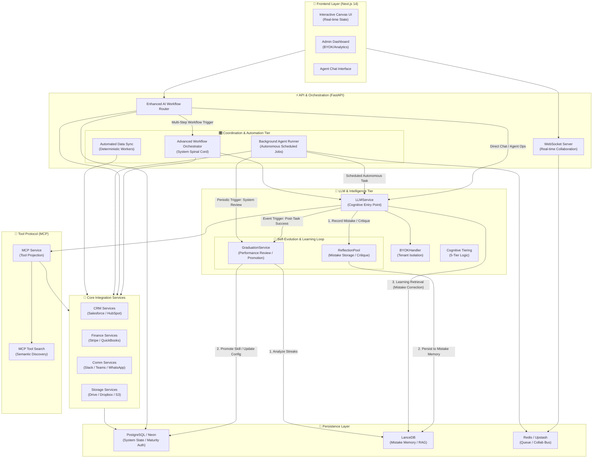

# ATOM Architecture Documentation

## Overview

ATOM is a comprehensive AI-powered task orchestration and management platform with web and desktop applications. This document describes the current architecture focusing on the unified authentication system and integration framework.

## Architecture Overview

ATOM is a unified platform designed for both human-in-the-loop and fully autonomous agent operations. The following diagram illustrates the interaction between the interface, orchestration, intelligence, and persistence layers.



### 🚀 Independent Execution Paths
The system satisfies three distinct operational modes:
1.  **Direct Real-Time**: Chat requests from the `Chat` UI hit the `Router`, which calls `LLMService` directly for low-latency agent interaction.
2.  **Autonomous (Scheduled)**: The `BackgroundRunner` acts independently, polling the `AgentRegistry` and triggering agents for maintenance, monitoring, or graduation checks without human intervention.
3.  **Coordination (Workflows)**: The `Orchestrator` manages multi-step, multi-agent pipelines, treating agents as modular "Execution Nodes" within a wider business process.

### 🧬 Self-Evolution & Learning Loop
ATOM utilizes a closed-loop "Evolution" tier powered by MiniMax M2.7 and LanceDB:
- **Mistake Memory**: Failures are captured by the `ReflectionPool` as recursive critiques and stored in the vector-backed `LanceDB`.
- **Learning Retrieval**: Before executing a task, agents query their "Mistake Memory" to "auto-correct" their reasoning based on previous failures.

### 🎓 Dual-Trigger Graduation
Graduation is the process of promoting skills from `SUPERVISED` to `AUTONOMOUS`. It is triggered by two paths:
1.  **Event-Driven**: Immediately after a `GenericAgent` completes a task successfully, it reports the outcome to the `GraduationService`.
2.  **Periodic Review**: The `BackgroundRunner` performs scheduled system-wide audits of skill performance streaks to identify promotion readiness.

---

*This document is maintained by the ATOM development team. Last updated: March 2026*
## Frontend to Backend Migration (February 2026)

### Migration Overview

**Date Completed**: February 2, 2026

In Phase 1.5, the platform migrated from direct database access in the Next.js frontend to a centralized backend API architecture. This migration improves security, maintainability, and auditability.

### Architecture Changes

#### Before Migration

```
Frontend (Next.js) ──┐
                       │
                       ├───> PostgreSQL (via pg library)
                       │
                       └──> Direct SQL queries (lib/db.ts)
```

**Issues**:
- Tight coupling between frontend and database
- Business logic scattered across frontend
- SQL queries in frontend code
- Difficult to audit and govern
- Security risks (SQL injection)

#### After Migration (Current)

```
Frontend (Next.js) ──┐
                       │
                       └──> HTTP Requests
                              │
                              ▼
                    Backend API (FastAPI)
                              │
                    ┌─────────────────────────┐
                    │  Authentication (JWT)      │
                    │  - User Context           │
                    │  - Role-Based Access      │
                    │  └─────────────────────────┘
                              │
                              ▼
                    SQLAlchemy ORM
                              │
                              ▼
                        PostgreSQL Database
```

**Benefits**:
- ✅ Centralized business logic in backend
- ✅ Consistent authentication across all clients
- ✅ Automatic audit logging
- ✅ SQL injection protection via ORM
- ✅ Type-safe API with Pydantic validation
- ✅ Instant rollback via feature flag

### Migration Components

#### 1. Backend API Routes

**Location**: `backend/api/`

Six new route groups created:
- `user_management_routes.py` - User profile and sessions
- `email_verification_routes.py` - Email verification
- `tenant_routes.py` - Multi-tenancy support
- `admin_routes.py` - Admin user management
- `meeting_routes.py` - Meeting attendance tracking
- `financial_routes.py` - Financial accounts and net worth

**Total Endpoints**: 12 new API endpoints

#### 2. Database Models

**Location**: `backend/core/models.py`

Seven new models added:
- `EmailVerificationToken` - Email verification codes
- `Tenant` - Multi-tenancy support
- `AdminRole` - Admin role definitions
- `AdminUser` - Administrative users
- `MeetingAttendanceStatus` - Meeting tracking
- `FinancialAccount` - Financial accounts
- `NetWorthSnapshot` - Net worth history

User model updated with:
- `email_verified` - Email verification status
- `user_id` - User identification

#### 3. Frontend API Client

**Location**: `frontend-nextjs/lib/api.ts`

Enhanced with API modules:
- `userManagementAPI` - User operations
- `emailVerificationAPI` - Email verification
- `adminAPI` - Admin management
- `meetingAPI` - Meeting attendance
- `financialAPI` - Financial data

#### 4. Feature Flag

**Environment Variables**:
```bash
# Enable backend API (new behavior)
NEXT_PUBLIC_USE_BACKEND_API=true

# Use direct DB (original behavior)
NEXT_PUBLIC_USE_BACKEND_API=false
```

**Purpose**: Allows instant rollback by toggling one flag

#### 5. Frontend Updates

**Files Modified**: 8 frontend API files

Each file updated with conditional logic:
```typescript
if (USE_BACKEND_API) {
  // Call backend API
  const result = await apiClient.someMethod();
} else {
  // Fall back to direct DB query
  const result = await query('SQL...');
}
```

**Modified Files**:
- `lib/auth.ts` - Authentication integration
- `pages/api/auth/verify-email.ts`
- `pages/api/auth/register.ts`
- `pages/api/auth/forgot-password.ts`
- `pages/api/auth/reset-password.ts`
- `pages/api/auth/sessions.ts`
- `pages/api/auth/send-verification-email.ts`
- `pages/api/meeting_attendance_status/[taskId].ts`

### API Documentation

See `docs/FRONTEND_TO_BACKEND_API.md` for complete API documentation including:
- Endpoint specifications
- Request/response formats
- Authentication requirements
- Error responses
- Rate limiting

### Performance Impact

**Cached governance**: <1ms (unchanged)
**Agent resolution**: <50ms (unchanged)
**API response time**: Target p95 <500ms

### Feature Flag Usage

#### Enable Backend API (Production Mode)
```bash
# frontend-nextjs/.env.local
NEXT_PUBLIC_USE_BACKEND_API=true
NEXT_PUBLIC_API_URL=http://localhost:8000
```

#### Disable (Rollback to Direct DB)
```bash
# frontend-nextjs/.env.local
NEXT_PUBLIC_USE_BACKEND_API=false
NEXT_PUBLIC_API_URL=http://localhost:8000
```

### Migration Statistics

| Metric | Value |
|--------|-------|
| Backend Files Created | 6 route files |
| Database Models Added | 7 models |
| Frontend Files Modified | 8 files |
| API Endpoints Created | 12 endpoints |
| Lines of Code Added | ~2,500 |
| Test Cases Created | 40+ |

### Rollback Procedure

If issues occur:

1. **Instant Rollback** (0 minutes):
   ```bash
   cd frontend-nextjs
   echo "NEXT_PUBLIC_USE_BACKEND_API=false" >> .env.local
   npm run dev
   ```

2. **Investigate Backend** (parallel):
   - Check backend logs: `backend/`
   - Test endpoint: `curl http://localhost:8000/api/users/me`
   - Review errors

3. **Fix and Re-enable**:
   - Fix backend issue
   - Set `NEXT_PUBLIC_USE_BACKEND_API=true`
   - Restart frontend

### Monitoring

**Key Metrics to Track**:
- API response time (p50, p95, p99)
- Error rate by endpoint
- Database connection pool usage
- Cache hit rate
- Frontend error rate (Sentry)

**Log Locations**:
- Backend: Server console + `logs/atom.log`
- Frontend: Browser console + Next.js logs

---
