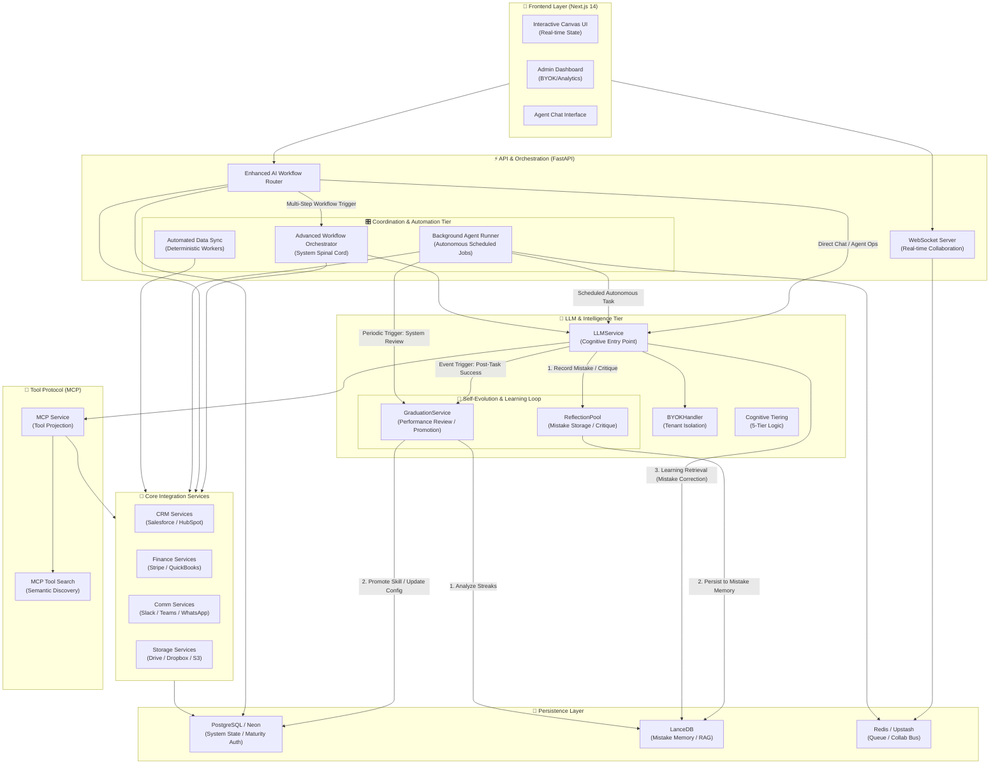

# Architecture Diagrams - Citation & JIT Fact Provision Systems

**Version**: 1.0
**Last Updated**: February 6, 2026
**Status**: Production Ready

---

## Overview

This document provides visual architecture diagrams for Atom's **Citation System** and **Just-In-Time (JIT) Fact Provision System**, illustrating data flows, component interactions, storage architecture, and retrieval patterns.

## Unified Platform Mapping

This diagram provides the top-level architectural context for the entire ATOM Agent OS, mapping the flow from user interfaces to the intelligence tier and persistence layer.



---

## System Context Diagram

---

## Citation System Architecture

### Component Overview

```
┌─────────────────────────────────────────────────────────────────────────────┐
│                          CITATION SYSTEM                                     │
├─────────────────────────────────────────────────────────────────────────────┤
│                                                                              │
│  ┌─────────────────────────────────────────────────────────────────────┐   │
│  │                        API Layer                                     │   │
│  │  ┌──────────────────┐  ┌──────────────────┐  ┌──────────────────┐  │   │
│  │  │ REST API         │  │  MCP Tools       │  │  Admin UI        │  │   │
│  │  │ /facts/*         │  │  save_fact       │  │  /admin/facts    │  │   │
│  │  │ /upload          │  │  verify_citation │  │                  │  │   │
│  │  └──────────────────┘  └──────────────────┘  └──────────────────┘  │   │
│  └─────────────────────────────────────────────────────────────────────┘   │
│                                    │                                        │
│                                    ▼                                        │
│  ┌─────────────────────────────────────────────────────────────────────┐   │
│  │                     WorldModelService                                │   │
│  │  ┌──────────────────┐  ┌──────────────────┐  ┌──────────────────┐  │   │
│  │  │  Fact Recording  │  │  Fact Retrieval  │  │  Verification    │  │   │
│  │  │  record_fact()   │  │  get_facts()     │  │  verify_citation()│  │   │
│  │  └──────────────────┘  └──────────────────┘  └──────────────────┘  │   │
│  └─────────────────────────────────────────────────────────────────────┘   │
│                                    │                                        │
│        ┌───────────────────────────┼───────────────────────────┐          │
│        ▼                           ▼                           ▼          │
│  ┌──────────────┐          ┌──────────────┐          ┌──────────────┐    │
│  │  LanceDB     │          │  Docling     │          │   R2/S3      │    │
│  │  Vector      │          │  Processor   │          │   Storage    │    │
│  │  Store       │          │              │          │              │    │
│  │              │          │              │          │              │    │
│  │ • Facts      │          │ • PDF/DOCX   │          │ • Documents  │    │
│  │ • Embeddings │          │ • OCR        │          │ • Archives   │    │
│  │ • Metadata   │          │ • Tables     │          │ • Citations  │    │
│  └──────────────┘          └──────────────┘          └──────────────┘    │
│                                                                              │
└─────────────────────────────────────────────────────────────────────────────┘
```

### Data Flow: Fact Upload & Extraction

```
┌─────────────┐
│   User      │
│  Uploads    │
│  Document   │
└──────┬──────┘
       │
       ▼
┌─────────────────────────────────────────────────────────────┐
│  POST /api/admin/governance/facts/upload                    │
│  Parameters: file, domain                                   │
└──────┬──────────────────────────────────────────────────────┘
       │
       ├──────────────────────────────────────────────────────┐
       │                                                      │
       ▼                                                      ▼
┌──────────────────┐                              ┌──────────────────┐
│  Storage Service │                              │  Temp File       │
│  Upload to R2/S3 │                              │  Save locally    │
└────────┬─────────┘                              └────────┬─────────┘
         │                                                 │
         │ s3://bucket/key                                 │
         │                                                 │
         └──────────────────────┬─────────────────────────┘
                                ▼
                 ┌──────────────────────────┐
                 │  DoclingDocumentProcessor │
                 │  process_document()       │
                 └────────┬───────────────────┘
                          │
                          ▼
                 ┌──────────────────────────┐
                 │  KnowledgeExtractor       │
                 │  extract_knowledge()     │
                 │  (LLM-based)             │
                 └────────┬───────────────────┘
                          │
                          │ entities + relationships
                          │
                          ▼
                 ┌──────────────────────────┐
                 │  BusinessFact Creation   │
                 │  • fact                  │
                 │  • citations (s3://...)  │
                 │  • reason                │
                 │  • metadata              │
                 └────────┬───────────────────┘
                          │
                          ▼
                 ┌──────────────────────────┐
                 │  WorldModelService       │
                 │  record_business_fact()  │
                 └────────┬───────────────────┘
                          │
                          ▼
                 ┌──────────────────────────┐
                 │  LanceDB                 │
                 │  business_facts table    │
                 │  • Vector index          │
                 │  • Metadata storage      │
                 └────────┬───────────────────┘
                          │
                          ▼
                 ┌──────────────────────────┐
                 │  Response                │
                 │  {                       │
                 │    success: true,        │
                 │    facts_extracted: N,   │
                 │    facts: [...]          │
                 │  }                       │
                 └──────────────────────────┘
```

### Citation Verification Flow

```
┌─────────────┐
│   Admin     │
│  Requests   │
│ Verification│
└──────┬──────┘
       │
       ▼
┌─────────────────────────────────────────────────────────────┐
│  POST /api/admin/governance/facts/{fact_id}/verify-citation│
└──────┬──────────────────────────────────────────────────────┘
       │
       ▼
┌──────────────────────────┐
│  WorldModelService       │
│  get_fact_by_id()        │
└────────┬─────────────────┘
         │
         ▼
┌──────────────────────────┐
│  Parse Citations         │
│  fact.citations = [      │
│    "s3://bucket/key",    │
│    "local/file.pdf"      │
│  ]                       │
└────────┬─────────────────┘
         │
         ├─────────────────┐
         │                 │
         ▼                 ▼
┌──────────────┐   ┌──────────────┐
│  S3/R2 Check │   │ Local Check  │
│              │   │              │
│ storage.     │   │ os.path.     │
│ check_exists()│  │ exists()     │
└──────┬───────┘   └──────┬───────┘
       │                   │
       │ exists?           │ exists?
       ├─────┬─────┐       ├─────┬─────┐
       │     │     │       │     │     │
       ▼     ▼     ▼       ▼     ▼     ▼
      True  False ...     True  False ...

       │                   │
       └─────────┬─────────┘
                 │
                 ▼
    ┌────────────────────────┐
    │  Aggregate Results     │
    │  [                    │
    │    {citation, exists}, │
    │    {citation, exists}, │
    │    ...                 │
    │  ]                    │
    └────────┬───────────────┘
             │
             ▼
    ┌────────────────────────┐
    │  Determine Status      │
    │  all_valid → verified  │
    │  any_missing → outdated│
    └────────┬───────────────┘
             │
             ▼
    ┌────────────────────────┐
    │  Update Fact           │
    │  update_fact_          │
    │  verification()        │
    └────────┬───────────────┘
             │
             ▼
    ┌────────────────────────┐
    │  Response              │
    │  {                     │
    │    fact_id,            │
    │    new_status,         │
    │    citations           │
    │  }                     │
    └────────────────────────┘
```

---

## JIT Fact Provision Architecture

### Component Overview

```
┌─────────────────────────────────────────────────────────────────────────────┐
│                           JIT FACT PROVISION SYSTEM                          │
├─────────────────────────────────────────────────────────────────────────────┤
│                                                                              │
│  ┌─────────────────────────────────────────────────────────────────────┐   │
│  │                      Agent Request Layer                             │   │
│  │  ┌──────────────────┐  ┌──────────────────┐  ┌──────────────────┐  │   │
│  │  │  Agent Task      │  │  Query Input     │  │  Decision Point  │  │   │
│  │  │  Description     │  │  Natural Lang    │  │  Context Need    │  │   │
│  │  └──────────────────┘  └──────────────────┘  └──────────────────┘  │   │
│  └─────────────────────────────────────────────────────────────────────┘   │
│                                    │                                        │
│                                    ▼                                        │
│  ┌─────────────────────────────────────────────────────────────────────┐   │
│  │                     WorldModelService                                │   │
│  │  ┌──────────────────────────────────────────────────────────────┐  │   │
│  │  │           recall_experiences(agent, query, limit)            │  │   │
│  │  └──────────────────────────────────────────────────────────────┘  │   │
│  └─────────────────────────────────────────────────────────────────────┘   │
│                                    │                                        │
│        ┌───────────────────────────┼───────────────────────────┐          │
│        │                           │                           │          │
│        ▼                           ▼                           ▼          │
│  ┌──────────────┐          ┌──────────────┐          ┌──────────────┐    │
│  │  Business    │          │  Knowledge   │          │  Experience  │    │
│  │  Facts       │          │  Graph       │          │  Memory      │    │
│  │              │          │              │          │              │    │
│  │ LanceDB      │          │ GraphRAG     │          │ LanceDB      │    │
│  │ Vector Search│          │ Communities  │          │ Semantic     │    │
│  └──────────────┘          └──────────────┘          └──────────────┘    │
│        │                           │                           │          │
│        ▼                           ▼                           ▼          │
│  ┌──────────────┐          ┌──────────────┐          ┌──────────────┐    │
│  │  Formulas    │          │  Episodes    │          │ Conversations│    │
│  │              │          │              │          │              │    │
│  │ Formula      │          │ PostgreSQL   │          │ PostgreSQL   │    │
│  │ Memory       │          │ Segmented    │          │ Recent       │    │
│  └──────────────┘          └──────────────┘          └──────────────┘    │
│                                                                              │
│                                    │                                        │
│                                    ▼                                        │
│  ┌─────────────────────────────────────────────────────────────────────┐   │
│  │                    Context Aggregation                               │   │
│  │  {                                                                   │   │
│  │    business_facts: [...],                                           │   │
│  │    knowledge_graph: "...",                                          │   │
│  │    experiences: [...],                                              │   │
│  │    formulas: [...],                                                 │   │
│  │    episodes: [...],                                                 │   │
│  │    conversations: [...]                                             │   │
│  │  }                                                                   │   │
│  └─────────────────────────────────────────────────────────────────────┘   │
│                                    │                                        │
│                                    ▼                                        │
│  ┌─────────────────────────────────────────────────────────────────────┐   │
│  │                    LLM Synthesis                                     │   │
│  │  KnowledgeQueryManager.answer_query()                               │   │
│  │  • Synthesize answer from context                                   │   │
│  │  • Include citations                                                 │   │
│  │  • Rank by relevance                                                 │   │
│  └─────────────────────────────────────────────────────────────────────┘   │
│                                    │                                        │
│                                    ▼                                        │
│  ┌─────────────────────────────────────────────────────────────────────┐   │
│  │                    Agent Decision                                    │   │
│  │  • Apply business rules                                             │   │
│  │  • Use verified facts                                               │   │
│  │  • Execute action                                                   │   │
│  └─────────────────────────────────────────────────────────────────────┘   │
│                                                                              │
└─────────────────────────────────────────────────────────────────────────────┘
```

### JIT Retrieval Sequence Diagram

```
┌─────────┐     ┌──────────────┐     ┌─────────────────┐     ┌──────────────┐
│  Agent  │────▶│  WorldModel  │────▶│  LanceDB        │────▶│  Business    │
│         │     │   Service    │     │                 │     │  Facts       │
└─────────┘     └──────┬───────┘     └─────────────────┘     └──────────────┘
                      │
                      │ 1. get_relevant_business_facts()
                      │
                      ▼
             ┌─────────────────┐
             │  Vector Search  │
             │  Query Embedding│
             └────────┬────────┘
                      │
                      ├──────────────────────────────────────────┐
                      │                                          │
                      ▼                                          ▼
             ┌──────────────┐                          ┌──────────────┐
             │  Ranked      │                          │  Business    │
             │  Results     │                          │  Facts       │
             │  by Score    │                          │  w/Citations │
             └──────┬───────┘                          └──────┬───────┘
                    │                                        │
                    │ 2. recall_experiences()                 │
                    │                                        │
                    ▼                                        │
             ┌─────────────────┐                             │
             │  Parallel Query │                             │
             │  ┌───────────┐  │                             │
             │  │Experience │  │                             │
             │  │Knowledge  │  │                             │
             │  │Graph      │  │                             │
             │  │Formulas   │  │                             │
             │  │Episodes   │  │                             │
             │  │Convos     │  │                             │
             │  └───────────┘  │                             │
             └────────┬────────┘                             │
                      │                                       │
                      ├─────────────────────────────────────────┤
                      │                                         │
                      ▼                                         ▼
             ┌─────────────────┐                    ┌──────────────┐
             │  Context        │                    │  Aggregated  │
             │  Aggregation    │────────────────────▶│  Context     │
             │                 │                    │  Dictionary  │
             └─────────────────┘                    └──────┬───────┘
                                                          │
                                                          │ 3. Synthesis
                                                          │
                                                          ▼
                                                 ┌─────────────────┐
                                                 │  LLM            │
                                                 │  Answer Gen     │
                                                 └────────┬────────┘
                                                          │
                                                          ▼
                                                 ┌─────────────────┐
                                                 │  Agent Response │
                                                 │  with Citations │
                                                 └─────────────────┘
```

---

## Storage Architecture

### Hybrid Storage Model

```
┌─────────────────────────────────────────────────────────────────────────────┐
│                          STORAGE ARCHITECTURE                                │
├─────────────────────────────────────────────────────────────────────────────┤
│                                                                              │
│  ┌─────────────────────────────────────────────────────────────────────┐   │
│  │                         HOT STORE (PostgreSQL)                        │   │
│  │  • Active agent executions                                           │   │
│  │  • Recent chat messages                                              │   │
│  │  • User sessions                                                      │   │
│  │  • Sub-ms lookup performance                                         │   │
│  │  • High write throughput                                              │   │
│  └─────────────────────────────────────────────────────────────────────┘   │
│                                    │                                        │
│                                    │ Age-out policy                         │
│                                    ▼                                        │
│  ┌─────────────────────────────────────────────────────────────────────┐   │
│  │                       WARM STORE (LanceDB)                            │   │
│  │  ┌──────────────┐  ┌──────────────┐  ┌──────────────┐              │   │
│  │  │ business_    │  │ agent_       │  │ knowledge_   │              │   │
│  │  │ facts        │  │ experience   │  │ graph        │              │   │
│  │  │              │  │              │  │              │              │   │
│  │  │ • Vector idx │  │ • Vector idx │  │ • Vector idx │              │   │
│  │  │ • Citations  │  │ • Learnings  │  │ • Entities    │              │   │
│  │  │ • Metadata   │  │ • Feedback   │  │ • Relations   │              │   │
│  │  │ • 100K facts │  │ • Episodes   │  │ • GraphRAG   │              │   │
│  │  └──────────────┘  └──────────────┘  └──────────────┘              │   │
│  │                                                                      │   │
│  │  • Semantic search (~50ms)                                          │   │
│  │  • S3-backed persistence                                             │   │
│  │  • Workspace isolation                                               │   │
│  └─────────────────────────────────────────────────────────────────────┘   │
│                                    │                                        │
│                                    │ Citation links                         │
│                                    ▼                                        │
│  ┌─────────────────────────────────────────────────────────────────────┐   │
│  │                       COLD STORE (R2/S3)                             │   │
│  │  ┌──────────────┐  ┌──────────────┐  ┌──────────────┐              │   │
│  │  │ Documents    │  │ Archives     │  │ Backups      │              │   │
│  │  │              │  │              │  │              │              │   │
│  │  │ • PDFs       │  │ • Old        │  │ • Snapshots  │              │   │
│  │  │ • DOCX       │  │   episodes   │  │ • Version    │              │   │
│  │  │ • Images     │  │ • Historic   │  │   history    │              │   │
│  │  │ • OCR        │  │   data       │  │              │              │   │
│  │  └──────────────┘  └──────────────┘  └──────────────┘              │   │
│  │                                                                      │   │
│  │  • Persistent storage                                                │   │
│  │  • CDN-eligible                                                      │   │
│  │  • Global distribution                                               │   │
│  └─────────────────────────────────────────────────────────────────────┘   │
│                                                                              │
└─────────────────────────────────────────────────────────────────────────────┘
```

### Data Flow: Document to Storage

```
┌─────────────┐
│  Document   │
│  Upload     │
└──────┬──────┘
       │
       ├──────────────────────────────────────┐
       │                                      │
       ▼                                      ▼
┌──────────────────┐              ┌──────────────────┐
│  Docling Parse   │              │  R2/S3 Upload    │
│  Text Extraction │              │  Original File   │
└────────┬─────────┘              └────────┬─────────┘
         │                                 │ s3://bucket/key
         │ text                            │ citation
         ▼                                 │
┌──────────────────┐                        │
│  Secrets         │                        │
│  Redaction       │                        │
└────────┬─────────┘                        │
         │ safe_text                       │
         ▼                                 │
┌──────────────────┐                        │
│  Knowledge       │                        │
│  Extraction      │                        │
│  (LLM)           │                        │
└────────┬─────────┘                        │
         │                                 │
         │ entities + relationships        │
         ├─────────────────────────────────┤
         │                                 │
         ▼                                 ▼
┌──────────────────┐              ┌──────────────────┐
│  BusinessFact    │              │  Citation        │
│  Creation        │              │  Verification   │
│  • fact          │              │                  │
│  • citations     │──────────────▶│  Check S3 exists │
│  • metadata      │              └──────────────────┘
└────────┬─────────┘
         │
         ▼
┌──────────────────┐
│  Embedding       │
│  Generation      │
│  (FastEmbed)     │
└────────┬─────────┘
         │ vector
         ▼
┌──────────────────┐
│  LanceDB         │
│  Storage         │
│  • Vector index  │
│  • Metadata      │
└──────────────────┘
```

---

## Integration Patterns

### Agent Decision-Making Flow

```
┌─────────────┐
│   Agent     │
│  Receives   │
│    Task     │
└──────┬──────┘
       │
       │ "Process invoice $750 from Acme Corp"
       │
       ▼
┌─────────────────────────────────────────────────────────────────┐
│                    JIT Context Retrieval                        │
│  ┌───────────────────────────────────────────────────────────┐ │
│  │  recall_experiences(agent, task_description, limit=5)     │ │
│  └───────────────────────────────────────────────────────────┘ │
└────────┬──────────────────────────────────────────────────────┘
         │
         ├────────────────────────────────────────────────┐
         │                                                │
         ▼                                                ▼
┌─────────────────┐                            ┌─────────────────┐
│  Business Facts │                            │  Experiences    │
│  • Rules        │                            │  • Past         │
│  • Policies     │                            │    executions   │
│  • Citations    │                            │  • Outcomes     │
└────────┬────────┘                            └────────┬────────┘
         │                                                │
         │ "Invoices > $500 need VP approval"             │
         │                                                │
         └──────────────────────┬─────────────────────────┘
                                ▼
                 ┌───────────────────────────┐
                 │  Context Aggregation       │
                 │  {                         │
                 │    business_facts: [...],  │
                 │    experiences: [...],     │
                 │    rules: [...]            │
                 │  }                         │
                 └────────┬──────────────────┘
                          │
                          ▼
                 ┌───────────────────────────┐
                 │  Decision Engine          │
                 │  if invoice.amount > 500: │
                 │    action = "approve_vp"  │
                 │  else:                    │
                 │    action = "auto_approve" │
                 └────────┬──────────────────┘
                          │
                          ▼
                 ┌───────────────────────────┐
                 │  Action Execution         │
                 │  • Apply rule             │
                 │  • Cite source            │
                 │  • Log decision           │
                 └────────┬──────────────────┘
                          │
                          ▼
                 ┌───────────────────────────┐
                 │  Response                 │
                 │  {                        │
                 │    action: "approve_vp",  │
                 │    reason: "Invoice $750  │
                 │      exceeds $500 limit", │
                 │    citation: "s3://..."   │
                 │  }                        │
                 └───────────────────────────┘
```

### Knowledge Graph Query Flow

```
┌─────────────┐
│   Query     │
│  "What      │
│  projects   │
│  is John    │
│  working    │
│  on?"       │
└──────┬──────┘
       │
       ▼
┌─────────────────────────────────────────────────────────────────┐
│                    GraphRAG Query                               │
│  query_graphrag(user_id, query, mode="global")                 │
└────────┬──────────────────────────────────────────────────────┘
         │
         ├──────────────────────────────────────┐
         │                                      │
         ▼                                      ▼
┌─────────────────┐                    ┌─────────────────┐
│  Local Search   │                    │  Global Search  │
│  • Entity-level │                    │  • Community    │
│  • Direct       │                    │    detection    │
│    connections  │                    │  • Hierarchical │
└────────┬────────┘                    │    summaries    │
         │                              └────────┬────────┘
         │                                      │
         │ entities + local_context             │ communities + summaries
         │                                      │
         └──────────────────┬───────────────────┘
                            ▼
                 ┌───────────────────────────┐
                 │  Result Synthesis         │
                 │  • Local entities         │
                 │  • Community context      │
                 │  • Relationship paths     │
                 └────────┬──────────────────┘
                          │
                          ▼
                 ┌───────────────────────────┐
                 │  Hierarchical Answer      │
                 │  "John is working on:     │
                 │   • Website Redesign      │
                 │     (lead developer)      │
                 │   • Mobile App            │
                 │     (project stakeholder) │
                 │   Both in Q4 roadmap"     │
                 └───────────────────────────┘
```

---

## Performance & Scalability

### Query Latency Breakdown

```
┌─────────────────────────────────────────────────────────────────┐
│                    JIT Query Latency                            │
├─────────────────────────────────────────────────────────────────┤
│                                                                 │
│  Total: ~650ms (P50)                                            │
│                                                                 │
│  ┌────────────┐  ┌────────────┐  ┌────────────┐  ┌──────────┐ │
│  │  Vector    │  │ Knowledge  │  │ GraphRAG   │  │  LLM     │ │
│  │  Search    │  │  Graph     │  │  Query     │  │  Synth   │ │
│  │            │  │            │  │            │  │          │ │
│  │  ~50ms     │  │ ~110ms     │  │ ~180ms     │  │ ~310ms   │ │
│  │  (8%)      │  │ (17%)      │  │ (28%)      │  │ (47%)    │ │
│  └────────────┘  └────────────┘  └────────────┘  └──────────┘ │
│       │                │                │             │         │
│       ▼                ▼                ▼             ▼         │
│  ┌────────┐      ┌────────┐      ┌────────┐    ┌────────┐    │
│  │LanceDB │      │LanceDB │      │GraphRAG│    │OpenAI  │    │
│  │ANN    │      │Traverse│      │Hierarchy│   │GPT-4   │    │
│  └────────┘      └────────┘      └────────┘    └────────┘    │
│                                                                 │
└─────────────────────────────────────────────────────────────────┘
```

### Storage Capacity Planning

```
┌─────────────────────────────────────────────────────────────────┐
│               Storage Capacity per Workspace                    │
├─────────────────────────────────────────────────────────────────┤
│                                                                 │
│  LanceDB (Warm Store)                                          │
│  ┌─────────────────────────────────────────────────────────┐   │
│  │  Business Facts:     100,000 facts × 1KB   = 100 MB     │   │
│  │  Experiences:        50,000 episodes × 2KB = 100 MB     │   │
│  │  Knowledge Graph:    200,000 edges × 500B  = 100 MB     │   │
│  │  Vectors:            350,000 × 384 × 4B    = 538 MB     │   │
│  │  ─────────────────────────────────────────            │   │
│  │  Subtotal: ~838 MB                                        │   │
│  └─────────────────────────────────────────────────────────┘   │
│                                                                 │
│  PostgreSQL (Hot Store)                                        │
│  ┌─────────────────────────────────────────────────────────┐   │
│  │  Chat Messages:      1M × 1KB           = 1 GB          │   │
│  │  Agent Executions:   100K × 5KB         = 500 MB        │   │
│  │  Episodes:           50K × 10KB         = 500 MB        │   │
│  │  ─────────────────────────────────────────            │   │
│  │  Subtotal: ~2 GB                                          │   │
│  └─────────────────────────────────────────────────────────┘   │
│                                                                 │
│  R2/S3 (Cold Store)                                            │
│  ┌─────────────────────────────────────────────────────────┐   │
│  │  Documents:          10K files × 5MB    = 50 GB         │   │
│  │  Archives:           5TB old data                        │   │
│  │  ─────────────────────────────────────────            │   │
│  │  Subtotal: ~5.05 TB                                       │   │
│  └─────────────────────────────────────────────────────────┘   │
│                                                                 │
│  Total per Workspace: ~5 TB (99% cold storage)                  │
│                                                                 │
└─────────────────────────────────────────────────────────────────┘
```

---

## Security Architecture

### Secrets Redaction Flow

```
┌─────────────┐
│  Document   │
│  Text       │
│  with       │
│  Secrets    │
└──────┬──────┘
       │
       │ "API key: sk-1234567890abcdef"
       │ "Email: user@example.com"
       │
       ▼
┌─────────────────────────────────────────────────────────────────┐
│                    Secrets Redactor                             │
│  ┌───────────────────────────────────────────────────────────┐ │
│  │  redact(text)                                              │ │
│  │  • Detect API keys, passwords, emails, PII                 │ │
│  │  • Replace with placeholders                               │ │
│  │  • Track redaction metadata                                │ │
│  └───────────────────────────────────────────────────────────┘ │
└────────┬──────────────────────────────────────────────────────┘
         │
         │ "API key: [REDACTED_API_KEY]"
         │ "Email: [REDACTED_EMAIL]"
         │ metadata: {
         │   "_redacted_types": ["api_key", "email"],
         │   "_redaction_count": 2
         │ }
         │
         ▼
┌─────────────────────────────────────────────────────────────────┐
│                    Safe for LLM Processing                     │
│  ┌───────────────────────────────────────────────────────────┐ │
│  │  KnowledgeExtractor.extract_knowledge(safe_text)          │ │
│  │  • No secrets leaked to external AI services              │ │
│  │  • Audit trail preserved in metadata                      │ │
│  └───────────────────────────────────────────────────────────┘ │
└─────────────────────────────────────────────────────────────────┘
```

### Access Control Layers

```
┌─────────────────────────────────────────────────────────────────┐
│                    RBAC Enforcement                             │
├─────────────────────────────────────────────────────────────────┤
│                                                                 │
│  ┌─────────────────────────────────────────────────────────┐   │
│  │  API Layer                                               │   │
│  │  ┌──────────────┐  ┌──────────────┐  ┌──────────────┐  │   │
│  │  │ ADMIN        │  │ USER         │  │ AGENT        │  │   │
│  │  │ Full CRUD    │  │ Read Only    │  │ Read Only    │  │   │
│  │  │ Verify       │  │ Query        │  │ JIT Retrieve │  │   │
│  │  │ Upload       │  │              │  │              │  │   │
│  │  └──────────────┘  └──────────────┘  └──────────────┘  │   │
│  └─────────────────────────────────────────────────────────┘   │
│                          │                                       │
│                          ▼                                       │
│  ┌─────────────────────────────────────────────────────────┐   │
│  │  Service Layer                                           │   │
│  │  require_role(UserRole.ADMIN)                           │   │
│  │  • Block unauthorized requests                           │   │
│  │  • Enforce workspace isolation                           │   │
│  └─────────────────────────────────────────────────────────┘   │
│                          │                                       │
│                          ▼                                       │
│  ┌─────────────────────────────────────────────────────────┐   │
│  │  Data Layer                                              │   │
│  │  • Workspace isolation (physical separation)             │   │
│  │  • User-scoped queries                                   │   │
│  │  • Secrets redaction (before storage)                    │   │
│  └─────────────────────────────────────────────────────────┘   │
│                                                                 │
└─────────────────────────────────────────────────────────────────┘
```

---

## Related Documentation

- [Citation System Guide](./CITATION_SYSTEM_GUIDE.md) - Business fact management
- [JIT Fact Provision System](./JIT_FACT_PROVISION_SYSTEM.md) - Real-time retrieval
- [Document Processing Pipeline](./DOCUMENT_PROCESSING_PIPELINE.md) - Multi-format parsing
- [Agent World Model](../backend/core/agent_world_model.py) - Core implementation
- [LanceDB Handler](../backend/core/lancedb_handler.py) - Vector database
- [Docling Processor](../backend/core/docling_processor.py) - Document parsing

---

## Diagram Legend

| Symbol | Meaning |
|--------|---------|
| `────▶` | Data flow / call |
| `┌─────┐` | Component / system |
| `│` | Internal process |
| `┼` | Parallel execution |
| `┌─────────┐` | Database / storage |
| `┌─────────┐` | External service |

---

## Changelog

### February 2026
- Initial architecture diagrams
- System context and component overviews
- Data flow and sequence diagrams
- Storage architecture documentation
- Security and access control patterns

### Future Updates
- [ ] Performance monitoring dashboards
- [ ] Deployment architecture diagrams
- [ ] Disaster recovery flows
- [ ] Multi-region replication patterns
