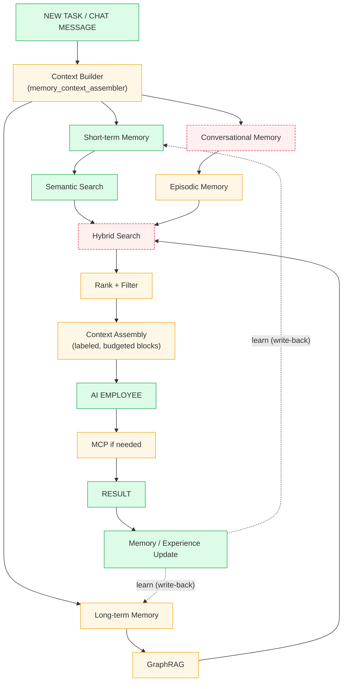

# Agent Memory Unification Plan — Retrieval at the Moment of Service

> **Status:** Adopted plan of record (2026-08-19). **P0 implemented & live-verified** (`7f55636ca`, 2026-08-19 — assembler, chat-path extraction, dropped-key renders incl. feedback, universal ingestion symmetry, GraphRAG keyword fix + property hydration); **P1.3 first slice + lexical leg done** (`74301215d`, 2026-08-19 — conversations leg in hybrid search, knowledge/conversations VFS subtree, FTS/BM25 leg live, ILIKE-fallback tokenization fix, poller persists IMs to the comms store). ~~Remaining P1: rerank (P1.4), graph embeddings (P1.5).~~ **P1 complete (2026-08-19):** P1.5 graph node vectors (LanceDB `graph_nodes` mirror written at node upsert + `backfill_node_vectors()`; local_search vector leg now LanceDB-based — SQLite-safe, replacing the Postgres-only `<=>` leg; `query()` runs local_search in a worker thread so the sync-embed async-context guard no longer silently voids the leg). P1.4 rerank wired into the assembler (cross-encoder, torch-dependent, graceful no-op where torch is unavailable). Known follow-up for P2.3: vector-leg ranking quality on paraphrase-only queries needs the eval harness — wiring is verified, recall quality is the harness's job to measure. Done since: **P1.1 tool equality** (meta agent now sees documents.search, search_communications, recall_episodes, memory_remember/forget), **P1.2 tool half** (recall_episodes action over the canonical episodes table — the agent_episodes mirror-table merge is deferred to P2: the two episode subsystems are each self-consistent and merging requires schema mapping), and the comm-store blocker cleared (fastembed fallback when torch is broken — 384-dim, empty-table self-heal; plus the Telegram normalizer bug that stored 'text' payloads as empty content). **P2.1 LLM-review consolidation (2026-08-20):** rule-based consolidation was already live; the deferred mem0-style LLM-review half now ships as `consolidate_with_llm()` — per-subject LLM review emitting bounded ADD/UPDATE/INVALIDATE ops with a uniform bi-temporal audit trail, shadow-gated by `ATOM_MEMORY_CONSOLIDATION_LLM` (default off), 16 tests green. P2 fully complete. Owner: brennan.ca pilot → upstream **P2 complete (2026-08-19):** P2.3 eval harness shipped (`core/memory_eval`, golden set incl. paraphrase class, recall@k gate — full run `python -m core.memory_eval`, exit-coded; in-suite gate skips where pytest AI fakes break the embedding stack; baseline: keyword 1.0 / paraphrase 1.0 / overall 1.0 — the harness also caught and fixed a P1.5 id-bridge bug that zeroed the semantic leg). P2.2 bi-temporal GraphEdge (valid_from/invalid_at/invalidation_reason; invalidate_edge(); edges_as_of(); all traversal/edge reads filter invalidated). P2.1 consolidation worker (rule-based contradiction + supersede sweeps, nightly, MEMORY_CONSOLIDATION_ENABLED). LLM-review pass deferred until the harness can measure it. Canvas-aware recall path ADDED (post-P2): recall_episodes now FUSES the canonical `episodes` table with the agent_episodes mirror (deduped, role-filter relaxed for canonical rows which lack agent_role metadata), segmentation stamps canvas_id + feedback_score into episode metadata so canvas/feedback boosts apply to canonical episodes, and the recall_episodes agent tool gained a canvas_id mode routing through the boosted ranking. The full mirror-table MERGE remains deferred — fusion makes it low-urgency (no consumer is blind to canonical data anymore). **P0.4 integration-symmetry audit COMPLETE (2026-08-20):** full coverage table now in §7 for Slack/WhatsApp/Gmail/Teams/Discord/Zendesk/Outlook. All seven integrations now have live `ingest_message` A-paths (Gmail/Teams/Discord queue bridges + Zendesk inbound webhook **FIXED 2026-08-21**, see §7 rows); remaining tracked items are Discord non-interaction bridging (needs a gateway client) and chat-bridge turn-fact wiring for Outlook/Discord.
> **Sponsor goal:** the README's "AI agent employee" promise — a teammate that remembers customers, commitments, and past work and retrieves the right memory **at the moment it serves an employee**.
> **Companion audit:** the gap inventory below comes from a full code trace (2026-08-19) of ingestion → retrieval paths. This plan maps research-proven patterns onto those exact gaps, ranked by pilot-visible value.
> **Supersedes:** `AGENT_MEMORY_CONTEXT_ASSEMBLY.md` (folded in here).
> **Cross-refs:** [`CONTEXT_MEMORY.md`](./CONTEXT_MEMORY.md) · [`AGENT_HYBRID_SEARCH.md`](./AGENT_HYBRID_SEARCH.md) · [`KNOWLEDGE_VFS.md`](./KNOWLEDGE_VFS.md)

---

## 1. Vision — the closed learning loop

```
NEW TASK → Context Builder → [Short-term | Conversational | Long-term] memory
                           → [Semantic Search | Episodic | GraphRAG]
                           → Hybrid Search → Rank+Filter → Context Assembly
                           → AI EMPLOYEE → MCP if needed → RESULT
                           → Memory/Experience Update ↺ (learn)
```

Before an agent starts any task (or answers any chat message), a **Context Builder** assembles everything a human would draw on, injects it into the prompt, lets the agent pull more **on-demand via MCP** during the task, and **writes back** what it learned afterward — a closed loop. The two middle rows are a clean **STORAGE → RETRIEVAL** split: three memory tiers feed three retrieval engines, fused by one hybrid search, ranked, filtered, and compiled into the prompt.

**Retrieval at the moment of service** means every surface an employee touches — web chat, Telegram/Slack/WhatsApp bridges, the agent ReAct loop — goes through the same assembly path. Today only the ReAct loop does (partially); chat surfaces are amnesiac.

---

## 2. Research summary — what the leading systems agree on

| System | Pattern worth borrowing | Source |
|---|---|---|
| **mem0** | Three-stage pipeline: extract salient facts → consolidate (LLM decides ADD / UPDATE / DELETE against existing memories — prevents bloat and contradiction) → hybrid retrieve (vector for semantics + graph for relational structure). Atom already owns all three stores; it lacks consolidation and the retrieval wiring. | Mem0 paper (arXiv:2504.19413), mem0 hybrid design |
| **Zep / Graphiti** | Bi-temporal graph edges: every fact carries valid-time + ingestion-time; contradictions invalidate edges instead of overwriting — "what was the price last month" stays answerable, stale facts stop leaking into prompts. | Zep paper (arXiv:2501.13956), Graphiti |
| **Letta / MemGPT** | Tiered memory: core (small, always-in-context block) vs archival (vector-searchable), plus sleep-time compute — memory reorganization happens offline, not in the user-facing turn. Latency-critical turns read; background workers write/compact. | MemGPT paper, Letta sleep-time compute |
| **Letta memory blocks** | Context is *compiled* from discrete, labeled, size-budgeted blocks (label + value + limit + description), persisted and individually addressable. Assembly is a typed contract, not string concatenation — a fetched-but-unrendered signal becomes visible instead of silently dropped. | Letta: Memory Blocks; Why Memory Isn't a Plugin |
| **Claude vs ChatGPT memory** | Two poles: ChatGPT injects a growing flat fact-list every turn; Claude starts blank and pulls context on demand via an inspectable file-based memory tool. Best-of-both: a bounded, high-precision always-injected block + agentic tools for deep dives. | Simon Willison's analysis, cross-vendor comparison |
| **Context engineering** | Hybrid retrieval cadence wins: cheap pre-retrieval for base context + just-in-time agentic search for depth, with post-retrieval reranking to fit latency budgets. Pure pre-retrieval goes stale; pure agentic search is slow. | Anthropic: Effective Context Engineering, mem0 retrieval strategies |
| **mem0 structured vs unstructured** | Structured facts (filterable fields) and unstructured prose (similarity-searched) on the same record: prose captures nuance, fields capture what code queries. Atom's `turn_facts` (prose + categories) and `BusinessFact` (verified, cited) already mirror this split. | mem0: Structured vs Unstructured Memory |

**Design principles adopted:**
1. Turns **read** memory; background jobs **write/compact** it.
2. Always-injected context must be **small and high-precision**; everything else is tool-gated.
3. Hybrid legs (vector + lexical + graph + episodes) **fused with bounded rerank** (RRF where scores are incomparable).
4. Facts **consolidate — supersede, don't accumulate**.
5. Context is **compiled from labeled, budgeted memory blocks** — assembly is a typed contract, not ad-hoc string concat (prevents the fetch-then-drop bug class).
6. **Retrieval at the moment of service**: every employee-facing surface routes through the same assembler.
7. **Ingestion symmetry**: every relevant third-party integration lands in the same readable-at-retrieval representation — comms store (FTS+vector `atom_communications`) **and** graph entities. An integration that writes only one pipeline is half-blind at the moment of service (Telegram today: graph yes, comms store no).

---

## 3. Canonical architecture (target state)



Node color = implementation status today: green live, amber partial, red gap.

| Node | Status | Gap |
|---|---|---|
| Context Builder | amber (P0.1 builds it; chat surfaces have nothing — G8) | `recall_experiences()` drops 3 of 7 fetched signals + per-episode feedback (G2) |
| Short-term Memory | green | turn facts (Tier-1 SQL + Tier-2 vector) |
| Conversational Memory | red | not a first-class lane in ReAct (G7); comms unreadable (G10) |
| Long-term Memory | amber | stored, partial retrieval |
| Semantic Search | green | `documents.search` BM25+vector RRF |
| Episodic Memory | amber | no agent tool (G4); table split-brain (G11); general episodes dropped (G2) |
| GraphRAG | amber | query works, no node embeddings (G1); context dropped (G2) |
| Hybrid Search (fusion) | red | RRF fused for documents only, not across the 3 engines (G6) |
| Rank + Filter | amber | per-lane, not unified (G6) |
| Context Assembly | amber | `memory_display` incomplete (G2) |
| MCP if needed | amber | whitelist excludes memory/search tools (G9) |
| Memory / Experience Update | green on ReAct path, **red on chat path** (G8) | turn-fact extraction never runs for chat/IM |

---

## 4. Current-state gaps (2026-08-19 code audit)

Unified inventory — G1–G7 from the agent-loop audit, G8–G12 from the surface/pipeline audit.

| ID | Gap | Evidence | Severity |
|---|---|---|---|
| G1 | Graph nodes/edges never embedded — and the vector leg uses the pgvector `<=>` operator (`graphrag_engine.py:1209`), which doesn't work on SQLite at all (exception swallowed at `:1219`), so Personal Edition is keyword-only **regardless of embeddings** | `graphrag_engine.py:1197-1235` (leg), `:254-314` (extractor stamps no embedding) | Medium |
| G2 | `recall_experiences` fetches 7 signals; `_react_step` renders ~3 — `knowledge_graph`, `conversations`, `episodes` fetched-then-dropped. Same bug class, different path: `feedback_context` is **not** a 7th top-level key — it's fetched and nested inside each enriched episode dict (`agent_world_model.py:1261`), then dropped when the renderer shows only task→outcome | `agent_world_model.py:1027-1281`; `atom_meta_agent.py:1383-1448`; `generic_agent.py:899-927` | High |
| G3 | Auto-injected `knowledge` block uses plain LanceDB vector, not the RRF hybrid | `agent_world_model.py:1105-1112` | Medium |
| G4 | No agent tool for episodic retrieval (service + HTTP only) | `core/episode_retrieval_service.py`; absent from `action_registry.py` / `tools/registry.py` | Medium |
| G5 | No read-only agent tool to query business facts (write-only `save_business_fact`) | `mcp_service.py:288` | Low |
| G6 | No generic `memory.search` — semantic retrieval over episodes/turn-facts not agent-callable; phantom `memory_search`/`memory_recall` sit in sandbox whitelists with no tool behind them | `core/sandbox_policy.py:86-119` | Medium |
| G7 | Conversational memory not a first-class type — `conversation_history` only in the simple-chat path, never in ReAct | `agent_execution_service.py:227-233` | Low-Med |
| G8 | **ChatOrchestrator — the brain behind web chat AND every IM bridge (Telegram/Slack/WhatsApp via `universal_webhook_bridge.py:120`) — performs zero retrieval and extracts no turn facts.** Static prompt + last-3 turns only. Chat is a memory black hole. | `integrations/chat_orchestrator.py:504-587` | **High** |
| G9 | Meta agent tool whitelist (`CORE_TOOLS_NAMES`) excludes `documents.search`, `memory_remember/forget`, and all communication-memory search — the flagship agent cannot self-serve memory | `atom_meta_agent.py:352-377` | High |
| G10 | Conversational data is unreadable at retrieval time: comms land in `atom_communications` (Pipeline A, vector+FTS — no agent reader), `integration_*` tables (Pipeline B — write-only), `tenant_*_messages` (Pipeline C). `DocumentsHybridSearch` reads only the `documents` table | `core/hybrid_search/documents_hybrid.py` | High |
| G11 | Episode split-brain: segmentation writes LanceDB `episodes`; world-model recall reads `agent_episodes`; no agent tool exposes `EpisodeRetrievalService` (HTTP-only) | `episode_service.py:1553`; `agent_world_model.py:1356` | Medium |
| G12 | Telegram asymmetry: graph ingestion yes (Pipeline B), FTS comms store no (not in Pipeline A's bridge list) | `ingestion_pipeline.py:1279` | Medium |

---

## 5. The plan — ranked by value to the AI agent employee

### P0 — Make the employee surface memory-aware (pilot-visible this week)

**P0.1 — Unified turn-time context assembly for ChatOrchestrator (highest value)**

New `core/memory_context_assembler.py`: given `(message, user_id, workspace_id)`, run in parallel with a hard budget (≤400 ms, degrade to empty on timeout):
- Comm-memory hybrid search: `CommunicationIngestionPipeline.search_communications` (vector+FTS) — top 5
- GraphRAG: `graphrag_engine.get_context_for_ai` — bounded entity/relationship string
- Episodes: `EpisodeRetrievalService.retrieve_contextual` — top 3
- Turn-facts: existing `prefetch_relevant_facts` — top 5

Fuse via per-leg caps + recency tiebreak (skip cross-encoder rerank in P0; add in P1), render as one `RELEVANT MEMORY` block ≤1,500 tokens into `_get_qwen_response`'s messages. Behind env `MEMORY_CONTEXT_ASSEMBLY=true` (default on, off = old behavior).

*Pattern: Anthropic pre-retrieval + Claude bounded-block; mem0 hybrid legs. Closes G8 (read side).* [Design note: implement the block renderer as a typed, labeled-block compiler (Letta memory-block pattern) from day one — it is also the rendering contract P0.3 reuses.]

**P0.2 — Turn-fact extraction on the chat path**

After orchestrator response, fire-and-forget `turn_fact_extractor` per turn (same call the meta agent makes at `atom_meta_agent.py:2301`). Chat stops being a memory black hole.

*Pattern: Letta — writes happen off the user-facing path. Closes G8 (write side).*

**P0.3 — Render the dropped keys (incl. per-episode feedback)**

`_react_step`/`generic_agent` render `knowledge_graph` and `episodes` from `recall_experiences` (bounded: graph ≤800 tokens, episodes ≤600), with a **feedback hint inside each episode line** — `task → outcome (user feedback: …)` sourced from the nested `feedback_context` (`agent_world_model.py:1261`) that is currently fetched per-episode and dropped at the task→outcome render. Two-block prompt diff; the flagship agent instantly sees ontology identities + learning episodes + how the user judged them — everything it already paid to fetch. *Closes G2.*

**P0.4 — Integration ingestion symmetry (Telegram first, then the audit)**

Add a telegram normalizer/bridge in the tiered comm list (`ingestion_pipeline.py:1279`) so Telegram messages get the FTS-indexed `atom_communications` representation alongside their graph entities. *Closes G12.*

This is an instance of design principle 7 — the contract applies to **every relevant third-party integration**: for each, verify it writes BOTH the comms store (Pipeline A) AND graph entities (Pipeline B), and that the P0.2 turn-fact extraction runs on its chat bridge. Run the audit across the integration surface (Slack, WhatsApp, Gmail, Outlook/Teams, Discord, Zendesk…); any integration that writes only one pipeline gets a normalizer/bridge added. Audit outcome recorded in this doc's Verification section as a coverage table.

**P0 verification:** live bot test — "what did we quote ACME Fab?" must return seeded graph facts; unit tests per leg; latency budget test.

### P1 — Agentic deep-dive + tool equality (week 2)

**P1.1 — Expose retrieval tools to the meta agent**: add `documents.search`, `memory_remember`, `memory_forget`, a new `search_communications` MCP tool (wrapping Pipeline A's search — memory store, not live APIs), and `business_facts.search` (read-only) to `CORE_TOOLS_NAMES`. Claude's memory-tool pattern: inspectable, agent-driven pulls for depth beyond the injected block. *Closes G9, G5.*

**P1.2 — Episodic recall tool + table unification**: register `recall_episodes` (modes: semantic / similar_failures / contextual) in the tool registry; standardize both write paths on the `episodes` table (migrate `agent_episodes` writes in `episode_service.py:1553`, backfill, read from one). *Closes G11, G4.*

**P1.3 — Conversations leg for hybrid search**: extend `DocumentsHybridSearch` (or add a `memory.search` action) to RRF-fuse `atom_communications` + `documents` + `turn_facts` legs — closing the "ingested but unreadable" loop for emails/Slack/WhatsApp. Swap the auto-injected `knowledge` block to the hybrid path at the same time. *Closes G10, G6, G3, G7.*

**P1.4 — Rerank**: cross-encoder rerank of the assembled block when budget allows (`HybridRetrievalService` already exists — reuse it inside the assembler instead of HTTP-only).

**P1.5 — Graph semantic leg (node embeddings)**: generate node/edge embeddings at ingest (`_llm_extract_entities_and_relationships`, `ingest_structured_data`) into LanceDB (`graph_nodes` table — works on Personal Edition SQLite and prod alike; keep the pgvector leg as a prod optimization), plus a backfill script for existing nodes. Upgrades the P0.1 GraphRAG leg from keyword-only to hybrid. *Closes G1.*

### P2 — Memory quality: consolidation + time (post-pilot, pre-SaaS)

**P2.1 — Consolidation worker (mem0-style)**: nightly `memory_consolidator` job — for each entity/subject, LLM reviews recent turn facts + comms extracts vs existing facts/graph edges, emits ADD/UPDATE/INVALIDATE ops with audit trail. Kills drift, dedupes, and controls prompt bloat. Sleep-time compute: never in the employee-facing turn. **Status (2026-08-20):** the rule-based passes (`consolidate_edges`, `consolidate_turn_facts`, `consolidate_workspace`) ship in the nightly worker; the deferred mem0-style LLM-review half landed as `consolidate_with_llm()` in `core/memory_consolidator.py` — per-subject review (grouped by 4-token subject prefix, >=2 facts, max 5 subjects / 6 facts each), emits capped ADD/UPDATE/INVALIDATE ops (max 20) applied with a uniform bi-temporal audit trail (superseded facts + invalidated edges + parent links), LLM call = `model="fast"`, temp 0.0, 20s timeout, never raises. **Shadow by default**: env `ATOM_MEMORY_CONSOLIDATION_LLM` (default off) flips it on; worker calls it after `consolidate_workspace` and reports under `report["llm_review"]`. Tests: `tests/test_memory_consolidator_llm.py` (16 passed).

**P2.2 — Bi-temporal graph edges**: add `valid_from`/`invalid_at` to `GraphEdge` (migration), invalidation-not-deletion on contradiction (Zep pattern). Makes "what did ACME pay last quarter" answerable and stops superseded facts leaking into `get_context_for_ai`.

**P2.3 — Memory eval harness**: golden set of (question → expected memory) pairs from brennan pilot transcripts; regression-gate recall@k for the assembler. Without this, consolidation changes are unmeasurable.

---

## 6. Budgets, risks, rollout

- **Latency:** assembler hard-caps at 400 ms parallel (P0); rerank only when total < 800 ms (P1). IM replies already tolerate multi-second LLM time; the budget protects p95.
- **Prompt bloat:** total injected memory ≤2,500 tokens across blocks; per-leg caps; consolidation (P2) is the long-term governor.
- **Privacy:** assembler is workspace-scoped; sensitivity tags respected (confidential+ excluded from any cross-user injection) — matches the org-sharing sensitivity ladder.
- **Rollout:** env-flagged (`MEMORY_CONTEXT_ASSEMBLY`), default-on after P0 verification on the brennan pilot, auditable in runbook.
- **Sequencing rationale:** P0 turns the surface employees actually touch (Telegram/web chat) from amnesiac to memory-aware and unblocks every demo beat that hinges on recall ("Atom remembered the quote, the budget, the deadline"). P1 gives agents self-serve depth. P2 makes memory trustworthy over months — the difference between a demo and a deployable employee.

---

## 7. Verification

- `recall_experiences` returns all 7 memory keys AND each key is surfaced in `_react_step` prompt (assert via a prompt-inspection unit test — the typed-block compiler makes "fetched but dropped" a test failure, not a silent bug).
- Assembler: unit test per leg + latency-budget test + flag-off parity test.
- Live bot golden questions from the pilot transcripts return seeded facts.
- New actions (`search_communications`, `recall_episodes`, `memory.search`, `business_facts.search`) are listed in `get_all_tools()` and pass governance + sandbox gates.
- Ingestion-symmetry coverage table: per integration — comms store (Pipeline A) ✓/✗, graph entities (Pipeline B) ✓/✗, turn-fact extraction on its chat bridge ✓/✗. Any ✗ from the P0.4 audit must have a tracked follow-up before P1 ships.

  | Integration | Pipeline A (comms store) | Pipeline B (graph entities) | Turn-fact on chat bridge | Audit date | Notes |
  |---|---|---|---|---|---|
  | **Outlook** | ✓ (webhook `ingestion_pipeline.py:1131` → `atom_communications`; poller `ingest_message` → `memory_manager.ingest_communication`) | ✓ (webhook `ingest_structured_data` at `:1097` from `_extract_structured_entities`; poller triggers `knowledge_manager.process_document` → GraphRAG) | ✗ (not wired — only `chat_orchestrator.py:492` runs P0.2 extraction; Outlook bridge doesn't call `turn_fact_extractor`) | 2026-08-20 | Backfill endpoint (`POST /api/integrations/outlook/backfill` → `OutlookIntegration.backfill_to_memory`) previously wrote only generic LanceDB entities via `_run_backfill` — neither `atom_communications` (A) nor graph (B). **FIXED (2026-08-20):** `_bridge_records_to_unified_memory` in `memory_integration_mixin.py` routes email/communication backfill records through `CommunicationIngestionPipeline.ingest_message` (Pipeline A + Pipeline B via its `process_document` trigger); CRM/other integrations keep generic behavior; never raises. Tests: `tests/test_memory_backfill_unified.py` (4 passed). Outlook content still does **not** land in `knowledge_documents`/`IngestedDocument` (SQL docs store read by `DocumentsHybridSearch`); it is readable via `search_communications` + the P1.3 conversations hybrid leg instead. |
  | **Slack** | ✓ on legacy/memory webhooks (`api/webhook_routes.py:41-65` → `_handle_webhook_message` at `atom_communication_ingestion_pipeline.py:578/601`; memory webhook `atom_communication_memory_webhooks.py:441`) — modern bridge **FIXED (2026-08-20)**: `slack_webhooks.py` now passes the full payload (was inner `data.get("event",{})`) so the UCB slack adapter + `_transform_slack_payload` (`event_callback` envelope) match | ✓ (queue `/webhooks/slack/events` non-tiered `:1076/:1097`; legacy `knowledge_manager.process_document` `:662`) | ✓ (bridge → `ChatOrchestrator.process_chat_message` → `:492`) | 2026-08-20 | Modern bridge A/B path was a silent no-op (inner event vs `event_callback` envelope) — **FIXED (2026-08-20).** Tests: `tests/test_memory_symmetry_fixes.py::TestSlackBridgeFullPayload`. |
  | **WhatsApp** | ✓ (bridge passes full payload `whatsapp_webhooks.py:100` → tiered `ingest_message` `:1329`; poller `_fetch_whatsapp_messages` `:782` → `ingest_message`) | ✓ (tiered; whatsapp ∈ `COMMUNICATION_INTEGRATIONS` + `MULTI_ENTITY_INTEGRATIONS`) | ✓ (bridge → UCB whatsapp adapter `:40` → orchestrator `:492`) | 2026-08-20 | Content bug **FIXED (2026-08-20):** `_normalize_message` WhatsApp branch now falls back across `content`/`text`/`body` (mirrors the generic branch) so transformer-emitted `text` payloads are no longer stored with empty content/embeddings. Tests: `tests/test_memory_symmetry_fixes.py::TestWhatsAppNormalizeContentFallback`. |
  | **Gmail** | ✓ (webhook **FIXED (2026-08-21)**: `process_webhook_payload` now bridges gmail records to `CommunicationIngestionPipeline.ingest_message("gmail", record)` — same normalized path as its poller; per-record fallback to the legacy raw write on bridge failure so records are never lost. Tests: `tests/test_gmail_webhook_ingest_message.py` 5); poller `_fetch_gmail_messages` → `ingest_message` ✓ (config-gated) | ✓ (non-tiered `:1076/:1097` + multi-entity `:1117`) | ✗ (no chat bridge; Gmail ∉ UCB `ADAPTERS` at `universal_communication_bridge.py:39-46`) | 2026-08-20 | Webhook A-path bypasses the comm pipeline (hardcoded direct write); no chat surface → turn-fact N/A on webhook. TRACKED follow-up. |
  | **Teams** | ✓ (bridge ✓ (`"teams"` in `_KNOWN_COMM_INTEGRATIONS`); queue `/webhooks/communication/teams` **FIXED (2026-08-21)**: `process_webhook_payload` bridges teams records to `ingest_message("teams", …)` with per-record raw-write fallback) | ✓ (tiered `:1384/:1393`; teams ∈ `COMMUNICATION_INTEGRATIONS` + `MULTI_ENTITY_INTEGRATIONS`) | ✓ (bridge only — UCB teams adapter `:43` → orchestrator `:492`) | 2026-08-20 | Alias **FIXED (2026-08-20):** `teams` added to `_KNOWN_COMM_INTEGRATIONS` (explicit A-path membership, no more shape-heuristic reliance) and the poller `_fetch_new_messages` accepts the `teams` alias alongside `microsoft_teams`. Tests: `tests/test_memory_symmetry_fixes.py::TestTeamsKnownCommAlias`. Queue A-path **FIXED (2026-08-21)**: bridged to `ingest_message` with per-record fallback. Tests: `test_gmail_webhook_ingest_message.py::TestTeamsDiscordQueueBridge`. |
  | **Discord** | ✓ (bridge ✓; queue path `/webhooks/communication/discord` **FIXED (2026-08-21)**: non-tiered route now bridges to `ingest_message("discord", …)` with per-record raw-write fallback, same as gmail/teams) | ✓ (tiered `:1384/:1393` — **no multi-entity**, discord ∉ `COMMUNICATION_INTEGRATIONS`; queue path B ✓) | ✓ (bridge, but **interactions only** — `adapters/discord.py:56-108` rejects plain `MESSAGE_CREATE`; route requires `guild_id`, no DMs) | 2026-08-20 | Poller **FIXED (2026-08-21):** `_fetch_discord_messages` walks bot guilds → text channels → messages (fail-closed without `DISCORD_BOT_TOKEN`, API errors degrade to []); **Gateway client FIXED (2026-08-21):** `integrations/discord_gateway.py` consumes MESSAGE_CREATE in real time (IDENTIFY/HEARTBEAT/reconnect-backoff, gated by `DISCORD_GATEWAY_ENABLED`+`DISCORD_BOT_TOKEN`, wired into app startup) → `ingest_message("discord", …)`. Bridge non-interaction support now redundant for ingestion. Multi-entity parity via `discord` ∈ `COMMUNICATION_INTEGRATIONS`. Tests: `test_discord_ingestion_parity.py` 7 + `test_discord_gateway.py` 6. |
  | **Zendesk** | ✓ (**FIXED (2026-08-21):** webhook `/webhooks/zendesk/events` (fail-closed HMAC `ZENDESK_WEBHOOK_SECRET`, R69 pattern) → `_transform_zendesk_payload` (comment-shaped: ticket+current_comment → message record; degenerate payloads degrade to a stub) → queue bridges to `ingest_message("zendesk", …)`; `zendesk` ∈ `_KNOWN_COMM_INTEGRATIONS`. Tests: `tests/test_zendesk_inbound_ingestion.py` 8) | ✗ (only `zendesk_sell` CRM via pm-crm queue `/webhooks/pm-crm/{id}` `ingestion_webhooks.py:1013` → non-tiered B-only; Zendesk Support itself has no graph path) | ✗ | 2026-08-20 | ~~**Largest gap — zero inbound ingestion.**~~ **FIXED (2026-08-21):** Support ticket comments now flow webhook → transformer → `ingest_message` (both pipelines). `zendesk_routes.py` remains the OAuth/admin surface; multi-entity extraction parity not added (support-domain, not comm-chat). |

  **Tracked follow-ups from the P0.4 audit (all ✗/partial rows above):**
  1. **WhatsApp content bug (HIGH — memory quality)**: ~~`_normalize_message` WhatsApp branch reads `content` but the transformer emits `text` → empty content/embedding in `atom_communications`.~~ **FIXED (2026-08-20)** — `content`/`text`/`body` fallback added (mirrors generic branch `:1717-1735`); tests `TestWhatsAppNormalizeContentFallback` (4).
  2. **Slack modern bridge payload**: ~~pass the full payload (or wrap in the `event_callback` envelope) to `WebhookBridge.process_event` so `_transform_slack_payload` matches and the modern A+B path is live, not a silent no-op.~~ **FIXED (2026-08-20)** — `slack_webhooks.py` passes full `data`; tests `TestSlackBridgeFullPayload` (2).
  3. **Teams alias**: ~~add `teams` to `_KNOWN_COMM_INTEGRATIONS` / `CommunicationAppType` (or normalize to `microsoft_teams` in the bridge) so A-path membership is explicit instead of shape-heuristic; align the poller key.~~ **FIXED (2026-08-20)** — `teams` added to `_KNOWN_COMM_INTEGRATIONS` + poller alias; tests `TestTeamsKnownCommAlias` (3).
  4. **Gmail webhook A-path**: ~~route `/webhooks/gmail/events` through the tiered `ingest_message` path instead of the hardcoded direct LanceDB write; add a chat-bridge if Gmail becomes an interactive surface.~~ **FIXED (2026-08-21)** — webhook records bridge to `ingest_message("gmail", …)` with per-record raw-write fallback; chat-bridge still N/A (Gmail ∉ UCB ADAPTERS, no interactive surface).
  5. **Discord**: add a poller branch; normalize plain `MESSAGE_CREATE` (not just interactions); add `discord` to `COMMUNICATION_INTEGRATIONS` for multi-entity parity.
  6. **Zendesk**: ~~build real inbound ingestion (webhook + `_transform_zendesk_payload` + comm-list membership) so support tickets reach both pipelines~~ **FIXED (2026-08-21)** — webhook + message-shaped transformer + `_KNOWN_COMM_INTEGRATIONS` membership + queue bridge; tests `test_zendesk_inbound_ingestion.py` (8). |
- Episode table unification: backfill idempotent; read/write paths assert on a single table.
- Graph embeddings: `local_search` vector leg returns non-empty on embedded data (SQLite + Postgres); backfill re-run does not duplicate.
- P2.3 eval harness gates recall@k on the golden set in CI (`backend-tests` job runs `python -m core.memory_eval`, exit-coded — the in-suite pytest gate self-skips under suite AI fakes, so the standalone run is the real gate). **2026-08-20:** full standalone run green — recall 1.0 / keyword 1.0 / paraphrase 1.0, exit 0.
- Dev-DB drift reconcile (2026-08-20): `scripts/reconcile_dev_db.py` applies the guarded, idempotent `graph_nodes.sensitivity` + `graph_edges.valid_from/invalid_at/invalidation_reason` column adds that the broken alembic chain never ran on hybrid SQLite dev stores (R71-style); `test_memory_p2` now uses uuid-suffixed workspaces AND node ids (the tests hit the session-bound engine, not the isolated DB their env override intended, so fixed global PKs collided on re-runs).

---

## 8. Sources

- **Mem0:** Building Production-Ready AI Agents with Scalable Memory (arXiv:2504.19413) · mem0: Long-Term Memory for AI Agents · Memory Retrieval Strategies · Structured vs Unstructured Memory in AI Agents
- **Zep / Graphiti:** A Temporal Knowledge Graph Architecture for Agent Memory (arXiv:2501.13956) · Graphiti (github.com/getzep/graphiti) · What Is a Temporal Knowledge Graph?
- **Letta / MemGPT:** Towards LLMs as Operating Systems (arXiv:2310.08560) · Sleep-time Compute · Memory Blocks: The Key to Agentic Context Management · Why Memory Isn't a Plugin · RAG Is Not Agent Memory
- **Claude vs ChatGPT memory:** Simon Willison: Claude memory · Memory implementations across Gemini/OpenAI/Anthropic
- **Context engineering:** Anthropic: Effective Context Engineering for AI Agents · Weaviate: Context Engineering · Elastic: Relevance in Context Engineering
