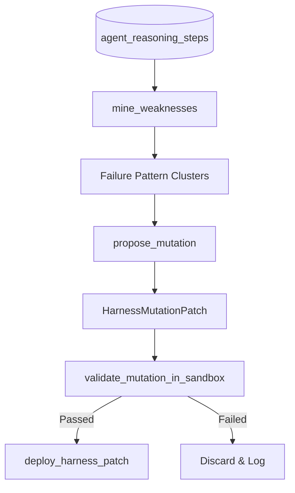

# Self-Evolving Harness & Weakness Mining

This document details the architecture of Atom's Self-Evolving Agent Harness framework.

---

## Why This Exists

### ❌ The Problem
Modern agentic engineering suffers from diminishing returns when relying on manual prompt tweaking ("vibes-based prompt engineering") and raw model scaling. Additionally, different foundation models have different "blind spots" (e.g. repeating failed shell commands, format dropouts), and fine-tuning weights to address these edge cases is slow, expensive, and risks catastrophic forgetting.

### 🎯 The Impact
Live user sessions suffer from **"loopmaxxing"**—forcing an agent to re-try failed actions endlessly during an active session, which inflates token consumption and latency.

### 🛡️ Our Solution
Atom shifts optimization from runtime user sessions to an offline **Meta-Runtime** via the `HarnessEvolutionService`. The system mines execution trace history, proposes targeted micro-patches to the harness, runs regression tests inside an isolated sandbox, and deploys the mutated configuration programmatically.

---

## Technical Specifications

### 1. Weakness Mining
The service queries `agent_reasoning_steps` for executions with negative feedback (`feedback_score < 0`) or failed verifications (`verified == 'failed_verification'`). These failures are clustered by step type and action tool to isolate repeating model blindspots.

### 2. Harness Mutation
Rather than global prompt changes, the engine proposes micro-patches targeted at specific failure categories:
- **AST Tripwire Rules**: Injecting blocked patterns (e.g., recursive deletes) into the sandbox pre-execution AST validator.
- **System Prompt Rules**: Injecting instructional boundaries dynamically.
- **Context Compaction Boundaries**: Tuning token bounds or compaction algorithms.

### 3. Sandbox Validation Gate
Mutated patches are executed against test suites inside the copy-on-write `SandboxTransaction` context. If the test fails, changes to the workspace are rolled back automatically.

### 4. Configuration Deployment
Validated patches are appended to the `AgentRegistry.configuration["harness_patches"]` JSON payload and saved to the database.
