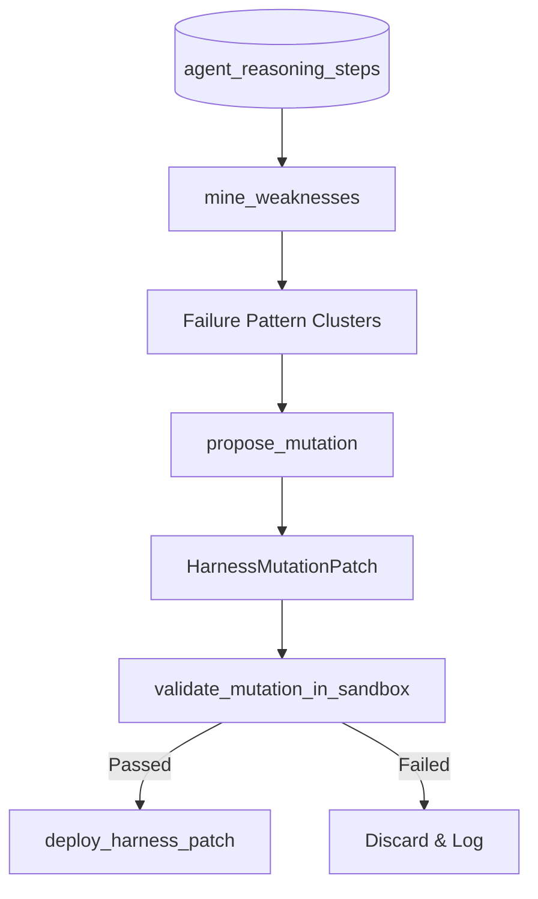

# Self-Evolving Harness & Weakness Mining

This document details the architecture of Atom's Self-Evolving Agent Harness framework.

---

## Why This Exists

### ❌ The Problem
Modern agentic engineering suffers from diminishing returns when relying on manual prompt tweaking ("vibes-based prompt engineering") and raw model scaling. Additionally, different foundation models have different "blind spots" (e.g. repeating failed shell commands, format dropouts), and fine-tuning weights to address these edge cases is slow, expensive, and risks catastrophic forgetting.

### 🎯 The Impact
Live user sessions suffer from **"loopmaxxing"**—forcing an agent to re-try failed actions endlessly during an active session, which inflates token consumption and latency.

### 🛡️ Our Solution
Atom shifts optimization from runtime user sessions to an offline **Meta-Runtime** via the `HarnessEvolutionService`. The system mines execution trace history, proposes targeted micro-patches to the harness, runs regression tests inside an isolated sandbox, and deploys the mutated configuration programmatically.

---

## Technical Specifications

```mermaid
flowchart TD
    A[(agent_reasoning_steps)] --> B[mine_weaknesses]
    B --> C[Failure Pattern Clusters]
    C --> D[propose_mutation]
    D --> E[HarnessMutationPatch]
    E --> F[validate_mutation_in_sandbox]
    F -->|Passed| G[deploy_harness_patch]
    F -->|Failed| H[Discard & Log]
```

### 1. Weakness Mining
The service queries `agent_reasoning_steps` for executions with negative feedback (`feedback_score < 0`) or failed verifications (`verified == 'failed_verification'`). These failures are clustered by step type and action tool to isolate repeating model blindspots.

### 2. Harness Mutation
Rather than global prompt changes, the engine proposes micro-patches targeted at specific failure categories:
- **AST Tripwire Rules**: Injecting blocked patterns (e.g., recursive deletes) into the sandbox pre-execution AST validator.
- **System Prompt Rules**: Injecting instructional boundaries dynamically.
- **Context Compaction Boundaries**: Tuning token bounds or compaction algorithms.

### 3. Sandbox Validation Gate
Mutated patches are executed against test suites inside the copy-on-write `SandboxTransaction` context. If the test fails, changes to the workspace are rolled back automatically.

### 4. Configuration Deployment
Validated patches are appended to the `AgentRegistry.configuration["harness_patches"]` JSON payload and saved to the database.

---

## The Four Evolution Mechanisms

Atom has four parallel self-evolution mechanisms. The `HarnessEvolutionService` above is one of them.

| Mechanism | What evolves | Mutation method |
|-----------|-------------|----------------|
| **Memento** (`auto_dev/memento_engine.py`) | Creates NEW skills from failure traces | LLM generates a new function from the failure observation |
| **AlphaEvolver** (`auto_dev/alpha_evolver_engine.py`) | Optimizes EXISTING skills | LLM rewrites the function; optionally wrapped in a HypothesisTree (Arbor HTR) |
| **HarnessEvolution** (above) | Patches agent config (tripwire, prompt, compaction) | Rule-based micro-patches |
| **GEA Loop** (`agent_evolution_loop.py`) | Population-based agent evolution | LLM generates directives; performance-novelty selection |

---

## Model Provenance & Scoped Patches (Round 82)

The problem statement above notes that *different foundation models have different blind spots*. Rounds up to R81 did not act on that: `mine_weaknesses` clustered failures by `(step_type, tool)` only (`AgentReasoningStep` had no model column), and every proposed patch shipped `"model_scope": "all"`. A prompt rule tuned on one checkpoint served every model routed to the agent.

### Two identities per LLM call

| Identity | When known | Source | Used for |
|---|---|---|---|
| **requested** | pre-flight | router-selected concrete model (BPC/tier/stage resolution; never a caller alias like `"auto"`) | patch applicability filtering at dispatch |
| **resolved** | post-flight | provider-echoed `model` field on the response body (`byok_handler._capture_echoed_model`, same `_raw_response` pattern as logprobs/usage) | drift detection, reasoning-step provenance, next mining cycle |

**Files**: `core/llm/model_provenance.py` (contextvar carrier + `ModelDriftDetector`), `core/llm/byok_handler.py` (`_capture_echoed_model` at all non-streaming create sites; `_record_outcome_feedback(resolved_model=...)` feeds the detector independently of `ATOM_LEARNING_ROUTER`).

### Silent-bump drift detection

CAIN-style vendor drift changes the resolved ID while the requested alias stays stable — invisible to requested-keyed consumers. `ModelDriftDetector` keeps a persisted baseline map `(provider_id, requested_model) → resolved` (`./data/model_resolution_state.json`) and fires a `DriftEvent` on divergence. Missing echoes are *unknown*, never *unchanged*; the detector self-heals when the echo stabilizes. Flag: `ATOM_MODEL_DRIFT_DETECTION_ENABLED` (default ON, detection-only, never raises).

### Patch scoping policy

`propose_mutation` now tags by component class:

- `ast_tripwire`, `context_compaction` → `"model_scope": "all"` (deterministic blast-radius controls are portable). Compaction is secretly model-sensitive via context windows — schema permits scoping later.
- `system_prompt` → `"model_scope": "model_family"` (+ `model_family` once mining keys clusters on `requested_model`). Evidence basis is precautionary, not demonstrated: AHE's −2.3pp system-prompt result is a same-model ablation (its cross-model runs transfer the full harness), but prompt-level artifacts also fail across task surfaces (ACE playbook regressing below seed on SWE-bench) and across models (PromptBridge model-drifting measurements).

**Family granularity is policy**: `normalize_model_family()` collapses dates/snapshots (`gpt-5.4-2026-03` → `gpt-5.4`) and `free`/`preview` tags, but PRESERVES variant tiers (`deepseek-v4-flash` ≠ `-pro`). Drift detection stays keyed on the concrete ID for maximum sensitivity; families govern only patch breadth.

### Application-time constraint

The tag alone is inert. `core/harness_evolution_service.py::applicable_patches(patches, current_model_id, provider_id=None, drift_detector=None)` is the read-time filter the first runtime consumer of `harness_patches` must call inside its step loop (per-LLM-call — tier routing means one run spans several models):

1. scope match — `all` always; family-scoped only on normalized family equality;
2. fail-safe — unknown origin family ⇒ excluded, never silently universalized;
3. **drift expiry** — active drift on `(provider_id, current_model_id)` suppresses matching family-scoped patches IMMEDIATELY (serve-path action, not next-cycle correction), restoring when the echo stabilizes.

**Known gaps**: streaming create sites uninstrumented; `requested_model` not yet populated at the meta-agent persistence seam; no runtime consumer exists yet — the filter ships first so the invariant is inherited, not retrofitted.

---

## Safety Architecture (Phase 1-2 Gap Closure)

The SOTA gap analysis (2026) identified critical safety gaps in the evolution system. These were closed in two phases.

Evidence: [Survey of Self-Evolving Agents (arXiv 2507.21046)](https://arxiv.org/html/2507.21046v4), [Misevolution (ICLR 2026)](https://openreview.net/forum?id=Fd1jgQQW28), [Darwin Gödel Machine (Sakana)](https://sakana.ai/dgm/), [RepoFixer (arXiv 2411.10213)](https://arxiv.org/html/2411.10213v2).

### Governance Gate (the misevolution defense)
**File: `agent_governance_service.py → validate_evolution_directive`**

Every evolution directive passes through this gate. Checks:
1. **30+ danger patterns** (safety bypass, privilege escalation, self-referential mutation)
2. **Protected config keys** — blocks mutations targeting `ast_tripwire`, `sandbox_config`, `governance_config`, `guardrails`
3. **Privilege escalation** — `elevated_privileges=True` rejected (must go through maturity graduation)
4. **Directive injection** — danger patterns in `evolution_directives`

### Behavioral Regression Validator
**File: `auto_dev/regression_validator.py`**

Runs BOTH parent and child code on the same test inputs and compares outputs. Distinguishes regression (behavior worsened) from improvement (parent crashed, child succeeds).

### Mutation Rollback Registry
**File: `auto_dev/mutation_rollback.py`**

Snapshots config before each deployment. Reverts individual mutations or all unverified mutations for an agent. LRU-bounded (max 1000).

### Daily Limit (fail-closed)
**File: `auto_dev/capability_gate.py`**

10 mutations/day default. **Fails closed** on error (previously failed open, disabling the limit during outages).

### Maturity-Gated Capability Access
Tier ladder: Memento→INTERN, AlphaEvolver→SUPERVISED, background→AUTONOMOUS.

### Unified Evolution Pipeline
**File: `auto_dev/evolution_pipeline.py`**

Single entry point enforcing all safety gates: governance → daily limit → rollback snapshot → deploy. Existing engines work standalone (backward compat).

---

## SOTA Comparison

| Capability | Atom | Darwin Gödel Machine | AlphaEvolve |
|-----------|------|---------------------|-------------|
| Mutation method | LLM-driven | LLM-driven (self-referential) | LLM-driven (ensemble) |
| Regression validation | ✅ Parent vs. child | ✅ SWE-bench tests | ✅ Evaluation function |
| Rollback | ✅ Mutation rollback registry | ✅ Version archives | ❌ |
| Governance gate | ✅ 30+ patterns + protected keys | ❌ | ❌ |
| Maturity tiers | ✅ 4-tier (Student→Autonomous) | ❌ | ❌ |
| Sandbox isolation | ✅ Docker + AST tripwires | ✅ | ✅ |

Atom prioritizes **safety** (governance, rollback, maturity tiers) over raw optimization power. SOTA systems achieve higher benchmark scores but lack the safety infrastructure needed for production business automation.

---

## What was NOT done (evidence-based)

- **AST-level mutation operators** — dropped. [Wang et al. 2025](https://arxiv.org/html/2406.09843v5): LLM mutation outperforms AST operators (77.4% vs 41.6%). AlphaEvolve uses LLM-driven mutation, not AST operators.
- **Crossover operator** — deferred. Requires population genetics infrastructure.
- **Model-layer evolution** (fine-tuning) — out of scope for the harness layer.
