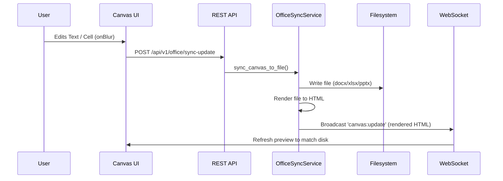

# Atom Office Automation & Canvas Co-Editing Guide

Atom provides native, python-based automation and real-time co-editing capabilities for Microsoft Office documents: Word (`.docx`), Excel (`.xlsx`), and PowerPoint (`.pptx`).

No Microsoft Office installation is required. Excel workbooks run through a **formula-evaluating workbook runtime** (`core/workbook_runtime.py`) — LibreOffice headless when available (full recalculation + pixel-accurate rendering + structural edits), the pure-Python `formulas` library as a fallback, and openpyxl cached values as a last resort. Word and PowerPoint remain pure-Python (python-docx / python-pptx).

See [WORKBOOK_RUNTIME.md](../architecture/WORKBOOK_RUNTIME.md) for the Excel engine architecture.

---

## Key Features

1. **AI-Native Manipulation**: Core python libraries edit OpenXML files directly. Excel writes trigger `WorkbookRuntime.recalculate()` so formulas are evaluated and the agent sees computed results immediately.
2. **DOM-like Spreadsheet Paths**: Select and write spreadsheet values or formulas using locator paths like `/SheetName/A1`. Written formulas are re-evaluated and the computed result is returned.
3. **Canvas Co-Editing**: Presents a live, editable document representation in the chat window, allowing real-time collaboration between the user and the agent.
4. **Real-Time Sync**: Modifications made inside the Canvas editor sync instantly back to the filesystem source, and modifications by the agent update the Canvas.
5. **Live Formula Evaluation**: Excel writes trigger recalculation (LibreOffice headless + `formulas` fallback) so agents read computed values, not unevaluated formula strings. HTML render includes conditional formatting and charts.

---

## CLI Reference

Atom OS provides CLI tools under the `office` command group:

### Excel Sheets
- **Read**: `atom-os office excel-read <file_path> [cell_path]`
  - Example: `atom-os office excel-read /data/financials.xlsx /Q1/B5:C12`
- **Write**: `atom-os office excel-write <file_path> <cell_path> <value> [--formula]`
  - Example: `atom-os office excel-write /data/financials.xlsx /Q1/C13 "=SUM(C5:C12)" --formula`

### Word Documents
- **Read**: `atom-os office word-read <file_path>`
- **Write**: `atom-os office word-write <file_path> <content> [--action append|replace] [--target placeholder] [--style Normal]`
  - Example: `atom-os office word-write letter.docx "John Doe" --action replace --target "[Client Name]"`

### PowerPoint Presentations
- **Read**: `atom-os office pptx-read <file_path>`
- **Write**: `atom-os office pptx-write <file_path> <slide_content> [--title "Slide Title"] [--layout-idx 1]`

### Render Previews
- **HTML Render**: `atom-os office render <file_path>`
  - Generates HTML conversion of the document.

---

## API Reference

Endpoints are exposed under the `/api/v1/office` prefix:

- `GET /api/v1/office/excel`: Reads worksheet cells.
- `POST /api/v1/office/excel`: Writes cell value/formula (auto-recalculates and returns computed result).
- `GET /api/v1/office/word`: Reads document paragraphs/tables.
- `POST /api/v1/office/word`: Modifies word file paragraphs or replaces placeholders.
- `GET /api/v1/office/pptx`: Reads presentation shapes and layouts.
- `POST /api/v1/office/pptx`: Appends new slides to presentation.
- `POST /api/v1/office/present`: Opens co-editing canvas panel.
- `POST /api/v1/office/sync-update`: Syncs user edits from Canvas back to filesystem.
- `POST /api/v1/office/excel/recalculate`: Force recalculation of all formulas.
- `POST /api/v1/office/excel/insert-rows`: Insert rows + recalculate to fix references.
- `POST /api/v1/office/excel/insert-columns`: Insert columns + recalculate.
- `GET /api/v1/office/excel/formula-result`: Get computed result of a formula cell.

---

## How It Works: Co-Editing Sync

