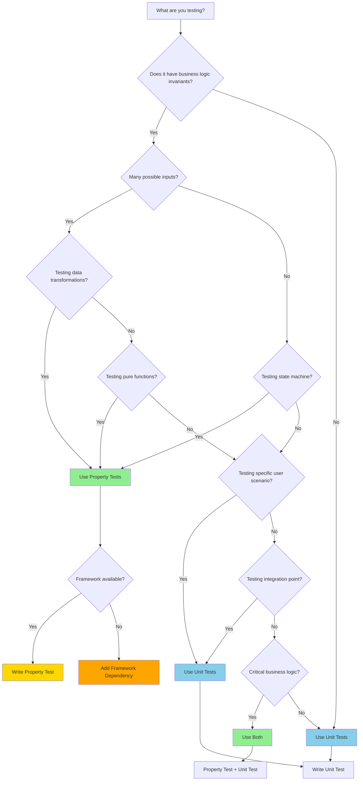

# Property Test Decision Tree

**Last Updated:** 2026-04-11
**Version:** 1.0
**Maintainer:** Testing Team

---

## Overview

This decision tree helps you choose between property-based tests and traditional unit tests. Not all features need property tests - use this guide to make informed decisions.

**Quick Answer:**
- **Use Property Tests** for business logic invariants (state management, data transformations, API contracts)
- **Use Unit Tests** for specific user scenarios (UI interactions, integration points, error cases)
- **Use Both** for critical business logic (property tests for invariants, unit tests for scenarios)

---

## Decision Tree



---

## When to Use Property Tests

### Scenarios

Use property tests when testing:

1. **Business Logic Invariants**
   - State updates are immutable
   - API round-trip preserves data
   - Transactions maintain consistency
   - Permissions are deterministic

2. **Many Possible Inputs**
   - All integers (e.g., age, count, balance)
   - All strings (e.g., names, emails, URLs)
   - All dates (e.g., timestamps, ranges)
   - All data structures (e.g., lists, dicts, trees)

3. **Edge Cases You Haven't Thought Of**
   - Null/empty values
   - Large numbers (overflow)
   - Unicode strings
   - Concurrent access

4. **Data Transformations**
   - Serialize/deserialize (JSON, YAML, protobuf)
   - Encode/decode (Base64, URL encoding)
   - Compress/decompress (Gzip, Brotli)
   - Normalize/denormalize (URLs, phone numbers)

5. **State Machines**
   - Valid transitions only
   - Terminal states reached
   - No invalid transitions
   - State history preserved

6. **Pure Functions**
   - Deterministic output
   - No side effects
   - Same input = same output
   - Referential transparency

### Real Examples from Atom

**Example 1: State Immutability (Property Test)**
```python
from hypothesis import given, settings
import hypothesis.strategies as st
import copy

@given(st.integers(), st.text())
@settings(max_examples=100)
def test_state_update_immutability(initial_count, initial_name):
    """
    INVARIANT: State update should not mutate input state
    VALIDATED_BUG: Shallow copy caused reference sharing
    """
    state = {"count": initial_count, "name": initial_name}
    state_copy = copy.deepcopy(state)
    update_state(state, {"count": initial_count + 1})
    assert state == state_copy  # Original unchanged
```

**Why Property Test?**
- Many possible inputs (all integers, all strings)
- Business logic invariant (immutability)
- Edge cases (empty strings, large numbers, unicode)

**Example 2: API Round-Trip (Property Test)**
```python
@given(st.builds(Request, id=st.uuid(), method=st.sampled_from(['GET', 'POST'])))
@settings(max_examples=100)
def test_request_roundtrip(request):
    """
    INVARIANT: Request serialization round-trip preserves data
    VALIDATED_BUG: JSON.stringify() converts undefined to null
    """
    serialized = request.to_json()
    deserialized = Request.from_json(serialized)
    assert deserialized == request
```

**Why Property Test?**
- Data transformation (serialize/deserialize)
- Many possible requests (all UUIDs, all methods)
- Invariant (round-trip preserves data)

**Example 3: Episode Segment Ordering (Property Test)**
```python
@given(st.lists(st.builds(
    EpisodeSegment,
    id=st.uuid(),
    content=st.text(),
    timestamp=st.datetimes()
), min_size=0, max_size=100))
@settings(max_examples=50)
def test_episode_segments_ordered(segments):
    """
    INVARIANT: Episode segments must be ordered by timestamp
    VALIDATED_BUG: Segments inserted in reverse order after migration
    """
    episode = Episode(segments=segments)
    timestamps = [s.timestamp for s in episode.segments]
    assert timestamps == sorted(timestamps)
```

**Why Property Test?**
- Business logic invariant (ordering)
- Many possible segments (all timestamps, all content)
- Edge cases (empty list, single segment, unsorted input)

---

## When to Use Unit Tests

### Scenarios

Use unit tests when testing:

1. **Specific User Scenarios**
   - User logs in with valid credentials
   - User creates canvas with chart
   - User uploads file and sees preview
   - User receives notification

2. **UI Components**
   - Button click triggers action
   - Form submission validates inputs
   - Modal opens and closes
   - Drag and drop works

3. **Integration Points**
   - API call to external service
   - Database query execution
   - File system operation
   - WebSocket connection

4. **Error Handling**
   - Specific error case (404, 500, timeout)
   - Network failure recovery
   - Invalid user input
   - File not found

5. **Configuration**
   - Environment variable loading
   - Feature flag evaluation
   - Settings validation
   - Default values

### Real Examples from Atom

**Example 1: User Login (Unit Test)**
```python
def test_user_login_with_valid_credentials():
    """
    Unit Test: User logs in with valid credentials
    """
    user = User.create(email="test@example.com", password="password123")
    response = client.post("/api/auth/login", json={
        "email": "test@example.com",
        "password": "password123"
    })
    assert response.status_code == 200
    assert "token" in response.json()
```

**Why Unit Test?**
- Specific user scenario (valid login)
- Integration point (API endpoint)
- Not testing invariant (testing flow)

**Example 2: Canvas Creation (Unit Test)**
```python
def test_create_canvas_with_chart():
    """
    Unit Test: User creates canvas with chart
    """
    response = client.post("/api/canvas", json={
        "type": "chart",
        "chart_type": "line",
        "data": [{"label": "A", "value": 10}]
    })
    assert response.status_code == 201
    assert response.json()["type"] == "chart"
```

**Why Unit Test?**
- Specific user scenario (create canvas)
- Integration point (API endpoint)
- Not testing invariant (testing creation flow)

**Example 3: Modal Component (Unit Test)**
```typescript
test('modal opens and closes', () => {
    const { getByText, getByRole } = render(<Modal />);

    fireEvent.click(getByText('Open'));
    expect(getByRole('dialog')).toBeVisible();

    fireEvent.click(getByText('Close'));
    expect(getByRole('dialog')).not.toBeVisible();
});
```

**Why Unit Test?**
- UI component interaction
- Specific user scenario (open/close modal)
- Not testing invariant (testing behavior)

---

## When to Use Both

### Scenarios

Use both property tests and unit tests for:

1. **Critical Business Logic**
   - **Property tests**: Verify invariants (immutability, round-trip, ordering)
   - **Unit tests**: Verify scenarios (happy path, error cases, edge cases)

2. **Complex Algorithms**
   - **Property tests**: Verify correctness (invariants hold for all inputs)
   - **Unit tests**: Verify edge cases (boundary conditions, null inputs)

3. **Data Structures**
   - **Property tests**: Verify invariants (structure preserved, operations valid)
   - **Unit tests**: Verify operations (insert, delete, lookup)

### Real Examples from Atom

**Example 1: Agent Governance (Both)**

**Property Test: Permission Check Deterministic**
```python
@given(st.sampled_from(['STUDENT', 'INTERN', 'SUPERVISED', 'AUTONOMOUS']),
       st.integers(min_value=1, max_value=4))
@settings(max_examples=100)
def test_permission_check_deterministic(maturity, complexity):
    """
    INVARIANT: Permission checks are deterministic
    """
    results = [permission_check(maturity, complexity) for _ in range(50)]
    assert all(r == results[0] for r in results)
```

**Unit Test: STUDENT Blocked from Critical Actions**
```python
def test_student_blocked_from_critical_actions():
    """
    Unit Test: STUDENT agent cannot delete data
    """
    agent = Agent.create(maturity='STUDENT')
    response = agent.execute_action(action='delete', resource_id='123')
    assert response.success == False
    assert "insufficient maturity" in response.error
```

**Why Both?**
- Property test: Verifies deterministic invariant for all maturity/complexity combinations
- Unit test: Verifies specific scenario (STUDENT blocked from delete)

**Example 2: Episode Retrieval (Both)**

**Property Test: Temporal Retrieval In Range**
```python
@given(st.datetimes(min_value=datetime(2020, 1, 1)),
       st.datetimes(min_value=datetime(2020, 1, 1)))
@settings(max_examples=100)
def test_temporal_retrieval_in_range(start_time, end_time):
    """
    INVARIANT: Temporal retrieval returns episodes in time range
    """
    if start_time > end_time:
        start_time, end_time = end_time, start_time
    episodes = retrieve_episodes_temporal(start_time, end_time)
    for episode in episodes:
        assert start_time <= episode.timestamp <= end_time
```

**Unit Test: Empty Result for Invalid Range**
```python
def test_temporal_retrieval_empty_for_future_range():
    """
    Unit Test: Retrieving episodes from future returns empty
    """
    start_time = datetime.now() + timedelta(days=1)
    end_time = datetime.now() + timedelta(days=2)
    episodes = retrieve_episodes_temporal(start_time, end_time)
    assert len(episodes) == 0
```

**Why Both?**
- Property test: Verifies invariant (all episodes in range) for all time ranges
- Unit test: Verifies specific scenario (future range returns empty)

---

## Cost-Benefit Analysis

### Property Tests

**Benefits:**
- Find edge cases you didn't think of
- Test hundreds of inputs automatically
- Document invariants formally
- Catch regressions early

**Costs:**
- Slower to write (need to identify invariant)
- Slower to run (hundreds of iterations)
- Harder to debug (random inputs)
- Require framework dependency

**When to Invest:**
- Critical business logic
- Many possible inputs
- High bug discovery rate
- Long-lived code

### Unit Tests

**Benefits:**
- Faster to write (test specific scenario)
- Faster to run (single execution)
- Easier to debug (known inputs)
- No framework dependency

**Costs:**
- Miss edge cases
- Don't document invariants
- Require more tests for coverage
- Brittle (break on implementation changes)

**When to Invest:**
- UI components
- Integration points
- Error handling
- Configuration

### Time Estimates

| Task | Property Test | Unit Test |
|------|---------------|-----------|
| Write Test | 30-60 minutes | 5-15 minutes |
| Run Test | 1-10 seconds | 0.01-0.1 seconds |
| Debug Failure | 15-30 minutes | 5-10 minutes |
| Maintenance | Low (invariant stable) | High (brittle) |

**ROI Calculation:**
```
ROI = (Bug Discovery Value × Probability) / (Write Time + Run Time × Iterations)

Property Test ROI: High for critical logic with many inputs
Unit Test ROI: High for UI/integration with specific scenarios
```

---

## Recommendations by Domain

### Agents

**Use Property Tests For:**
- Governance checks (determinism, maturity levels)
- State management (immutability, transitions)
- Permission checks (idempotence, monotonicity)

**Use Unit Tests For:**
- Agent creation flow
- Specific execution scenarios
- Error handling (timeout, failure)

### Episodes

**Use Property Tests For:**
- Segment ordering (time-ordered)
- Retrieval modes (temporal, semantic)
- Data integrity (content length, timestamps)

**Use Unit Tests For:**
- Episode creation flow
- Specific retrieval scenarios
- Lifecycle transitions

### Canvas

**Use Property Tests For:**
- State transitions (valid transitions only)
- Data validation (format, limits)
- Audit trail (all actions logged)

**Use Unit Tests For:**
- Canvas creation flow
- Component rendering
- User interactions

### Database

**Use Property Tests For:**
- ACID properties (atomicity, isolation, durability)
- Constraints (foreign keys, unique, check)
- Concurrency (optimistic locking, pessimistic locking)

**Use Unit Tests For:**
- Specific query scenarios
- Migration execution
- Backup/restore flow

### Authentication

**Use Property Tests For:**
- Token generation (uniqueness, format)
- Session management (timeout, isolation)
- Authorization (monotonicity, idempotence)

**Use Unit Tests For:**
- Login flow (valid credentials)
- Token refresh flow
- Logout flow

---

## Decision Checklist

Use this checklist when deciding:

**Property Test?**
- [ ] Does it test a business logic invariant?
- [ ] Are there many possible inputs?
- [ ] Could edge cases break it?
- [ ] Is it a data transformation?
- [ ] Is it a state machine?
- [ ] Is it a pure function?

**Unit Test?**
- [ ] Does it test a specific user scenario?
- [ ] Is it a UI component?
- [ ] Is it an integration point?
- [ ] Does it test error handling?
- [ ] Does it test configuration?

**Both?**
- [ ] Is it critical business logic?
- [ ] Is it a complex algorithm?
- [ ] Is it a data structure?

**Score:**
- 4+ "Yes" in Property Test → Use Property Tests
- 4+ "Yes" in Unit Test → Use Unit Tests
- 3+ in Both → Use Both

---

## Examples by Category

### Category 1: Business Logic Invariants

**Use Property Tests**

**Example: Transaction Atomicity**
```python
@given(st.integers(min_value=0, max_value=1000),
       st.integers(min_value=1, max_value=1000))
@settings(max_examples=200)
def test_transaction_atomicity(initial_balance, debit_amount):
    """
    INVARIANT: Transactions are atomic (all-or-nothing)
    """
    balance = initial_balance
    try:
        balance -= debit_amount
        if balance < 0:
            balance = initial_balance  # Rollback
    except:
        balance = initial_balance  # Rollback
    assert balance >= 0  # Never negative
```

### Category 2: Many Possible Inputs

**Use Property Tests**

**Example: Email Validation**
```python
@given(st.emails())
@settings(max_examples=100)
def test_email_validation(email):
    """
    INVARIANT: Valid emails pass validation
    """
    is_valid = validate_email(email)
    assert is_valid == is_valid_email_format(email)
```

### Category 3: Specific User Scenario

**Use Unit Tests**

**Example: User Registration Flow**
```python
def test_user_registration_flow():
    """
    Unit Test: User registers with valid email
    """
    response = client.post("/api/auth/register", json={
        "email": "test@example.com",
        "password": "Password123!"
    })
    assert response.status_code == 201
    assert "user_id" in response.json()
```

### Category 4: UI Component

**Use Unit Tests**

**Example: Button Click**
```typescript
test('button triggers action on click', () => {
    const handleClick = jest.fn();
    const { getByRole } = render(<Button onClick={handleClick}>Click Me</Button>);

    fireEvent.click(getByRole('button'));
    expect(handleClick).toHaveBeenCalledTimes(1);
});
```

### Category 5: Critical Business Logic

**Use Both**

**Property Test: Round-Trip Invariant**
```python
@given(st.builds(User, id=st.uuid(), email=st.emails()))
@settings(max_examples=100)
def test_user_roundtrip(user):
    """
    INVARIANT: User serialization round-trip preserves data
    """
    serialized = user.to_json()
    deserialized = User.from_json(serialized)
    assert deserialized == user
```

**Unit Test: User Creation Flow**
```python
def test_user_creation_flow():
    """
    Unit Test: User created with valid data
    """
    response = client.post("/api/users", json={
        "email": "test@example.com",
        "name": "Test User"
    })
    assert response.status_code == 201
    assert response.json()["email"] == "test@example.com"
```

---

## Common Mistakes

### Mistake 1: Using Property Tests for UI Components

**Bad:**
```typescript
fc.assert(fc.property(fc.string(), (text) => {
    const { getByText } = render(<Button>{text}</Button>);
    expect(getByText(text)).toBeVisible();
}));
```

**Why Bad?**
- UI components test behavior, not invariants
- Property tests overkill for specific scenarios
- Hard to maintain (framework overhead)

**Fix: Use Unit Tests**
```typescript
test('button displays text', () => {
    const { getByText } = render(<Button>Click Me</Button>);
    expect(getByText('Click Me')).toBeVisible();
});
```

### Mistake 2: Using Unit Tests for Data Transformations

**Bad:**
```python
def test_json_roundtrip_specific():
    """Unit Test: Specific JSON round-trip"""
    data = {"name": "Test", "value": 123}
    serialized = json.dumps(data)
    deserialized = json.loads(serialized)
    assert deserialized == data
```

**Why Bad?**
- Only tests one case
- Misses edge cases (unicode, nested objects, null)
- Doesn't document invariant

**Fix: Use Property Tests**
```python
@given(st.dictionaries(st.text(), st.integers() | st.text() | st.none()))
@settings(max_examples=100)
def test_json_roundtrip(data):
    """
    INVARIANT: JSON round-trip preserves data
    """
    serialized = json.dumps(data)
    deserialized = json.loads(serialized)
    assert deserialized == data
```

### Mistake 3: Testing Implementation Instead of Invariants

**Bad:**
```python
@given(st.integers())
@settings(max_examples=100)
def test_increment_implementation(x):
    """Property Test: Increment adds 1"""
    result = increment(x)
    assert result == x + 1  # Tests implementation
```

**Why Bad?**
- Tests implementation, not invariant
- Brittle (breaks if implementation changes)
- Misses point of property testing

**Fix: Test Invariant**
```python
@given(st.integers())
@settings(max_examples=100)
def test_state_immutability(x):
    """
    INVARIANT: State update doesn't mutate input
    """
    state1 = {count: x}
    state2 = {count: x}
    increment(state1)
    assert state2.count == x  # Original unchanged
```

---

## Quick Reference

| Scenario | Use Property Tests | Use Unit Tests | Use Both |
|----------|-------------------|---------------|----------|
| Business logic invariants | ✅ | ❌ | ❌ |
| Many possible inputs | ✅ | ❌ | ❌ |
| Edge cases | ✅ | ❌ | ❌ |
| Data transformations | ✅ | ❌ | ❌ |
| State machines | ✅ | ❌ | ❌ |
| Pure functions | ✅ | ❌ | ❌ |
| Specific user scenarios | ❌ | ✅ | ❌ |
| UI components | ❌ | ✅ | ❌ |
| Integration points | ❌ | ✅ | ❌ |
| Error handling | ❌ | ✅ | ❌ |
| Configuration | ❌ | ✅ | ❌ |
| Critical business logic | ✅ | ✅ | ✅ |
| Complex algorithms | ✅ | ✅ | ✅ |
| Data structures | ✅ | ✅ | ✅ |

---

## Related Documentation

- **Property Testing Guide**: `docs/testing/property-testing.md` (1,170 lines)
- **Invariants Catalog**: `backend/tests/property_tests/INVARIANTS_CATALOG.md`
- **Performance Guide**: `docs/testing/PROPERTY_TEST_PERFORMANCE.md` (to be created)
- **Phase 098 Summary**: `.planning/phases/098-property-testing-expansion/`

---

**Document Version:** 1.0
**Last Updated:** 2026-04-11
**Maintainer:** Testing Team
